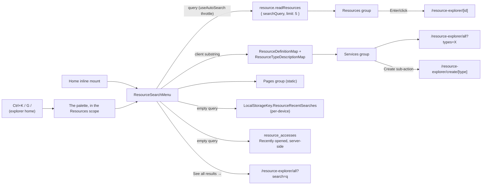

# Global Search

Azure-portal-faithful search over the Resource Explorer: one `ResourceSearchMenu` combobox with an as-you-type dropdown grouped into Resources / Services / Pages, mounted inline on Home (portal landing parity), and the same search as the [command palette](/docs/architecture/ui-library#command-palette)'s scope while the explorer home page (`pages/resource-explorer/index.vue`) is open, so `Ctrl+K` there searches resources. No new backend — the Resources group rides `resource.readResources`, which ranks prefix matches first.

## How it works

With a query set the dropdown shows three groups plus a footer:

| Group     | Source                                                                 | Row                                     | Target                                                                                   |
| --------- | ---------------------------------------------------------------------- | --------------------------------------- | ---------------------------------------------------------------------------------------- |
| Resources | `resource.readResources { searchQuery, limit: 5 }` via `useAutoSearch` | type icon · name · type caption         | `RoutePath.Resource(id)`                                                                 |
| Services  | client-side match over type titles + descriptions                      | type icon · title · "Create" sub-action | `/resource-explorer/all?types=X`; Create → `/resource-explorer/create/[type]`            |
| Pages     | static `PageSearchItems`                                               | page icon · title                       | every [service menu](/docs/resource/resource-service-menu) entry, plus Create a resource |
| footer    | always when a query is set                                             | "See all results →"                     | `/resource-explorer/all?search={q}`                                                      |

- **Empty query**: two groups instead — recent searches (`LocalStorageKey.ResourceRecentSearches`, capped at 5, pushed on submit/pick) and **Recently opened**, the caller's own server-side access rows read through the recents store ([favorites & recents](/docs/resource/favorites-and-recents)). The two are stored differently on purpose ([favorites & recents](/docs/resource/favorites-and-recents) says why): the resources you opened follow you between machines; a query you typed does not.
- **Match highlight**: the matched substring is bolded in the inline menu's row titles (`ResourceSearchHighlightedTitle` over `getHighlightParts`); the palette draws its rows the one way for every scope.
- **No results**: a single "No resources found for '{q}'" row plus the See-all footer.
- `/resource-explorer/all` reads `?search=` and `?types=` on load, so the footer and Services rows deep-link into a pre-filtered list.

## Keyboard

- On Home's inline menu, `↑`/`↓` move through a flat list across groups (the See-all footer is the last option), `Enter` activates the selection and falls back to See-all when nothing is selected, and `Esc` closes the panel. The field is `role="combobox"` with `aria-expanded`/`aria-activedescendant`; the panel is `role="listbox"` with `role="option"` rows.
- `useResourceCommands`, called by the explorer home page, registers the same search as the palette's scope — the rows as palette commands, each service's Create sub-action as a row of its own, and See all as the last — and the Azure `G`-chords as commands: `G /` opens the palette on resources, `G A` goes to `/resource-explorer/all`, and `G N` opens the [notifications](/docs/resource/notifications) panel. Picking a row remembers the query as a recent search.
- The chords are bound through the command registry, so they never fire in a field, and `Shift+?` lists them in the app's one shortcuts dialog while the page is open.

## Relevance

`readResources` ranks the closest trigram match first, then prefix matches above the remaining substring matches, newest-first within each tier. The search value is escaped and bound through the query builder throughout, and `getResourcesWhere` stays the single filter source so `readResourcesCount` never drifts from the list. Typo tolerance and the ranking ladder are covered in [global search relevance](/docs/resource/global-search-relevance); Azure AI Search stays [deferred](/docs/resource/deferred/azure-ai-search).

## Key files

| File                                                        | Role                                                                                     |
| ----------------------------------------------------------- | ---------------------------------------------------------------------------------------- |
| `app/components/Resource/Search/Menu.vue`                   | the combobox + panel (single source for both mounts); keyboard nav, select bookkeeping   |
| `app/components/Resource/Search/ResultList.vue`             | grouped listbox rows, Create sub-action, See-all footer                                  |
| `app/components/Resource/Search/HighlightedTitle.vue`       | bolds the matched substring in row titles                                                |
| `app/pages/resource-explorer/index.vue`                     | explorer home — the inline mount, and the page whose commands and scope are registered   |
| `app/composables/resource/search/useResourceSearchItems.ts` | grouping and recent-search persistence over [`useAutoSearch`](/docs/architecture/search) |
| `app/composables/resource/useRecordResourceAccess.ts`       | records the open from the resource page, feeding the Recently opened group               |
| `app/composables/resource/useResourceCommands.ts`           | the palette's Resources scope and the `G`-chords, registered with the explorer home page |
| `app/services/resource/search/`                             | pure grouping/highlight/recents helpers (`getServiceSearchItems`, `pushRecent`, …)       |
| `server/trpc/routers/resource.ts`                           | prefix-match ranking in `readResources`                                                  |

## Notes

- One search, two surfaces — `useResourceSearchItems` feeds both Home's menu and the palette's scope, never two search implementations.
- Explorer-scoped, not app chrome — the scope exists only while the explorer home page is open; elsewhere the palette searches the whole app.
- The Services group answers "search matches type names" client-side ("survey" surfaces the Survey service row) — pushing type-title matching into the server `where` was rejected; the client already knows `ResourceDefinitionMap`. A handful of types doesn't justify a fuzzy library; if the Pages/actions list ever grows, add `fuse.js`/`minisearch` (tiny, client-only) rather than server work.
- Recent searches are per-device by design (localStorage); server-side search history is not worth a table. Recently opened resources are the opposite: they live server-side in `resource_accesses`, because the `Last accessed` column they feed has to agree between machines.
