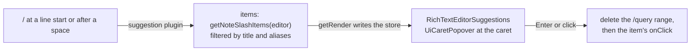

# Note slash menu

A Note's blocks are reached through its menu bar, and a writer who stays on the keyboard types `/`, a few letters of the block, and Enter, as in Notion. The menu is a suggestion on the Note editor, drawn at the caret.

## What it offers

| Item         | Inserts / converts the line to | Typed alias    |
| ------------ | ------------------------------ | -------------- |
| Paragraph    | a paragraph                    | `p`, `text`    |
| Heading 1–3  | a heading of that level        | `h1` – `h3`    |
| Task List    | a task list                    | `todo`         |
| Blockquote   | a blockquote                   | `quote`        |
| Bullet List  | a bullet list                  | `bullet`, `ul` |
| Ordered List | an ordered list                | `number`, `ol` |
| Code Block   | a code block                   | `code`         |
| Divider      | a horizontal rule              | `hr`, `rule`   |

## Decisions

- **Items are read off the menus, not listed twice.** The block items moved out of the menu bar into `getNoteBlockMenuItems`, and the slash menu takes those with the composer's shared `getListMenuItems`. The Code Block and Divider items exist only in the slash menu, since the menu bar has no room for them and the inline Code button is a different command.
- **The menu bar's order changed.** Paragraph, the headings, Task List and Blockquote now form the first group, then a divider, the text marks and inline Code, then a divider and the two lists. Before, the task list and blockquote sat after the lists. Both menus share the one block group, so its order is set once.
- **The slash menu's order follows the menu bar's**: blocks, then lists, then the code block and divider, rather than the proposal's table order, so the two menus read the same way.
- **Aliases live in one constant map keyed by title** (`NoteSlashAliasMap`). A block with no entry is found by its title alone.
- **The command deletes the typed `/query` first, then runs the item's own `onClick`** at the emptied line, so a slash command and a menu click run the same code.
- **`Item.onClick`'s event is optional.** A suggestion runs an item with no pointer or key event, so the type says so rather than passing a placeholder.
- **The trigger is its own `SuggestionTrigger` member, `NoteBlock`**, with the title `BLOCKS`, so a Note's popover is headed differently from the composer's `COMMANDS` while sharing the `/` character.
- **The extension is added in the editor, not in `getNoteExtensions`.** That set also builds the published `generateHTML` render, which must not carry a suggestion plugin.
- **The list draws in the editor's caret popover** through `RichTextEditorSuggestions`, which the Note editor now hosts beside its menu bar, so the page's theme scope reaches the list.
- **No slash menu in the message composer.** Its `/` stays the message slash commands.
- **Embeds and database blocks are left out** (`/table`, `/image`, `/page`), since each is a new node type with its own design.

## Key files

| File                                                              | Role                                                               |
| ----------------------------------------------------------------- | ------------------------------------------------------------------ |
| `apps/web/app/composables/resource/note/useNoteSlashExtension.ts` | the suggestion extension, built on `createSuggestionExtension`     |
| `apps/web/app/services/resource/note/NoteSlashSuggestion.ts`      | trigger, items, command and render of the suggestion               |
| `apps/web/app/services/resource/note/getNoteSlashItems.ts`        | the slash items, read off the menus plus the two slash-only blocks |
| `apps/web/app/services/resource/note/getNoteBlockMenuItems.ts`    | the Note's block items, shared by the menu bar and the slash menu  |
| `apps/web/app/services/resource/note/NoteSlashAliasMap.ts`        | the aliases a reader types, keyed by title                         |
| `apps/web/app/components/Resource/Note/BlockList.vue`             | the list drawn in the caret popover                                |
| `apps/web/app/components/Resource/Note/Editor.vue`                | adds the extension and hosts the suggestion list                   |
| `apps/web/app/components/Resource/Note/EditorMenuBar.vue`         | the menu bar, now built from `getNoteBlockMenuItems`               |
| `apps/web/app/services/message/SuggestionTrigger.ts`              | the `NoteBlock` trigger member                                     |
| `apps/web/app/models/resource/note/NoteSlashItem.ts`              | the item type: a menu item with its aliases                        |

## Sources

- [Notion — keyboard shortcuts](https://www.notion.com/help/keyboard-shortcuts) — `/` opening the block menu and filtering by typing.
