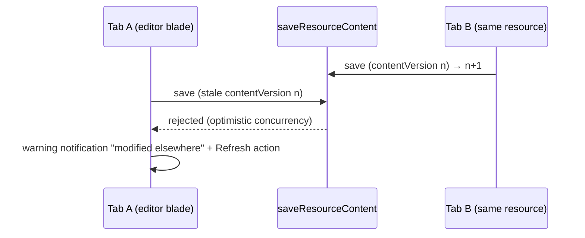

# Resource Page Parity

Azure's commands and destructive-operation parity on `/resource-explorer/[id]/[[blade]]`: every command the portal's bar has, Refresh, a Duplicate command, and a type-the-name delete confirmation, arranged as a page header rather than as the portal's bar.

## Commands

- **One action shown** (`ResourceBladeHeader`): the next step towards others seeing the resource, in the accent — Publish for a publishable resource with no publication, then Share once it has one. A type that cannot be published shows none. Beside it stand the star and the close ✕, which never move into a menu.
- **The rest in the page's overflow menu**, on every width, and on a right-click, long press or the menu key over the title, from one `Item` list: Refresh, Rename, Duplicate; Version history; Unpublish; an Import and an Export per format, named by both, such as "Export CSV"; then Delete, alone and in the danger colour. A command already under way is disabled in the menu rather than hidden.
- **Why not the portal's bar.** A labelled button per command put a dozen buttons of equal weight on the title row, which the design pass refuses: one thing first, as [Primer's page header](https://primer.style/product/components/page-header/guidelines/) and GitHub's repository header keep one or two actions visible and the rest behind an overflow button. The labelled bar, its group dividers, Import and Export as submenus, and the collapse into `…` only on a narrow screen were retired with the UI library's first page header.
- **Refresh**: re-runs `useResourceStore`'s `readResource` (row + publication), disabled in the menu while it runs.
- **Duplicate**: `resource.duplicateResource` — copies the row as `{name} (copy)` + the content blob; never the publication (a copy starts as Draft). Routes to the new resource's Overview and raises a "Go to resource" [notification](/docs/resource/notifications). Capability-independent (every type supports it).

## Destructive-operation guard

`StyledDeleteFormDialog` takes an optional `confirmName` prop: a text field whose value must equal it before Delete enables (Azure's "type the resource name to confirm"). The blade Delete command and the `/all` row delete type the resource name; a bulk delete past one selection has no single name to type, so it falls back to a count phrase ([list filters & views](/docs/resource/list-filters-and-views)).

## Save-conflict surface

A `saveResourceContent` rejected for a stale `contentVersion` routes into the [notifications](/docs/resource/notifications) store as "'{name}' was modified elsewhere — refresh to load the latest", with a Refresh action that hard-reloads (the one path guaranteed to re-run every blade's content loader).

## Procedures

| Procedure                    | Auth                | Input    | Purpose                                                                  |
| ---------------------------- | ------------------- | -------- | ------------------------------------------------------------------------ |
| `resource.duplicateResource` | `getOwnerProcedure` | `{ id }` | copy row (`{name} (copy)`, fresh id, no publication) + copy content blob |

## Key files

| File                                         | Role                                                        |
| -------------------------------------------- | ----------------------------------------------------------- |
| `app/components/Resource/Blade/Header.vue`   | the one action shown and the overflow menu's `Item` list    |
| `app/components/Styled/DeleteFormDialog.vue` | `confirmName` guard prop                                    |
| `app/store/resource/index.ts`                | refresh/duplicate actions, conflict + outcome notifications |

## Notes

- Listing snapshots, previewing one, and rolling back to it are [resource snapshots](/docs/resource/resource-snapshots), not command-bar parity — the one command that reaches them lives in the page's overflow menu, where `Version history` opens the panel, and nothing else about it does. Whether the open resource's own edits have landed is [save state](/docs/resource/resource-save-state), which is a readout beside those commands rather than one of them.
- JSON view / export-template parity is [out of scope](/docs/resource/rejected/json-config-parity).
