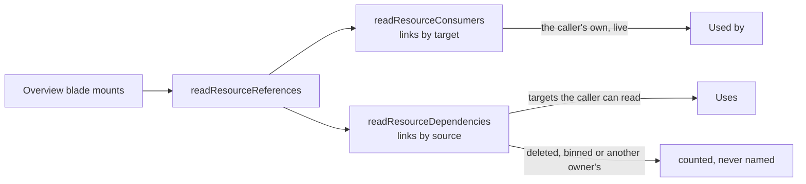

# Resource References

Every resource's Overview blade carries a **Related resources** card below Essentials, with two columns. **Used by** lists the owner's other resources that reference this one: the dashboards charting a Sheet, the emails merging from a survey's responses, the Program issuing a survey's tokens. **Uses** lists what this resource's own content references. Each row leads with its type's mark and goes to that resource. Power BI's lineage view does the same for an item, placing it between what feeds it and what it feeds.

## How it works

`ResourceRelatedResources` reads `resource.readResourceReferences` once when the blade mounts, through `useQuery` and off the blade's Suspense boundary. A failed read fails inside the card with its retry, and the card shows skeleton rows while the read is out. The procedure answers both directions from the [resource-link index](/docs/architecture/resource-links), with the two reads overlapping:

- **Used by** is `readResourceConsumers`, the same read the [delete-time reference warning](/docs/resource/delete-reference-warning) makes: the caller's live resources holding a link whose target is this one.
- **Uses** is `readResourceDependencies`: this resource's own links, then the targets the caller can read, by id and ordered by name. A target bound in two roles is listed once: a survey can be both a Program's audience and its survey.

A reference whose target is deleted, in the recycle bin, or another owner's is still the owner's own content, so it is counted under Uses ("1 referenced resource can't be found"). It is never named, because what it points at is not the owner's to read ([cross-owner references](/docs/architecture/security/cross-owner-references)). Fixing one happens where the reference is picked, which is where each consumer already says its source is missing ([datasets](/docs/architecture/dataset)).

## Key files

| File                                                            | Role                                                              |
| --------------------------------------------------------------- | ----------------------------------------------------------------- |
| `apps/web/server/trpc/routers/resource.ts`                      | `readResourceReferences`, both directions in one round trip       |
| `apps/web/server/services/resource/readResourceConsumers.ts`    | the owner's live resources linking to a set of targets            |
| `apps/web/server/services/resource/readResourceDependencies.ts` | a resource's own links, its readable targets and the rest counted |
| `apps/web/shared/models/resource/ResourceReferences.ts`         | the read's shape                                                  |
| `apps/web/app/components/Resource/RelatedResources.vue`         | the Overview card, with its loading and failed states             |
| `apps/web/app/components/Resource/LinkedResourceList.vue`       | a row per resource, each a link to it                             |

## Notes

- Each column holds at most `MAX_READ_LIMIT` resources, more than any one resource binds or is bound by.

## Sources

- Microsoft, "Data lineage - Power BI" — lineage view shows an item's connections upstream and downstream: https://learn.microsoft.com/en-us/power-bi/collaborate-share/service-data-lineage
