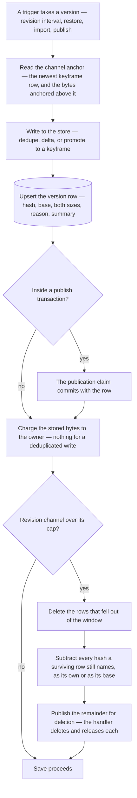
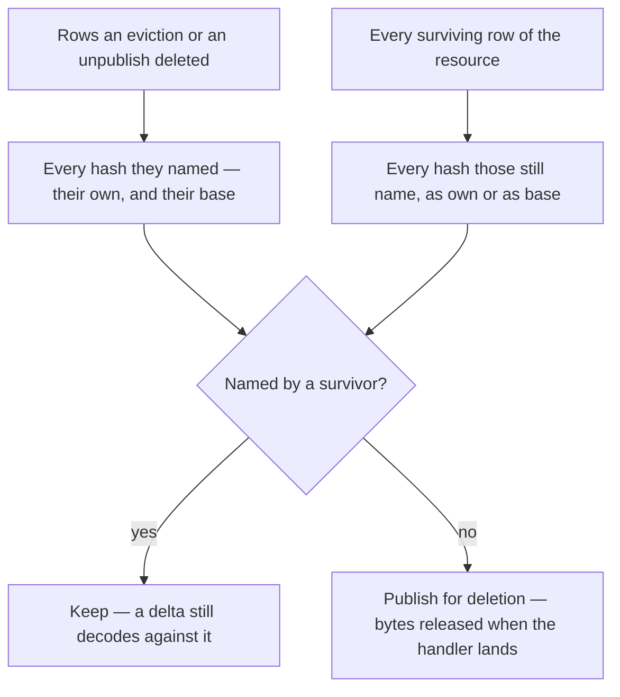

# Resource version store

A retained version of a resource — a revision of the working copy, or a published snapshot — is a row in `resourceVersions` and a content-addressed object in the resource assets container. The object is a zstd **keyframe**, compressed on its own, or a **delta** compressed against exactly one keyframe with that keyframe's plaintext as the dictionary. Successive versions of one document differ only by the edit between them, so a version usually costs a few hundred bytes, and the storage meter moves by what the owner actually added rather than by another copy of everything they already had ([storage quotas](/docs/resource/storage-quotas)).

Every trigger, channel and retention rule stays what [resource snapshots](/docs/resource/resource-snapshots) describes. This page is only what a version _is_ on disk, and what that changes for the code that writes, reads, charges and evicts one.

## The codec

The codec is the `keyframe-store` workspace package, a general library that never sees a schema: it takes bytes and returns bytes, addresses an object by the SHA-256 of its plaintext, and decides per write whether a delta or a keyframe is cheaper. The `keyframe-store` README is the reference for the object format, the promotion ratio, the segment budget and the compression parameters. Two properties of it are what the resource layer is built on:

- **Reconstruction is at most two reads.** A delta's own header names its keyframe, so there is no chain to walk and no version depends on the one written before it.
- **An object is write-once and content-addressed.** A version whose content the store already holds is a row pointing at the existing object — nothing written, nothing charged. That is the case that makes the meter honest about a save that changed nothing, and about a restore back to a version the store still has.

The store's only contact with Azure is `createSnapshotObjectStore`: one resource's objects under `{id}/objects/{hash}`, written create-only so two writers of the same content cannot race, and deleted through the blob deletion event rather than directly, because that path already deletes and releases the ledger entry as one retried unit.

Objects are scoped by resource rather than by owner. Successive versions of one document are where deduplication fires, an object then has exactly one payer, and every path that already takes `{id}/` wholesale — purge, and the ledger release behind it — takes the objects with it, so nothing outside the app process has to know the store exists.

## Taking a version

`writeSnapshotVersion` is the one way a version is taken, whichever channel it lands in. It reads the channel's anchor, writes the content to the store against it, and upserts the row that makes the version visible. The object is durable before the row exists, so a failure between the two leaves no version rather than a row naming nothing — the correct outcome for a version that was never stored. An orphaned object is adopted by the next write of the same content, never swept.

**The anchor is derived, never stored.** A channel's anchor is its newest row whose base is empty, and the bytes anchored to it are the stored sizes of the rows above it — `readSnapshotAnchor` answers both from the primary key. A column holding either would be a second source of truth for what one indexed read answers, and one that could disagree with the rows after a failed write.

**The charge is separate from the write**, because a publish takes its version inside the transaction that claims `publishVersion` and the charge takes the ledger row's lock and then the user's — a transaction held open across those waits on locks it is itself holding. `chargeSnapshotVersion` runs after the transaction and charges exactly the stored bytes, against the object's own key, so the object's `BlobCreated` reconciles to the same figure and its eventual deletion releases it.

**The one rewrite** is a publish repairing its own snapshot at the version it already claimed ([publishing](/docs/architecture/publishing)). The upsert moves the row to the new object, and the object it named before is collected if no other row still names it.

## Reading a version

`readSnapshotVersionContent` looks the row up by resource, channel and version, reconstructs the plaintext through the store, and parses it with the type's content schema. A version whose row is gone — evicted, or swept by an unpublish between the listing and the click — reads as no content, which the public read turns into the 404 page rather than an internal error. The history listing is a query over the channel's rows, ordered by version; reason, summary and the taken-at clock are columns, so the listing never opens an object.

## Collection

An object survives while any row of the resource names it, as its own hash or as its base. `collectSnapshotObjects` answers that with one query over the resource's rows, which is what the base hash is denormalised onto the row for: without it, deciding whether a keyframe is still needed would mean reading every surviving delta's header. Because a delta is anchored to a keyframe that is itself a version, a keyframe is collectable only once its own row and every delta anchored to it are gone — a ring buffer therefore sheds its oldest segment whole.

Eviction hands the deletion path the exact set of objects nothing references, rather than a version number computed a fixed distance behind the newest. An unpublish deletes the published channel's rows the same way, and keeps its prefix sweep for the asset clones under `{id}/published/`, which are not objects.

## Key files

| File                                                                       | Role                                                                    |
| -------------------------------------------------------------------------- | ----------------------------------------------------------------------- |
| `packages/keyframe-store/src/createKeyframeStore.ts`                       | the codec — dedupe, delta or keyframe, two-read reconstruction, collect |
| `packages/db-schema/src/schema/resourceVersions.ts`                        | the version row — hash, base, both sizes, reason, summary               |
| `apps/web/server/services/resource/snapshot/createSnapshotObjectStore.ts`  | the store's one contact with Azure — objects under `{id}/objects/`      |
| `apps/web/server/services/resource/snapshot/writeSnapshotVersion.ts`       | the one way a version is taken, in either channel                       |
| `apps/web/server/services/resource/snapshot/readSnapshotAnchor.ts`         | the channel's anchor, derived from its rows                             |
| `apps/web/server/services/resource/snapshot/chargeSnapshotVersion.ts`      | the charge for the stored bytes, after the transaction                  |
| `apps/web/server/services/resource/snapshot/readSnapshotVersionContent.ts` | reconstruct and parse one version                                       |
| `apps/web/server/services/resource/snapshot/collectSnapshotObjects.ts`     | what an eviction or unpublish may delete                                |
| `apps/web/server/services/resource/snapshot/takeResourceRevision.ts`       | the revision take, its ring buffer and its eviction                     |
| `apps/web/server/trpc/procedure/resource/createResourceProcedures.ts`      | the publish take, the public read, and the unpublish                    |

## Notes

- Existing snapshots written as full blobs under `{id}/revisions/` and `{id}/published/` were discarded rather than converted: a resource published before the store shipped has to be published again, and the blobs stay charged until purge takes the directory. Migration was scoped out because the history was recoverable by a republish and a conversion would have paid a full read of every snapshot for versions the ring buffer evicts within a session.
- A write always encodes twice — standalone and against the anchor — because the promotion ratio compares the two. On a multi-megabyte document that is hundreds of milliseconds on the save path, where a full copy was an upload of the same size; the committed bench beside `createKeyframeStore` is the record of what each shape costs, and the compression level is an option so a sweep of it never touches the implementation.
- The second phase the same substrate unlocks — addressing assets by content so a publish references them instead of cloning them — stays a [proposal](/docs/proposals/resource/content-addressed-assets), because its correctness rests on a scan of content rather than on a column.
