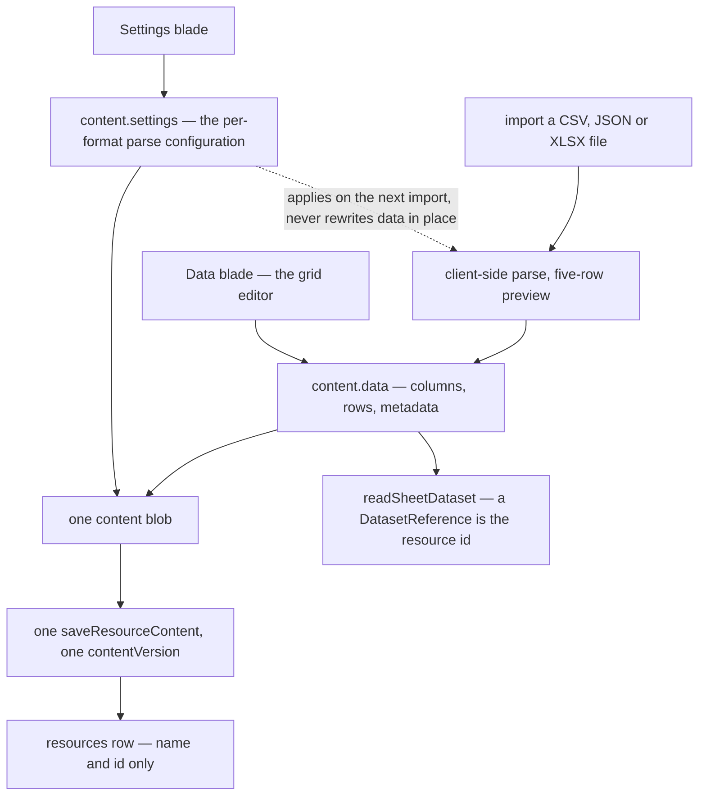

# Sheet Resource

Each imported file (CSV/JSON/XLSX) is its own resource, and the three concerns it carries each live somewhere different:

| Concern                                     | Home                                   |
| ------------------------------------------- | -------------------------------------- |
| Identity (name, id)                         | `resources` row                        |
| Settings (`DataSourceType` + configuration) | `settings` section of the content blob |
| Data (columns/rows/metadata)                | `data` section of the content blob     |

The split is not three storage systems — it is one row and one blob, with the blob sectioned so the two blades never write the same keys:



## Data model

```ts
// apps/web/shared/models/resource/sheet/SheetResource.ts — interface-first
export const sheetResourceSchema = z.object({
  data: dataSourceSchema, // columns, rows, metadata
  settings: sheetSettingsSchema, // discriminatedUnion("type"): Csv | Json | Xlsx file settings
}) satisfies z.ZodType<ToData<SheetResource>>;
```

A Sheet resource always has a `data` section (empty `DataSource` on create) — there is no `dataSource: null` state. "Not yet imported" is `rows.length === 0`, rendered as `UiEmptyState` pointing at the Import command. The `Column` family and the per-format configurations live in `shared/models/resource/sheet/`; `DataSource`, `DataSourceType` and the transformations sit under its `datasource/` subfolder.

## Capabilities

- **DatasetProvider** — `readSheetDataset` reads `content.data` via `dataSourceToDataset`. A `DatasetReference` is just the resource id — a resource _is_ the item, so there is no sub-item selector.
- **Portable** — `PortableFormatMap[ResourceType.Sheet]` carries a format per `DataSourceType` (accept/mimeType/serialize/deserialize); both Import and Export commands appear in the command bar. Import is a client-side parse (no upload) with a 5-row preview. The imported document is then saved like any other, so its ceiling is `MAX_RESOURCE_CONTENT_SIZE`, the content limit every resource shares: a Sheet under it saves, staged through Blob Storage once it outgrows one request body, and one over it is refused on the client with a notification ([file uploads](/docs/architecture/file-uploads)). An import replaces the data through `useSetDataSource`, which first hands the replaced sheet's identities to the imported one with `reconcileDataSource` — a column by its source header, a row by its position — so importing the same file again stores the same bytes, which the version store keeps once ([large documents](/docs/architecture/large-documents)). The xlsx codecs `await import` their workbook libraries inside `serializeXlsx`/`deserializeXlsx` rather than at module scope: the command bar renders on every resource page, so a static import would ship a parser to the eight types that can neither import nor export.

## Blades

- **Data** — the entire grid editor: inline editing, computed columns, statistics, clipboard, find/replace, undo/redo. Components live under `Resource/Sheet/*`; the grid's feature set is documented in the [sheet editor](/docs/resource/sheet) area. Its view state — page, search, sort, selected rows and columns, the cell selection, find and replace, column filters — is keyed by the loaded resource, so the next sheet opened starts clean, and a filter is read back only for a column the sheet still has.
- **Settings** — the file type, choosing which swaps in that format's defaults, beside that format's own parse options (delimiter etc.), editing `content.settings`; changing settings re-parses on next import, never silently rewrites data.

Both blades edit sections of one blob and save through one `saveResourceContent` with one `contentVersion`.

## Key files

| File                                            | Role                                                |
| ----------------------------------------------- | --------------------------------------------------- |
| `shared/models/resource/sheet/SheetResource.ts` | content blob schema (`data` + `settings`)           |
| `app/components/Resource/Sheet/Data.vue`        | Data blade (grid editor)                            |
| `app/components/Resource/Sheet/Settings.vue`    | Settings blade (file type beside its options form)  |
| `app/store/resource/sheet/`                     | grid state + command/undo stack over `content.data` |
| `app/services/resource/PortableFormatMap.ts`    | CSV/JSON/XLSX import/export formats                 |

## Notes

- **Settings live in the content blob, not a column.** Rejected alternatives: a `settings` jsonb column on `resources` (untyped at the DB boundary — per-type settings schemas can't be one column schema; splits one artifact across two write paths with two version races) and a separate `{id}/settings` blob (doubles round-trips, needs its own version field for one consumer). The settings/data split is a UX separation (blades), not a storage separation ([resources](/docs/architecture/resource)).
- The command/undo stack (`useSheetHistoryStore`, holding `ADataSourceCommand` instances) operates on a single `DataSource` — exactly one Sheet resource's `content.data`; it initializes from `useResourceStore` content.
- **Row, column and byte counts are derived, not stored.** `computeDataSourceStatistics` reads them off `columns` and `rows` when the status bar renders. Persisting them meant every command re-syncing a copy that could only ever restate the blob it sits in, or drift from it.
- **A Sheet holds exactly one data source**, so nothing in the store or the dataset provider needs a sub-item selector. A sibling resource type for the Vuetify component demos was [rejected](/docs/resource/rejected/vuetify-component-resource).
