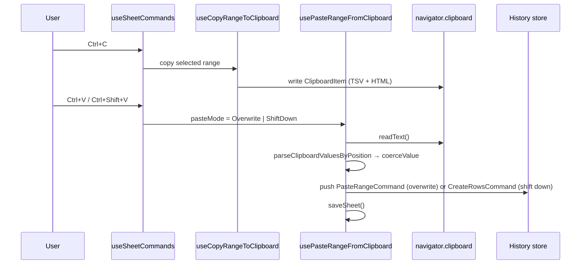

# Clipboard

Keyboard-driven copy/paste for cell ranges, aligned with Excel selection UX; every paste is reversible through undo/redo.

## How it works

The grid maintains an anchor/focus cell selection in the cell store. `useSheetCommands` registers the keys as the sheet's commands (`useCommands`), so they are listed in the shortcuts dialog, never fire while a field has focus, and copy, paste and clearing are bound only while cells are selected — the page's own copy works whenever the grid holds no selection. They route to two composables: `useCopyRangeToClipboard` and `usePasteRangeFromClipboard`.

**Copy (`Ctrl+C` / `Cmd+C`)** materializes the selected columns and filtered rows through `filterDataSourceColumns` — so computed columns copy their displayed value, not an empty cell ([copy computed values](/docs/resource/sheet/copy-computed-values)) — and hands the sub-DataSource to `copyToClipboard`, which writes both `text/plain` (TSV) and `text/html` (a styled table, so pasting into Excel/Sheets keeps structure) via `ClipboardItem`, falling back to `writeText` where `ClipboardItem` is unavailable (e.g. Firefox). Hidden columns are excluded; the header row is included or not based on the `isCopyIncludingHeaders` toolbar toggle.

**Paste** reads TSV from the clipboard, parses it position-based (no header row expected) with `parseClipboardValuesByPosition`, and coerces each value to its target column's type via `coerceValue`. The `Shift` key selects the mode:

| Mode                  | Trigger        | Behaviour                                                                                                                                                                                                    |
| --------------------- | -------------- | ------------------------------------------------------------------------------------------------------------------------------------------------------------------------------------------------------------ |
| `PasteMode.Overwrite` | `Ctrl+V`       | Overwrites cells in place starting at the anchor (top-left of the selection, or appends at the end with no selection); rows past the last row are appended; columns past the last display column are ignored |
| `PasteMode.ShiftDown` | `Ctrl+Shift+V` | Inserts the parsed rows at the anchor row index, shifting existing rows down                                                                                                                                 |

Overwrite pushes a `PasteRangeCommand` that snapshots the affected original rows, so undo removes any appended rows and restores overwritten cells. Shift-down reuses `CreateRowsCommand` with the anchor as start index, so undo removes the inserted rows. Both paths save the file after the command executes.

## Selection UX

| Gesture     | Behaviour                                    |
| ----------- | -------------------------------------------- |
| Click cell  | Start single-cell selection                  |
| Shift+click | Extend selection from anchor to clicked cell |
| Drag        | Extend selection while mouse held            |
| Arrow keys  | Move selection (collapses to single cell)    |
| Shift+Arrow | Extend selection in arrow direction          |
| Ctrl/Cmd+A  | Select all cells                             |
| Escape      | Clear selection                              |

The anchor is preserved across Shift+click and Shift+Arrow; dragging re-anchors on mousedown.

The rows are the data table's grid ([UI library](/docs/architecture/ui-library)), so the plain arrows, Home and End, Page Up and Page Down belong to the table: they walk its active cell, the one stop in the tab order, and the sheet makes each cell they land on the selection, as a spreadsheet's active cell is. A press selects its cell first and then takes it as the active one, so a Shift+click range survives the focus it brings. Enter on a cell opens its editor, and Enter or Escape in the editor hands focus back to the cell, saving or dropping the edit. The shortcuts dialog still shows the plain arrows as the sheet's, registered with nothing to run, while Shift+Arrow and the clipboard keys stay bound, since the grid reads no chord but Ctrl+Home and Ctrl+End — so the table and the sheet never both answer one key.

## Key files

All paths relative to `apps/web/app`.

| File                                                                 | Role                                                                                                                                               |
| -------------------------------------------------------------------- | -------------------------------------------------------------------------------------------------------------------------------------------------- |
| `models/resource/sheet/commands/PasteMode.ts`                        | `PasteMode` enum (`Overwrite` / `ShiftDown`)                                                                                                       |
| `models/resource/sheet/commands/PasteRangeCommand.ts`                | Overwrite paste + undo snapshot                                                                                                                    |
| `services/resource/sheet/commands/parseClipboardValuesByPosition.ts` | TSV → `string[][]` (no header row)                                                                                                                 |
| `services/resource/sheet/commands/copyToClipboard.ts`                | TSV + HTML `ClipboardItem` write with `writeText` fallback                                                                                         |
| `composables/resource/sheet/useCopyRangeToClipboard.ts`              | Slices the selected range and writes it to the clipboard                                                                                           |
| `composables/resource/sheet/commands/usePasteRangeFromClipboard.ts`  | Wires clipboard → `usePasteRange` or `useCreateRows`                                                                                               |
| `composables/resource/sheet/commands/usePasteRange.ts`               | The overwrite paste as a `useSheetCommand`, so both modes share one execute/push/save tail                                                         |
| `composables/resource/sheet/useSheetCommands.ts`                     | The sheet's keys as registered commands; `Ctrl+Shift+V` → `PasteMode.ShiftDown`                                                                    |
| `components/Resource/Sheet/Row/Table.vue`                            | The rows on the data table's grid: its active cell made the selection, Enter opening the editor, and each column's width kept in the settings      |
| `store/resource/sheet/cell.ts`                                       | Anchor/focus selection state, keyboard navigation, and the `selectedCellRange` computed (normalized `rowStart`/`rowEnd`/`columnStart`/`columnEnd`) |

## Notes

- Copying is keyboard-only — the toolbar carries no copy button, just the `isCopyIncludingHeaders` toggle deciding whether a copied range leads with its header row.
