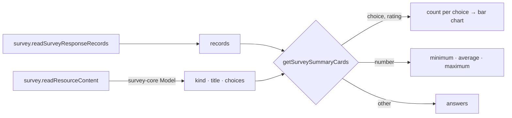

# Survey Response Summary

The Responses blade was a table of raw responses, one column per question ([survey response management](/docs/resource/survey-response-management)). Seeing what the responses say — how many picked each option, the average rating — meant building a Dashboard over the survey's dataset. Google Forms answers it on the response page itself: a **Summary** tab of one chart per question beside the **Individual** view.

## How it works

The blade is a `UiTabs` pair, **Summary** (the default) and **Individual**, which is the table and detail dialog as they were. Summary is a column of cards, one per question in the survey's own order, each drawn by `getSurveySummaryCards` from what kind of question it is:

| Question kind (SurveyJS)               | Card                                                                               |
| -------------------------------------- | ---------------------------------------------------------------------------------- |
| `radiogroup`, `dropdown`, `boolean`    | a bar per choice, labelled with its count and its share of the responses answering |
| `checkbox`, `tagbox`                   | the same; each share is of respondents, so together they can pass 100%             |
| `rating`                               | a bar per rating value, and the average                                            |
| `text` with a numeric input type       | minimum, average and maximum                                                       |
| `text`, `comment` and every other kind | the first answers as a list, and a button to the Individual view for the rest      |

Each card is headed by the question's title and "_n_ responses", counting the responses that answered it, so a skipped optional question reads honestly.

- **No new procedure.** The blade reads the survey's content beside its response records, both existing owner reads, and parses the model with `survey-core`'s `Model`, as the respondent page does — so a question's kind, its title and its choices' labels (a boolean's _Yes_ and _No_, a rating's scale) are SurveyJS's own. Choices are shown by their labels rather than their stored values. Only questions the records hold a column for are summarised, so presentation elements have no card. The two reads fail apart: a survey that cannot be read shows its error in the Summary alone, and the Individual view still lists the responses.
- **Charts are the dashboard's engine.** The bars are `StyledApexChart`'s horizontal bar chart, themed as every chart in the app is; no chart dependency is added.
- **The row cap applies as everywhere.** A survey past it shows the truncation alert above both views ([dataset row-cap warning](/docs/resource/dataset-row-cap-warning)), since the summary is computed from what was read.
- **Before the first response** the Summary view is the same empty state the table shows.

## What is deliberately not in it

- **Not SurveyJS Dashboard.** It is SurveyJS's proprietary analytics component, licensed per developer; the card kinds above cover what Google Forms' summary shows with code already owned.
- **No "latest" answers.** A response is stored under a random key with no submission time a list could order by, so a written question's card lists the first answers read and sends the reader to the Individual view for all of them.
- **No cross-filtering** ("only respondents who answered Yes"). That is the Dashboard's job, and the survey is already a dataset it binds to.
- **No per-question view** (Google Forms' Question tab). The Individual table sorts and searches by column, which is the same lookup.

## Key files

| File                                                              | Role                                       |
| ----------------------------------------------------------------- | ------------------------------------------ |
| `apps/web/app/components/Resource/Survey/Responses.vue`           | The Summary and Individual views           |
| `apps/web/app/components/Resource/Survey/ResponseSummaryCard.vue` | One question's card                        |
| `apps/web/app/services/survey/summary/getSurveySummaryCards.ts`   | The cards, from the questions and the rows |

## Sources

- [Google Forms Help — view and manage form responses](https://support.google.com/docs/answer/139706) — the Summary tab of charts per question beside the Individual tab.
- [SurveyJS licensing](https://surveyjs.io/licensing) — the Form Library is MIT while Dashboard is proprietary, which is why the summary is built on the app's own charts.
