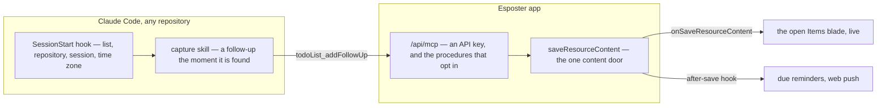

# TodoList Agent Follow-ups

Built on [due reminders](/docs/resource/todolist-due-reminders), [task rows](/docs/resource/todolist-task-rows) and [agent access](/docs/architecture/agent-access). The TodoList holds state that outlives any session, acts on a clock through its reminders and reaches a phone through web push; a Claude Code session has none of the three, so a follow-up it noticed and left alone — "the same guard is missing in the sibling router", "the docs page still names the old flag" — used to survive only in its scrollback. A session now writes each one into the owner's TodoList as it finds it, and the owner reads them with everything else.

No model runs inside Esposter. The model stays in the terminal; Esposter stores the follow-ups and shows them, and its reminders and live sync do the rest.



## Why this and not more products

The owner keeps one TodoList, holding everything to do, and works at a desk nine times in ten. That ruled out the other candidates for the next piece of product work: the cross-list views stay deferred because their trigger never fires with one list ([smart lists](/docs/resource/deferred/todo-smart-lists), [global calendar](/docs/resource/deferred/global-calendar)), and phone capture or natural-language dates save little for someone at a desk ([quick add](/docs/resource/todolist-quick-add)). At the desk, the place a todo is born is a terminal session, so the missing piece was the route from that terminal to the list.

It also sidesteps the platform decision [AI resource generation](/docs/resource/deferred/ai-resource-generation) waits on, the first LLM dependency inside Esposter: every model call is the owner's own Claude Code session, and Esposter serves plain tools over data it already stores.

## The origin

A todo a session wrote carries an `origin`, and one the owner wrote carries none:

```ts
interface TodoListItemOrigin {
  // Set once a drain hands it to the owner, and absent while an agent may still take it
  handedBackAt?: Date;
  // `owner/name` from the origin remote, so the same repository matches from every clone and machine
  repository: string;
  // The Claude Code session that wrote it, for `claude --resume`
  sessionId: string;
}
```

A todo with an `origin` is a **follow-up**, and otherwise an ordinary todo: it sorts, stars, dates, reminds and prints like the rest. Its row's metadata line names the repository, and its edit dialog shows where it came from with a copy button for `claude --resume <sessionId>`, noting that a resume works only on the machine holding the session and from its project folder.

## The follow-up procedures

Four procedures on the TodoList router, each opted into the MCP bridge with a description written for the agent, and each taking the list's `id` and the owner guard every TodoList procedure has.

| Procedure          | Input                                                          | Does                                                                                                                                |
| ------------------ | -------------------------------------------------------------- | ----------------------------------------------------------------------------------------------------------------------------------- |
| `addFollowUp`      | name, plain-text notes, optional due date, repository, session | appends an open follow-up at the foot of the list, as quick add does, its notes escaped into the editor's HTML; answers with its id |
| `readFollowUps`    | repository                                                     | the open follow-ups of that repository not handed back, in the list's manual order                                                  |
| `completeFollowUp` | follow-up id, a line on what was done, IANA time zone          | ticks it as the checkbox does, so a repeating one rolls to its next due date in that zone, and appends the line to its notes        |
| `handBackFollowUp` | follow-up id, the reason                                       | sets `handedBackAt` and appends the reason to its notes                                                                             |

- **Only a follow-up is in reach.** Each acts on a todo with an `origin`, open and not handed back: an id naming a todo the owner wrote answers not found before anything is saved, so no key ticks or annotates it, and there is no delete.
- **Read, changed and saved on the server.** Where the browser saves the whole list it holds, each of these reads the list, changes the one follow-up and saves the list at the version it read. A save the owner made in between makes that save stale, and the list is read again and the change reapplied, a bounded number of times, rather than written over.
- **A repeating follow-up waits for its date.** Ticking one rolls it forward and leaves it open, so `readFollowUps` holds it back until its next due date instead of handing it straight back to a drain: one take per occurrence.
- **Everything written is validated** by the same `todoListItemSchema` a browser save is.

## The plugin

The endpoint, the session's values and the skills ship as one Claude Code plugin, `packages/follow-ups`, laid out as the [persona plugin](/docs/infra/claude-interface/persona-plugin) is and listed in the same marketplace, so one install reaches every repository on the machine. The list's **Connect an agent** button opens the steps: create a key under API keys in the settings, install the plugin, and give its install the site, the list's id and the key, each with a copy button.

```text
packages/follow-ups/
  .claude-plugin/plugin.json   ← userConfig: the site, the list's id, and the API key marked sensitive
  .mcp.json                    ← /api/mcp over HTTP, the key as its bearer token
  hooks/hooks.json             ← SessionStart: the list, the repository, the session and the time zone into context
  skills/capture/SKILL.md      ← what a follow-up is, and writing one
  skills/drain/SKILL.md        ← the loop that works through them
```

- **The key lives in the credential store.** It is a `userConfig` value marked sensitive, which Claude Code keeps in the system credential store rather than a settings file, and `.mcp.json` reads it into the `Authorization` header.
- **The session's values come from a hook.** A tool call cannot see which session made it, but every hook's input names the session, so the `SessionStart` hook reads the session id, the origin remote as `owner/name`, the machine's time zone and the configured list's id, and adds them to the session's context for the tools to be passed unchanged. A folder with no origin remote says so, and the capture skill writes nothing there, since nothing could drain it.
- **It has no dependencies.** The hook is one TypeScript file node runs directly, so an install runs no package install.

## What counts as a follow-up

The capture skill is what keeps the list from filling with noise, so its rules are strict:

- **Work the session saw and left undone** because it was outside the change in hand, written as an instruction a cold session can act on, with the files named in the notes.
- **Never what the session could finish now.** A repository whose rules have a finding fixed by the change that finds it gets it fixed, and a follow-up is not a way around that rule.
- **Never what needs a design.** In Esposter that is a proposal ([engineering loops](/docs/architecture/engineering-loops)); elsewhere the skill tells the owner in its reply instead.
- **Written when found, not at the end.** A session ends in many ways, and one interrupted or compacted before a closing step loses everything held for it.
- **One todo each**, never several in one todo's notes, since a drain completes one follow-up per change.

## What is deliberately not in it

- **A model inside Esposter.** No summarising, ranking or generating in the app: a session does the thinking, the app keeps the state.
- **A second list for agents.** Follow-ups go into the one list the owner reads, filtered by `origin` when a session asks for them.
- **Running sessions from the app.** A session the user started does the work.

## Key files

| File                                                                  | Role                                                                        |
| --------------------------------------------------------------------- | --------------------------------------------------------------------------- |
| `apps/web/shared/models/resource/todoList/TodoListItemOrigin.ts`      | the origin, and the `owner/name` rule its repository keeps                  |
| `apps/web/server/trpc/routers/todoList.ts`                            | the four follow-up procedures, opted into the MCP bridge                    |
| `apps/web/server/services/resource/todoList/updateTodoListContent.ts` | read, change and save at the version read, reapplied over a concurrent save |
| `apps/web/server/services/resource/todoList/checkIsOpenFollowUp.ts`   | the line between the owner's todos and a session's                          |
| `apps/web/app/components/Resource/TodoList/Origin.vue`                | where a follow-up came from, with its resume command to copy                |
| `apps/web/app/components/Resource/TodoList/ConnectAgentButton.vue`    | the steps that connect a session to this list                               |
| `packages/follow-ups/scripts/start.ts`                                | the SessionStart hook                                                       |
| `packages/follow-ups/skills/capture/SKILL.md`                         | what counts as a follow-up                                                  |

## Sources

- [Claude Code — plugin manifest reference](https://code.claude.com/docs/en/plugins-reference) — a plugin bundling an HTTP MCP server, hooks and skills, a `userConfig` value marked `sensitive` kept in the platform's credential store, `${user_config.KEY}` substituted into an HTTP server's `headers`, and `CLAUDE_PLUGIN_OPTION_<KEY>` in a hook's environment.
