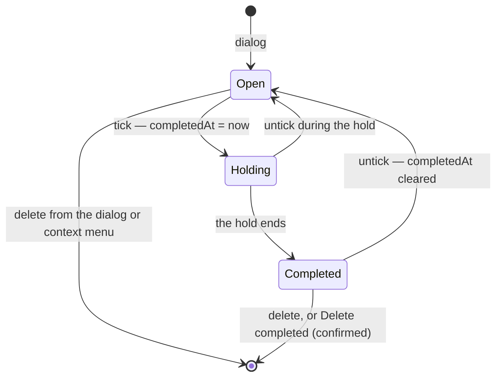

# TodoList Completion

The second part of [TodoList to a todo product](/docs/proposals/resource/todo-list), built on [task rows](/docs/resource/todolist-task-rows). Finishing a todo used to mean deleting it, which lost the record that it was done; now a tick keeps it, with the date it was done.

## How it works

`TodoListItem` has `completedAt?: Date`, absent while open, so a todo saved before completion existed reads as open. One field carries both facts a completed row shows — that it is done, and when — so there is no `isCompleted` boolean to fall out of step with the date.

- **The checkbox leads the row, beside it rather than inside it.** A task row is one button, and a button holds nothing interactive, so `UiList` has a `leading` slot drawn before the row's button. A `UiListItem` with `hasLeadingSlot` keeps no mark column inside its button, so the checkbox stands where the mark would. It is `UiCheckbox`, named by the todo's title, and reached by Tab like the trailing actions are.
- **Ticking** sets `completedAt` to now and saves through the store's `toggleCompleted`; ticking a completed row clears it. Neither confirms, since each undoes the other and neither deletes anything. A refused save puts back the value the todo held.
- **The tick lands before the row moves.** The title strikes through from its start over `--ui-motion-short`, and the row holds its place for `TODO_COMPLETION_HOLD_MS` before it moves under Completed. An untick during the hold cancels the move.
- **The list splits in two.** Open todos keep the list's order at the top. Completed ones gather under a **Completed · n** `UiCollapsible` at the foot, the newest completion first, each struck through and muted, its metadata line reading _Completed_ and the date through `NuxtTime` in place of the due date. The heading is open by default, so a tick never makes a todo vanish; whether it is collapsed is the viewer's convenience, kept per list in `localStorage` (`LocalStorageKey.TodoListCompletedCollapsed`) and never in the content. A completed todo is never drawn overdue.
- **Deleting** stays in the todo's dialog, and is also on a right-click: every row has a context menu through `useContextMenu`, passed to `UiList`'s `getRowProps`, holding **Mark as completed** (or **Mark as not completed**) and **Delete todo**. The Completed heading's overflow menu holds **Delete completed**, which takes the completed todos the heading counts — a search narrows both, so it never deletes a todo the list is not showing. Both go through one singleton `ResourceTodoListConfirmDeleteDialog`, targeted by `useTodoDialogStore`'s per-list `deletingIds`, whose answer names the count ("Delete 12 todos") because nothing in the list brings them back — the working copy's [version history](/docs/resource/resource-snapshots) can, but that is recovery, not undo. The store's `deleteItems` removes the rows at once and puts each back where it stood if the save is refused.
- **The Calendar blade** keeps a completed todo on its due date, struck through (`UiCalendarEvent.isCompleted`), since the calendar answers "what was due when".
- **Reminders** skip a completed todo at both ends: `scheduleTodoReminders` enqueues nothing for it — and schedules its due date afresh once it is reopened — and `sendTodoReminderHandler` drops a reminder whose todo was completed after it was enqueued ([TodoList due reminders](/docs/resource/todolist-due-reminders)).

## What is deliberately not in it

- **No archive state** — the Completed section is where done things go ([rejected](/docs/resource/rejected/todo-archive-state)).
- **No completion sound.** Microsoft To Do plays one; the app has no sound layer outside the games, and one chime is not a reason to start one.
- **No auto-purge of old completions.** A list's completed items are the user's record; the resource-level recycle bin is the only timer.
- **No travel between the groups.** The row leaves the open group and appears under Completed without a FLIP move, since the two groups are separate lists; the strike and the hold already say what happened. The FLIP move arrives with [manual order](/docs/proposals/resource/todo-list/manual-order), which needs it within one list.

## Key files

| File                                                                  | Role                                                                  |
| --------------------------------------------------------------------- | --------------------------------------------------------------------- |
| `apps/web/shared/models/resource/todoList/TodoListItem.ts`            | The item, with `completedAt`                                          |
| `apps/web/app/store/resource/todoList/index.ts`                       | `toggleCompleted` and `deleteItems`, each unwinding on a refused save |
| `apps/web/app/store/resource/todoList/todoDialog.ts`                  | The per-list `deletingIds` the confirm dialog opens on                |
| `apps/web/app/components/Resource/TodoList/Items.vue`                 | The open group, the Completed group, the hold and Delete completed    |
| `apps/web/app/components/Resource/TodoList/Rows.vue`                  | One group's rows: the checkbox, the title and the context menu        |
| `apps/web/app/components/Resource/TodoList/ItemTitle.vue`             | The strike, the Completed line and the notes                          |
| `apps/web/app/components/Resource/TodoList/ConfirmDeleteDialog.vue`   | The one delete confirmation, for a todo or every completed one shown  |
| `apps/web/app/components/Ui/List/Row.vue`                             | The `leading` slot, beside the row's button                           |
| `apps/web/app/components/Resource/TodoList/Calendar.vue`              | Completed todos struck through on their due date                      |
| `apps/web/server/services/resource/todoList/scheduleTodoReminders.ts` | Enqueues nothing for a completed todo                                 |
| `apps/functions/src/handlers/sendTodoReminderHandler.ts`              | Drops a reminder whose todo completed after it was enqueued           |

## Sources

- [Microsoft To Do — create, edit, delete and restore tasks](https://support.microsoft.com/en-us/office/create-edit-delete-and-restore-tasks-30346281-30d4-4d6b-a6fa-55beca8d38a3) — a task deleted from its detail view, or by right-clicking it and choosing Delete selected task.
- [Microsoft To Do — screen reader guide to tasks](https://support.microsoft.com/en-us/accessibility/todo/use-a-screen-reader-to-work-with-tasks-in-to-do) — completing by the checkbox, un-completing by ticking again, completed and open tasks both shown by default.
- [Todoist — view completed tasks](https://www.todoist.com/help/articles/view-completed-tasks-in-todoist-J19h2s) — restoring a completed task by unchecking it where it is listed, rather than from a separate archive.
- [Apple Human Interface Guidelines — motion](https://developer.apple.com/design/human-interface-guidelines/motion) — the tick's motion tells what happened and stays brief on a frequent act.
