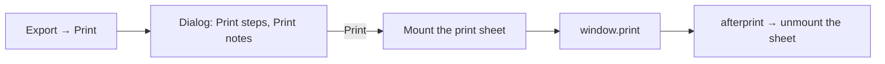

# TodoList Print List

Part of [TodoList to a todo product](/docs/resource#shipped-log), built on [task rows](/docs/resource/todolist-task-rows). A TodoList declared no capability, so the only way its work left the screen was a screenshot. Microsoft To Do's list menu answers that with **Print list**, and nothing more.

## How it works

- **The TodoList is Portable, with one export-only format: Print.** `ResourceDefinitionMap` gives it `portable`, and `PortableFormatMap` holds its one format, so **Print** sits in the resource page's Export menu beside every other type's exports ([resource model](/docs/architecture/resource)). The browser's print dialog also saves a PDF, so this is the list's export as much as its print.
- **Print opens a dialog of toggles**, as To Do's does: **Print steps**, on by default, and **Print notes**, off. The export runs from the Export menu, outside any component, so it loads the list and opens the dialog through `useTodoListPrintDialogStore`, keyed by the list it was opened for, as the Sheet's export opens `useSheetPortableDialogStore`. The toggles are the viewer's and carry to the next print. `ResourceDialogsComponentMap` maps the TodoList to `ResourceTodoListDialogs`, which mounts the edit dialog, the print dialog and the print sheet together, as `ResourceSheetDialogs` does.
- **What prints is the list as the reader sees it**: the list's name as the heading, then each open todo in the viewer's sort, through the same `sortTodoListItems` the Items blade draws with ([importance](/docs/resource/todolist-importance)), each after an empty circle to tick on paper, with its due date through `NuxtTime`. Its [steps](/docs/resource/todolist-steps) follow when that toggle is on, each ticked or not, and its notes when that one is. Completed todos follow under a **Completed** heading, struck through and newest first, as the section on screen does.
- **The printed sheet is its own element.** `ResourceTodoListPrintSheet` mounts only between **Print** and the browser's `afterprint`, teleported to the body and drawn `hidden print:block`. While it is mounted it marks the body, and a print rule hides every other child of the body, so the page prints the list and none of the app. It prints in the light scheme whatever the page's theme. The notes are the schema's already-sanitized HTML.

## What is deliberately not in it

- **No CSV or Markdown export yet.** Portable makes either one more entry in the same map, but To Do offers neither and no one has asked for one; printing to PDF already makes a file.
- **No email list.** To Do reaches email only through sharing, which is the [smart lists](/docs/resource/deferred/todo-smart-lists)' and sharing's territory.

## Key files

| File                                                            | Role                                                          |
| --------------------------------------------------------------- | ------------------------------------------------------------- |
| `apps/web/shared/services/resource/ResourceDefinitionMap.ts`    | The TodoList declares `portable`                              |
| `apps/web/app/services/resource/PortableFormatMap.ts`           | The Print format, loading the list and opening the dialog     |
| `apps/web/app/services/resource/ResourceDialogsComponentMap.ts` | Maps the TodoList to `ResourceTodoListDialogs`                |
| `apps/web/app/components/Resource/TodoList/Dialogs.vue`         | The edit dialog, the print dialog and the sheet               |
| `apps/web/app/components/Resource/TodoList/Print/Dialog.vue`    | The two toggles, and Print                                    |
| `apps/web/app/components/Resource/TodoList/Print/Sheet.vue`     | The printed list, and the rule hiding the app while it prints |
| `apps/web/app/store/resource/todoList/printDialog.ts`           | Whether the dialog is open, the toggles, and printing         |
| `apps/web/app/services/resource/todoList/sortTodoListItems.ts`  | The order the sheet prints the open todos in                  |

## Sources

- [Microsoft To Do — printing lists](https://support.microsoft.com/en-us/office/printing-lists-in-microsoft-to-do-a8075c8d-6403-4b13-82d0-1ba5a8e01d33) — "Turn on or off the toggles next to Print steps and Print notes. Select Print list", from the list's three-dot menu.
