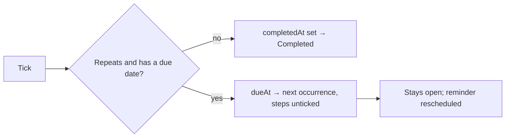

# TodoList Recurrence

The last part of [TodoList to a todo product](/docs/resource#shipped-log), built on [completion](/docs/resource/todolist-completion), since ticking is what advances a repeat. A habit or a bill kept as a todo had to be written again each time it came round.

## How it works

- **A recurrence is a unit, an interval and where it counts from.** `TodoListItem.recurrence` is absent on a todo that does not repeat, as `isImportant` is absent on one nobody starred, so lists saved before it parse unchanged. A `Recurrence` is a `RecurrenceUnit` — `Day`, `Weekday`, `Week`, `Month` or `Year` — an interval from 1 to `TODO_LIST_RECURRENCE_INTERVAL_MAX`, and `startsAt`, the due date the repeat was set on.
- **Repeat sits under the due date in the dialog**, shown once the todo has one: Never, Daily, Weekdays, Weekly, Monthly or Yearly, and once it repeats, an **Every** field for the custom interval. Moving the due date by hand moves `startsAt` with it, and clearing the date stops the repeat, since there is nothing left to roll forward.
- **Ticking a repeating todo rolls it forward instead of completing it.** The store's `toggleCompleted` moves `dueAt` to the next occurrence and unticks its steps in one save, and the todo stays in the open group with `completedAt` still absent, as Microsoft To Do and Todoist do. The chime plays as for any tick; the row keeps its place and shows the new date rather than moving under Completed. A refused save puts the date and the steps back. Because the due date changed, the [due reminders](/docs/resource/todolist-due-reminders) diff schedules the next reminder with no change of its own. Every tick takes this path — the checkbox and the row's context menu alike.
- **The next occurrence is computed on the client** by `getNextDueAt`, with `Temporal` in the browser's time zone, keeping the time of day. Days, weekdays and weeks step from the current due date. Months and years count from `startsAt`, as the first multiple of the interval past the current due date, so a monthly todo due on the 31st lands on the last day of a shorter month and returns to the 31st after it.
- **The row's metadata line** marks a repeating todo beside its due date.
- **Stop repeating** is choosing Never; the next tick then completes the todo into the Completed section like any other. Once a todo has rolled forward, moving its date back by hand is the undo.

## What is deliberately not in it

- **No "complete forever" or "skip this occurrence" menu** (Todoist's extra actions). Never and editing the date cover both with the controls already there.
- **No repeat from the completion date** ("every 3 days after I last did it"). One rule — from the due date — is one thing to explain.
- **No RRULE import or export.** The five units cover the reference product's presets; an iCalendar rule is a format to parse for nobody asking.
- **No hold before the roll.** A tick shows as done and moves the row a moment later for a todo that completes; a repeating one rolls in the same save, since holding it ticked would be a second write for a state it never keeps.

## Key files

| File                                                         | Role                                                          |
| ------------------------------------------------------------ | ------------------------------------------------------------- |
| `apps/web/shared/models/resource/todoList/Recurrence.ts`     | A recurrence and its schema                                   |
| `apps/web/shared/models/resource/todoList/RecurrenceUnit.ts` | The five units                                                |
| `apps/web/shared/models/resource/todoList/TodoListItem.ts`   | `recurrence`, absent on a todo that does not repeat           |
| `apps/web/app/services/resource/todoList/getNextDueAt.ts`    | The next occurrence, in the browser's time zone               |
| `apps/web/app/store/resource/todoList/index.ts`              | `toggleCompleted`, which rolls a repeating todo forward       |
| `apps/web/app/components/Resource/TodoList/RepeatField.vue`  | The Repeat select and the Every field                         |
| `apps/web/app/components/Resource/TodoList/EditForm.vue`     | Places Repeat under the due date, and moves its start with it |
| `apps/web/app/components/Resource/TodoList/ItemTitle.vue`    | The repeat mark on the metadata line                          |

## Sources

- [Todoist — complete a task with a recurring date](https://www.todoist.com/help/articles/complete-a-task-with-a-recurring-date-dmI6SVqdP) — completing a recurring task shifts it to its next date, with its sub-tasks reset.
- [Microsoft To Do — screen reader guide to tasks](https://support.microsoft.com/en-us/accessibility/todo/use-a-screen-reader-to-work-with-tasks-in-to-do) — the repeat presets and the custom schedule set from the detail view.
- [MDN — Temporal](https://developer.mozilla.org/en-US/docs/Web/JavaScript/Reference/Global_Objects/Temporal) — plain dates for the next-occurrence arithmetic.
