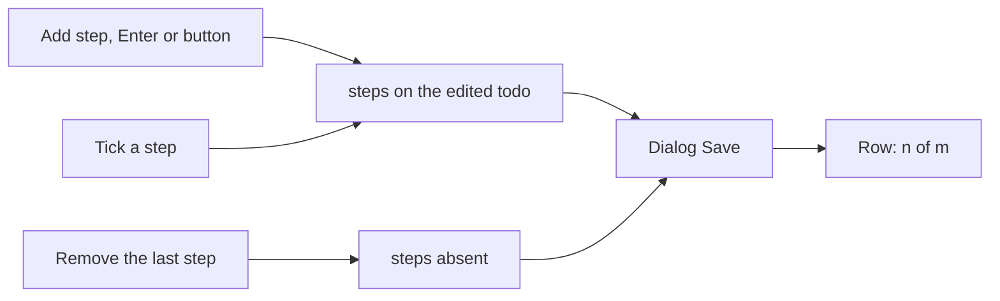

# TodoList Steps

Part of [TodoList to a todo product](/docs/proposals/resource/todo-list), built on [completion](/docs/resource/todolist-completion), whose `completedAt` each step reuses. A todo that is really several small actions had nowhere to list them but its notes, where nothing could be ticked.

## How it works

- **A step is a name and a completion.** `TodoListStep` is `{ id, name, completedAt? }`, one level deep and no further. `TodoListItem.steps` holds them, and is absent until the first step is added and absent again once the last is removed, as `isImportant` is absent on a todo nobody starred — so the todos saved before steps existed parse as they are, with no backfill. The schema takes one to `TODO_LIST_ITEM_STEPS_MAX_LENGTH` steps, unique by id.
- **In the dialog**, `ResourceTodoListSteps` sits under the title as a checklist. A step's checkbox ticks it, its name edits where it stands, and a quiet **Remove step** deletes it. An **Add step** field at its foot adds on Enter and stays focused for the next, as [quick add](/docs/resource/todolist-quick-add) does, or on the **Add step** button beside it for a reader without a keyboard. At `TODO_LIST_ITEM_STEPS_MAX_LENGTH` steps the button disables and the field says why, so the dialog never holds a checklist its schema would reject. The field sits inside the dialog's own form, so it takes Enter itself and a step never saves the dialog. Steps save with the dialog's Save, as the rest of the form does, so its dirty check and discard cover them.
- **On the row**, the metadata line gains "_n_ of _m_" once a todo has steps, beside its due or completed date.
- **A checkbox changes only the thing it is beside.** Completing a todo leaves its steps as they were, and ticking the last step does not complete the todo, as in Microsoft To Do.

## What is deliberately not in it

- **No sub-tasks with their own due dates, notes or steps.** A step is a line of a checklist; a task that needs a date of its own is its own task. Nesting is how a todo list turns into a project tool, which is Planner's job and not this one's.
- **No promote-a-step-to-a-task.** Microsoft To Do has it; the lean scope does not earn a second write path for it yet.

## Key files

| File                                                       | Role                                               |
| ---------------------------------------------------------- | -------------------------------------------------- |
| `apps/web/shared/models/resource/todoList/TodoListStep.ts` | A step and its schema                              |
| `apps/web/shared/models/resource/todoList/TodoListItem.ts` | `steps`, absent while a todo has none              |
| `apps/web/shared/services/resource/item/constants.ts`      | `TODO_LIST_ITEM_STEPS_MAX_LENGTH`                  |
| `apps/web/app/components/Resource/TodoList/Steps.vue`      | The checklist and its Add step field in the dialog |
| `apps/web/app/components/Resource/TodoList/EditForm.vue`   | Places the steps under the title                   |
| `apps/web/app/components/Resource/TodoList/ItemTitle.vue`  | The "n of m" count on the row's metadata line      |

## Sources

- [Microsoft To Do — steps, importance, notes](https://support.microsoft.com/en-us/todo/add-steps-importance-notes-tags-and-categories-to-your-tasks) — "+ Add step" in the detail view and the counter beneath the task's name.
