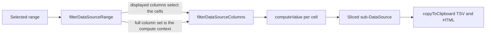

# Copy computed values

Range copy includes computed-column values, matching the Excel expectation that copying a formula cell yields its value.

## How it works

`copyToClipboard` serializes each cell from stored `row.data`, and a computed column stores nothing there — so handing it a raw slice of the selection would serialize those cells empty.

Copy therefore materializes through the same path export uses: `filterDataSourceColumns` resolves every selected cell through `computeValue` — the one resolver headers, cell render, and export all share — against the full row and column context. The selection's row range bounds the clone/compute work to the selected rows (aggregation transformations still see every row), so copying a small range in a large sheet stays cheap. Non-computed columns are unaffected (`computeValue` returns `row.data[column.name]` for them), so the only behavioural change is computed cells carrying their displayed value. There is one materialization code path, not a copy-specific fork.

A cell range indexes the **displayed** columns, while `computeValue` resolves a computed column's source by id against the columns it is handed and answers `null` for a source it cannot find — so the two sets are not interchangeable. `filterDataSourceRange` derives both from the one `DataSource`: the displayed columns select which cells the range covers, and the full column set stays the compute context. Hiding the source column of a computed column therefore changes nothing about what copy produces, matching the grid, which passes every column.

Paste needs no change: computed columns are read-only and every write site already skips them, so pasting over a computed cell stays a no-op. The copied value simply lands wherever the user pastes it — another column, Excel, Sheets — exactly the Excel semantics.

## Key files

Paths relative to `packages/app/app`.

| File                                                            | Role                                                   |
| --------------------------------------------------------------- | ------------------------------------------------------ |
| `composables/resource/sheet/useCopyRangeToClipboard.ts`         | Materializes the selection via `filterDataSourceRange` |
| `services/resource/sheet/dataSource/filterDataSourceRange.ts`   | Derives the range's columns and the compute context    |
| `services/resource/sheet/dataSource/filterDataSourceColumns.ts` | The shared resolver that materializes computed values  |
| `services/resource/sheet/column/computeValue.ts`                | Per-cell resolver shared by render, export and copy    |

## Notes

- Copy is a hot interactive path, but a selection is small and `computeValue` is already evaluated per cell on render, so materializing the same cells once more on `Ctrl+C` is negligible.
- A chained or cyclic computed column resolves exactly as it renders (`null` → empty cell), so copy can never be worse than what the grid shows.
