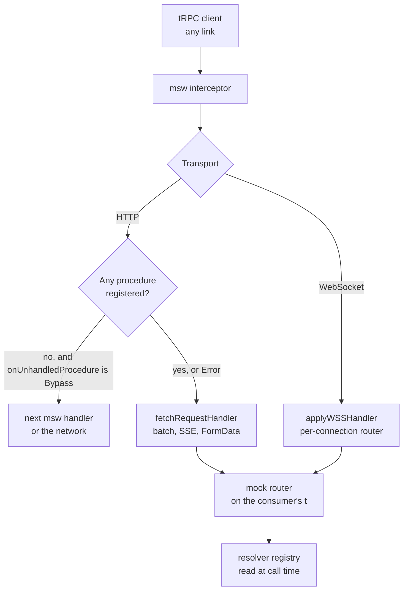

# trpc-msw

`packages/trpc-msw` (npm `trpc-msw`) answers a tRPC client's calls at the network, inside a test. A test registers a resolver per procedure through a proxy typed off the router — `trpcMsw.resource.readResource.query(({ input }) => …)` — and every request the client sends is served by a router built from those resolvers, on the consumer's own `initTRPC` result, through tRPC's own handlers. Nothing about tRPC's wire format is written in the package: batching, the transformer, the error formatter, `FormData` and octet input, method override, server-sent events and the WebSocket protocol are all tRPC's.

It replaced `msw-trpc`, an adapter between the same two engines that re-implemented the wire format by hand, and is the worked example of the absorption flow in [dependency admission](/docs/architecture/dependency-admission).

## How a call is answered

- **One HTTP handler** matches everything under the endpoint and hands the request to `fetchRequestHandler`, over a router built from every path registered so far. A batch carries several procedures behind one url, which is why the unit is the endpoint and never the procedure.
- **Resolvers are read when a procedure is called**, not when the router is built. A resolver a test replaces answers the next call on any transport, and a path whose resolver was cleared by `reset` answers tRPC's `NOT_FOUND`.
- **WebSockets** are bridged by presenting each msw client connection as the `ws.WebSocket` tRPC's `applyWSSHandler` drives. tRPC binds a connection to the router it was accepted with, so registering a path the current router lacks closes the open connections on the spot; the client queues its next call, reconnects and resubscribes onto the new router. tRPC's reconnect notification is not used for this: the client reads it only on its next turn, and a call sent before then would reach the old router.
- **The mock router is built on the consumer's own `t`**, so a thrown `TRPCError` reaches the client through the real error formatter, and a resolver returns the procedure's output before the transformer rather than its serialized envelope.

## Upstream

Every `msw-trpc` issue and pull request, with its verdict. The four verdicts and what each owes are the [triage](/docs/architecture/dependency-admission) on the dependency admission page; a defect's proof is the named test in `packages/trpc-msw/src/createTRPCMsw.test.ts` or the type test in `src/models/TRPCMswRouterRecord.test-d.ts`.

| Upstream                                                                                                                                                                       | Verdict            | Proof                                                                                                                                               |
| ------------------------------------------------------------------------------------------------------------------------------------------------------------------------------ | ------------------ | --------------------------------------------------------------------------------------------------------------------------------------------------- |
| [#50](https://github.com/maloguertin/msw-trpc/issues/50)                                                                                                                       | False positive     | The mock answers the transport, so it works under any client, TanStack's new API included                                                           |
| [#48](https://github.com/maloguertin/msw-trpc/issues/48)                                                                                                                       | In scope — defect  | The transformer comes from `t`, so a resolver returns plain data; "answers a batch through the transformer in both directions"                      |
| [#43](https://github.com/maloguertin/msw-trpc/issues/43)                                                                                                                       | In scope — feature | "#43 reads FormData mutation input"                                                                                                                 |
| [#38](https://github.com/maloguertin/msw-trpc/issues/38)                                                                                                                       | In scope — defect  | Input decoding is tRPC's; "answers a batch through the transformer in both directions"                                                              |
| [#37](https://github.com/maloguertin/msw-trpc/issues/37)                                                                                                                       | In scope — feature | Typed on tRPC 11's public inference helpers only, never `unstable-core-do-not-import`                                                               |
| [#35](https://github.com/maloguertin/msw-trpc/issues/35), [#33](https://github.com/maloguertin/msw-trpc/issues/33), [#13](https://github.com/maloguertin/msw-trpc/issues/13)   | In scope — feature | A resolver throws a `TRPCError`; "#13 rejects with the error the resolver throws, shaped by the real formatter"                                     |
| [#29](https://github.com/maloguertin/msw-trpc/issues/29)                                                                                                                       | False positive     | Reporter's tRPC prerelease; nested routers are "answers a batch through the transformer in both directions"                                         |
| [#28](https://github.com/maloguertin/msw-trpc/issues/28)                                                                                                                       | Out of scope       | A test replacing `global.fetch` after msw patched it — the test setup's, answered in the thread                                                     |
| [#27](https://github.com/maloguertin/msw-trpc/issues/27)                                                                                                                       | False positive     | Shipped in msw-trpc 2; the peer range here is msw 3's                                                                                               |
| [#25](https://github.com/maloguertin/msw-trpc/issues/25)                                                                                                                       | In scope — defect  | Batching is served; the query's input type is "#25 query" in the type test                                                                          |
| [#24](https://github.com/maloguertin/msw-trpc/issues/24), [#12](https://github.com/maloguertin/msw-trpc/issues/12), [#9](https://github.com/maloguertin/msw-trpc/issues/9)     | False positive     | Integration questions for Next, Ladle and React Query; the README's setup is framework-free                                                         |
| [#23](https://github.com/maloguertin/msw-trpc/issues/23)                                                                                                                       | False positive     | node's `fetch` rejects a relative url — the client's configuration, as the thread found                                                             |
| [#22](https://github.com/maloguertin/msw-trpc/issues/22), [#2](https://github.com/maloguertin/msw-trpc/issues/2)                                                               | In scope — defect  | "#22 mutation with an output parser" and "#2 context" in the type test                                                                              |
| [#20](https://github.com/maloguertin/msw-trpc/issues/20)                                                                                                                       | Out of scope       | The service worker starting after the first query — msw's deferred mounting                                                                         |
| [#19](https://github.com/maloguertin/msw-trpc/issues/19), [PR #47](https://github.com/maloguertin/msw-trpc/pull/47), [PR #44](https://github.com/maloguertin/msw-trpc/pull/44) | In scope — feature | "#19 streams a subscription over a WebSocket, including one registered after the socket opened", and "streams a subscription as server-sent events" |
| [#17](https://github.com/maloguertin/msw-trpc/issues/17)                                                                                                                       | False positive     | Fixed upstream in 1.3.3; resolvers here receive a decoded input, never a promise of one                                                             |
| [#15](https://github.com/maloguertin/msw-trpc/issues/15)                                                                                                                       | In scope — defect  | ESM-only, and the build's `attw` and `publint` passes fail a broken module type                                                                     |
| [#14](https://github.com/maloguertin/msw-trpc/issues/14)                                                                                                                       | Out of scope       | A `console.log` inside a handler — msw's, as the reporter found                                                                                     |
| [#8](https://github.com/maloguertin/msw-trpc/issues/8)                                                                                                                         | In scope — defect  | "answers a batch through the transformer in both directions"                                                                                        |
| [#6](https://github.com/maloguertin/msw-trpc/issues/6)                                                                                                                         | In scope — defect  | Resolvers are fully typed, so nothing reaches `no-unsafe-argument`; the type test                                                                   |
| [#4](https://github.com/maloguertin/msw-trpc/issues/4)                                                                                                                         | In scope — defect  | Both engines are peers on their current majors                                                                                                      |
| [PR #51](https://github.com/maloguertin/msw-trpc/pull/51)                                                                                                                      | In scope — feature | `UnhandledProcedureAction.Bypass`; "passes a request naming no registered procedure on when told to bypass"                                         |
| [PR #49](https://github.com/maloguertin/msw-trpc/pull/49)                                                                                                                      | In scope — feature | `createContext` sees the request; "hands the resolver the context built from the request"                                                           |
| [PR #46](https://github.com/maloguertin/msw-trpc/pull/46)                                                                                                                      | In scope — feature | `allowMethodOverride`; "#46 answers a query sent as a POST"                                                                                         |
| [PR #45](https://github.com/maloguertin/msw-trpc/pull/45), [PR #36](https://github.com/maloguertin/msw-trpc/pull/36)                                                           | In scope — defect  | "#45 #36 answers a mutation with no input and no output"                                                                                            |
| [PR #1](https://github.com/maloguertin/msw-trpc/pull/1)                                                                                                                        | In scope — defect  | The proxy reads its last segment as the method, so a procedure named `query` registers; the batch test                                              |

Never ported: **observable subscriptions**. tRPC 11 deprecates them in favour of async generators, so a subscription resolver here returns an async iterable and nothing else.

## Key files

| File                                                  | Role                                                                          |
| ----------------------------------------------------- | ----------------------------------------------------------------------------- |
| `packages/trpc-msw/src/createTRPCMsw.ts`              | The factory — the HTTP and WebSocket handlers, the registry and the proxy     |
| `packages/trpc-msw/src/services/createMockRouter.ts`  | The router over the registered paths, reading each resolver when it is called |
| `packages/trpc-msw/src/models/TRPCMswRouterRecord.ts` | The registration proxy's type, walked from the router's record                |
| `packages/trpc-msw/src/models/MswWebSocketAdapter.ts` | An msw client connection presented as the socket tRPC's handler drives        |
| `apps/web/app/services/trpc/mswTrpc.test.ts`          | The app's wiring — its endpoint, its `rootConfig`, and the vitest lifecycle   |
| `apps/web/server/trpc/rootConfig.ts`                  | The transformer and error formatter the server and the mock router share      |

## Sources

- [maloguertin/msw-trpc](https://github.com/maloguertin/msw-trpc) — the package replaced, its issues and pull requests.
- [Fetch adapter](https://trpc.io/docs/server/adapters/fetch) (tRPC) — `fetchRequestHandler`, which serves batches, method override and server-sent events.
- [WebSockets](https://trpc.io/docs/server/websockets) (tRPC) — `applyWSSHandler`, the connection handler and the reconnect notification.
- [Subscriptions](https://trpc.io/docs/server/subscriptions) (tRPC) — async generators as the subscription shape, observables deprecated.
- [Mocking WebSocket](https://mswjs.io/docs/websocket) (msw) — `ws.link` and the client connection the adapter wraps.
