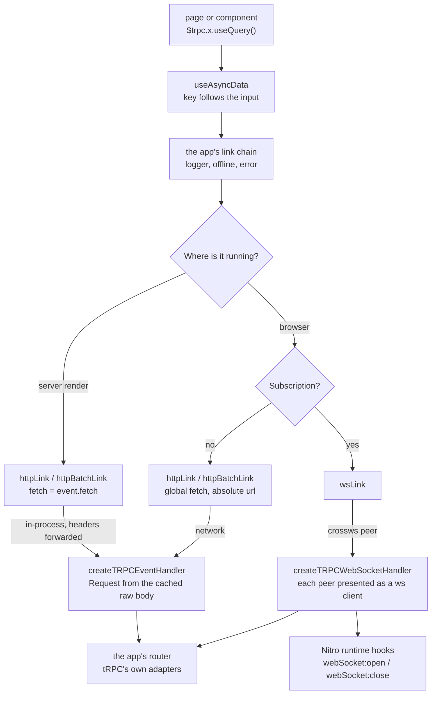

# trpc-nuxt-module

`packages/trpc-nuxt-module` (npm `trpc-nuxt-module`) joins tRPC to Nuxt. Registered in `nuxt.config` with the file that exports the router and the file that exports the context factory, it generates the HTTP handler at the configured endpoint and, when asked, the WebSocket handler Nitro serves; auto-imports `createTRPCNuxtClient`, the two HTTP links and the two key helpers; and decorates every procedure on the client with `useQuery`, `useLazyQuery`, `useMutation` and `useSubscription`, each a composable over Nuxt's own `useAsyncData`. Nothing about tRPC's protocol is written in the package: the handlers are tRPC's fetch and WebSocket adapters, and the links are tRPC's own with a `fetch` chosen for where they run.

It replaced `trpc-nuxt`, which left the handler routes, the WebSocket bridge, the plugin and a `build.transpile` entry to each app, and is the second worked example of the absorption flow in [dependency admission](/docs/architecture/dependency-admission), after [trpc-msw](/docs/trpc-msw).

## How a call travels

- **Server rendering sends through the request event.** `event.fetch` is Nitro's `fetchWithEvent` over its in-process fetch: the incoming request's headers are forwarded, no socket is opened, and the answer is a real `Response` with its headers intact. The link reads the event when it is built, inside the app's context, because a batch sends a tick later when that context is gone.
- **The browser sends through the global `fetch` against an absolute url**, which is also what a network interceptor sees, so a test answers the real links, batching included, at the network ([trpc-msw](/docs/trpc-msw)).
- **The HTTP handler rebuilds the request from what h3 caches**: the raw body rather than the stream, so a middleware that read the body first leaves it to be read again; the path Nitro routed on, below any `app.baseURL`; and a signal aborted when the response closes early, which is what ends a streamed subscription when the client leaves.
- **The WebSocket handler is tRPC's `applyWSSHandler` over crossws.** tRPC drives a `ws` server, so the handler presents one and a `ws` client per peer — the shape trpc-msw presents an msw connection in — and replays each crossws hook onto the client it belongs to. As a connection opens and closes it calls the `trpc-nuxt-module:webSocket:open` and `:close` Nitro runtime hooks with the connection's context, which the app's `server/plugins/webSocketConnection.ts` answers with the user's connect and disconnect, and on Nitro's `close` it broadcasts tRPC's reconnect notice so clients resubscribe rather than fail.
- **A query's key follows its input.** The `useAsyncData` key is a getter over the procedure path and a hash of the input, so a changed input is fetched and cached under its own key; a fixed `queryKey` watches the input instead.

## Registering it

The module is registered by its options — the router and context as the file and export name each lives under, resolved through Nuxt's aliases, the HTTP endpoint, and optionally the WebSocket endpoint with tRPC's keep-alive. The generated handlers import both from there, and the type template reads the router's context type for the hooks. Inside this repository it is registered by the path to its source module rather than its package name: `nuxt prepare` loads every module from the app's `postinstall`, before any workspace package is built, and a package name resolves to a `dist` a fresh clone does not have yet. That rule, and the package shape it belongs to, is [Nuxt module packages](/docs/architecture/nuxt-module-packages).

The app keeps only what is its own: `app/plugins/trpc.ts` composes its logger, offline and error links around the module's transport links and provides the client `createTRPCNuxtClient` returns.

## Upstream

Every `trpc-nuxt` issue and pull request, with its verdict. The four verdicts and what each owes are the [triage](/docs/architecture/dependency-admission) on the dependency admission page; a defect's proof is the named test in `packages/trpc-nuxt-module/src` — the event handler, WebSocket handler, client and link suites, or the type tests beside the models.

| Upstream                                                                                                                                                                                                                                                                                                                                                                                                                                                                                                                                                                                                                                                                                                                                                                                                                                                                                                                                                                                                                                                                                                                                                                                                                                                                                                                                                                                                                                                                                                                                                                                                                                                                                                                                                                                                                                                                                                                                                    | Verdict            | Proof                                                                                                                                                                                                                                                                                                                                                                                             |
| ----------------------------------------------------------------------------------------------------------------------------------------------------------------------------------------------------------------------------------------------------------------------------------------------------------------------------------------------------------------------------------------------------------------------------------------------------------------------------------------------------------------------------------------------------------------------------------------------------------------------------------------------------------------------------------------------------------------------------------------------------------------------------------------------------------------------------------------------------------------------------------------------------------------------------------------------------------------------------------------------------------------------------------------------------------------------------------------------------------------------------------------------------------------------------------------------------------------------------------------------------------------------------------------------------------------------------------------------------------------------------------------------------------------------------------------------------------------------------------------------------------------------------------------------------------------------------------------------------------------------------------------------------------------------------------------------------------------------------------------------------------------------------------------------------------------------------------------------------------------------------------------------------------------------------------------------------------- | ------------------ | ------------------------------------------------------------------------------------------------------------------------------------------------------------------------------------------------------------------------------------------------------------------------------------------------------------------------------------------------------------------------------------------------- |
| [PR #262](https://github.com/wobsoriano/trpc-nuxt/pull/262), [PR #261](https://github.com/wobsoriano/trpc-nuxt/pull/261), [#260](https://github.com/wobsoriano/trpc-nuxt/issues/260), [#117](https://github.com/wobsoriano/trpc-nuxt/issues/117), [PR #80](https://github.com/wobsoriano/trpc-nuxt/pull/80), [#43](https://github.com/wobsoriano/trpc-nuxt/issues/43)                                                                                                                                                                                                                                                                                                                                                                                                                                                                                                                                                                                                                                                                                                                                                                                                                                                                                                                                                                                                                                                                                                                                                                                                                                                                                                                                                                                                                                                                                                                                                                                       | In scope — defect  | h3 is a peer and the context factory takes its own `H3Event`; "#260 hands the context factory h3's own H3Event, which Nitro augments"                                                                                                                                                                                                                                                             |
| [PR #257](https://github.com/wobsoriano/trpc-nuxt/pull/257), [PR #256](https://github.com/wobsoriano/trpc-nuxt/pull/256), [#255](https://github.com/wobsoriano/trpc-nuxt/issues/255), [PR #235](https://github.com/wobsoriano/trpc-nuxt/pull/235), [#233](https://github.com/wobsoriano/trpc-nuxt/issues/233), [PR #115](https://github.com/wobsoriano/trpc-nuxt/pull/115), [#113](https://github.com/wobsoriano/trpc-nuxt/issues/113), [#22](https://github.com/wobsoriano/trpc-nuxt/issues/22), [#20](https://github.com/wobsoriano/trpc-nuxt/issues/20), [#5](https://github.com/wobsoriano/trpc-nuxt/issues/5)                                                                                                                                                                                                                                                                                                                                                                                                                                                                                                                                                                                                                                                                                                                                                                                                                                                                                                                                                                                                                                                                                                                                                                                                                                                                                                                                          | In scope — defect  | "#255 #233 types a query's data, undefined until it arrives"                                                                                                                                                                                                                                                                                                                                      |
| [#250](https://github.com/wobsoriano/trpc-nuxt/issues/250), [PR #248](https://github.com/wobsoriano/trpc-nuxt/pull/248), [#247](https://github.com/wobsoriano/trpc-nuxt/issues/247), [#242](https://github.com/wobsoriano/trpc-nuxt/issues/242), [PR #241](https://github.com/wobsoriano/trpc-nuxt/pull/241), [#240](https://github.com/wobsoriano/trpc-nuxt/issues/240), [#226](https://github.com/wobsoriano/trpc-nuxt/issues/226), [#181](https://github.com/wobsoriano/trpc-nuxt/issues/181), [#137](https://github.com/wobsoriano/trpc-nuxt/issues/137), [#133](https://github.com/wobsoriano/trpc-nuxt/issues/133), [#56](https://github.com/wobsoriano/trpc-nuxt/issues/56), [#48](https://github.com/wobsoriano/trpc-nuxt/issues/48), [#11](https://github.com/wobsoriano/trpc-nuxt/issues/11), [#1](https://github.com/wobsoriano/trpc-nuxt/issues/1)                                                                                                                                                                                                                                                                                                                                                                                                                                                                                                                                                                                                                                                                                                                                                                                                                                                                                                                                                                                                                                                                                              | In scope — defect  | The runtime imports only published packages (`nuxt/app`, `h3`, `vue`), never `#imports`, and Nuxt transpiles a module's own root, so no `build.transpile` entry exists; `publint` and `attw` gate every build                                                                                                                                                                                     |
| [PR #239](https://github.com/wobsoriano/trpc-nuxt/pull/239)                                                                                                                                                                                                                                                                                                                                                                                                                                                                                                                                                                                                                                                                                                                                                                                                                                                                                                                                                                                                                                                                                                                                                                                                                                                                                                                                                                                                                                                                                                                                                                                                                                                                                                                                                                                                                                                                                                 | In scope — defect  | "#239 fetches a changed input under its own key" — the `useAsyncData` key is a getter over the input                                                                                                                                                                                                                                                                                              |
| [#224](https://github.com/wobsoriano/trpc-nuxt/issues/224)                                                                                                                                                                                                                                                                                                                                                                                                                                                                                                                                                                                                                                                                                                                                                                                                                                                                                                                                                                                                                                                                                                                                                                                                                                                                                                                                                                                                                                                                                                                                                                                                                                                                                                                                                                                                                                                                                                  | In scope — defect  | "#224 rejects a mutate whose mutation failed"                                                                                                                                                                                                                                                                                                                                                     |
| [#221](https://github.com/wobsoriano/trpc-nuxt/issues/221)                                                                                                                                                                                                                                                                                                                                                                                                                                                                                                                                                                                                                                                                                                                                                                                                                                                                                                                                                                                                                                                                                                                                                                                                                                                                                                                                                                                                                                                                                                                                                                                                                                                                                                                                                                                                                                                                                                  | In scope — defect  | "#221 answers under an app base url" — the request is rebuilt from the path Nitro routed on, below `app.baseURL`                                                                                                                                                                                                                                                                                  |
| [PR #219](https://github.com/wobsoriano/trpc-nuxt/pull/219), [#218](https://github.com/wobsoriano/trpc-nuxt/issues/218)                                                                                                                                                                                                                                                                                                                                                                                                                                                                                                                                                                                                                                                                                                                                                                                                                                                                                                                                                                                                                                                                                                                                                                                                                                                                                                                                                                                                                                                                                                                                                                                                                                                                                                                                                                                                                                     | In scope — defect  | The request body is the raw one h3 caches, never a re-read stream; "#215 answers a mutation whose body a middleware read first"                                                                                                                                                                                                                                                                   |
| [#215](https://github.com/wobsoriano/trpc-nuxt/issues/215)                                                                                                                                                                                                                                                                                                                                                                                                                                                                                                                                                                                                                                                                                                                                                                                                                                                                                                                                                                                                                                                                                                                                                                                                                                                                                                                                                                                                                                                                                                                                                                                                                                                                                                                                                                                                                                                                                                  | In scope — defect  | Split. The hang is the handler's and h3 1.15 already reuses a cached body for the stream upstream read; the handler reads that cached raw body itself, pinned by "#215 answers a mutation whose body a middleware read first". The filter is nuxt-security's — out of scope, measured in `configuration/security.test.ts` and recorded on [security posture](/docs/architecture/security-posture) |
| [PR #213](https://github.com/wobsoriano/trpc-nuxt/pull/213), [#210](https://github.com/wobsoriano/trpc-nuxt/issues/210)                                                                                                                                                                                                                                                                                                                                                                                                                                                                                                                                                                                                                                                                                                                                                                                                                                                                                                                                                                                                                                                                                                                                                                                                                                                                                                                                                                                                                                                                                                                                                                                                                                                                                                                                                                                                                                     | In scope — defect  | "#210 types a subscription's data"                                                                                                                                                                                                                                                                                                                                                                |
| [PR #208](https://github.com/wobsoriano/trpc-nuxt/pull/208), [PR #194](https://github.com/wobsoriano/trpc-nuxt/pull/194), [#190](https://github.com/wobsoriano/trpc-nuxt/issues/190)                                                                                                                                                                                                                                                                                                                                                                                                                                                                                                                                                                                                                                                                                                                                                                                                                                                                                                                                                                                                                                                                                                                                                                                                                                                                                                                                                                                                                                                                                                                                                                                                                                                                                                                                                                        | In scope — defect  | "#190 takes a mutation's input and resolves with its output"                                                                                                                                                                                                                                                                                                                                      |
| [#191](https://github.com/wobsoriano/trpc-nuxt/issues/191)                                                                                                                                                                                                                                                                                                                                                                                                                                                                                                                                                                                                                                                                                                                                                                                                                                                                                                                                                                                                                                                                                                                                                                                                                                                                                                                                                                                                                                                                                                                                                                                                                                                                                                                                                                                                                                                                                                  | In scope — defect  | "#191 aborts a procedure's signal when the client goes away"                                                                                                                                                                                                                                                                                                                                      |
| [#175](https://github.com/wobsoriano/trpc-nuxt/issues/175), [#72](https://github.com/wobsoriano/trpc-nuxt/issues/72)                                                                                                                                                                                                                                                                                                                                                                                                                                                                                                                                                                                                                                                                                                                                                                                                                                                                                                                                                                                                                                                                                                                                                                                                                                                                                                                                                                                                                                                                                                                                                                                                                                                                                                                                                                                                                                        | In scope — defect  | "#175 sends through the request event during server rendering" — `event.fetch` returns a real `Response`, headers included, with no wrapper between it and tRPC                                                                                                                                                                                                                                   |
| [#170](https://github.com/wobsoriano/trpc-nuxt/issues/170), [#70](https://github.com/wobsoriano/trpc-nuxt/issues/70), [#46](https://github.com/wobsoriano/trpc-nuxt/issues/46), [PR #28](https://github.com/wobsoriano/trpc-nuxt/pull/28), [PR #25](https://github.com/wobsoriano/trpc-nuxt/pull/25), [#24](https://github.com/wobsoriano/trpc-nuxt/issues/24), [#21](https://github.com/wobsoriano/trpc-nuxt/issues/21), [#15](https://github.com/wobsoriano/trpc-nuxt/issues/15), [#14](https://github.com/wobsoriano/trpc-nuxt/issues/14), [#4](https://github.com/wobsoriano/trpc-nuxt/issues/4), [#2](https://github.com/wobsoriano/trpc-nuxt/issues/2)                                                                                                                                                                                                                                                                                                                                                                                                                                                                                                                                                                                                                                                                                                                                                                                                                                                                                                                                                                                                                                                                                                                                                                                                                                                                                                | In scope — defect  | Server rendering fetches in-process through `event.fetch`, which forwards the incoming request's headers; "#175 sends through the request event during server rendering"                                                                                                                                                                                                                          |
| [PR #163](https://github.com/wobsoriano/trpc-nuxt/pull/163), [#162](https://github.com/wobsoriano/trpc-nuxt/issues/162), [#92](https://github.com/wobsoriano/trpc-nuxt/issues/92), [#78](https://github.com/wobsoriano/trpc-nuxt/issues/78)                                                                                                                                                                                                                                                                                                                                                                                                                                                                                                                                                                                                                                                                                                                                                                                                                                                                                                                                                                                                                                                                                                                                                                                                                                                                                                                                                                                                                                                                                                                                                                                                                                                                                                                 | In scope — defect  | "#92 #162 types a query's data by its transform and its default"                                                                                                                                                                                                                                                                                                                                  |
| [PR #160](https://github.com/wobsoriano/trpc-nuxt/pull/160), [PR #159](https://github.com/wobsoriano/trpc-nuxt/pull/159), [PR #152](https://github.com/wobsoriano/trpc-nuxt/pull/152), [#144](https://github.com/wobsoriano/trpc-nuxt/issues/144), [#143](https://github.com/wobsoriano/trpc-nuxt/issues/143), [PR #53](https://github.com/wobsoriano/trpc-nuxt/pull/53)                                                                                                                                                                                                                                                                                                                                                                                                                                                                                                                                                                                                                                                                                                                                                                                                                                                                                                                                                                                                                                                                                                                                                                                                                                                                                                                                                                                                                                                                                                                                                                                    | In scope — defect  | No `ofetch` in the transport, so there is no `FetchError` to detect: tRPC reads the error body from the response itself                                                                                                                                                                                                                                                                           |
| [PR #149](https://github.com/wobsoriano/trpc-nuxt/pull/149), [PR #140](https://github.com/wobsoriano/trpc-nuxt/pull/140), [PR #138](https://github.com/wobsoriano/trpc-nuxt/pull/138), [PR #124](https://github.com/wobsoriano/trpc-nuxt/pull/124), [#123](https://github.com/wobsoriano/trpc-nuxt/issues/123), [PR #88](https://github.com/wobsoriano/trpc-nuxt/pull/88), [#87](https://github.com/wobsoriano/trpc-nuxt/issues/87)                                                                                                                                                                                                                                                                                                                                                                                                                                                                                                                                                                                                                                                                                                                                                                                                                                                                                                                                                                                                                                                                                                                                                                                                                                                                                                                                                                                                                                                                                                                         | In scope — defect  | Typed on tRPC's public types only — the links take `HTTPLinkOptions` and `HTTPBatchLinkOptions` as they are                                                                                                                                                                                                                                                                                       |
| [PR #76](https://github.com/wobsoriano/trpc-nuxt/pull/76)                                                                                                                                                                                                                                                                                                                                                                                                                                                                                                                                                                                                                                                                                                                                                                                                                                                                                                                                                                                                                                                                                                                                                                                                                                                                                                                                                                                                                                                                                                                                                                                                                                                                                                                                                                                                                                                                                                   | In scope — defect  | The proxy hands a call's input and its options on together; "#234 subscribes, and unsubscribes once disabled"                                                                                                                                                                                                                                                                                     |
| [#35](https://github.com/wobsoriano/trpc-nuxt/issues/35)                                                                                                                                                                                                                                                                                                                                                                                                                                                                                                                                                                                                                                                                                                                                                                                                                                                                                                                                                                                                                                                                                                                                                                                                                                                                                                                                                                                                                                                                                                                                                                                                                                                                                                                                                                                                                                                                                                    | In scope — defect  | Both engines, Nuxt, h3 and crossws are peers                                                                                                                                                                                                                                                                                                                                                      |
| [#253](https://github.com/wobsoriano/trpc-nuxt/issues/253)                                                                                                                                                                                                                                                                                                                                                                                                                                                                                                                                                                                                                                                                                                                                                                                                                                                                                                                                                                                                                                                                                                                                                                                                                                                                                                                                                                                                                                                                                                                                                                                                                                                                                                                                                                                                                                                                                                  | In scope — feature | "#253 runs no query while disabled" — `enabled` is `useAsyncData`'s own                                                                                                                                                                                                                                                                                                                           |
| [#237](https://github.com/wobsoriano/trpc-nuxt/issues/237), [PR #236](https://github.com/wobsoriano/trpc-nuxt/pull/236), [#225](https://github.com/wobsoriano/trpc-nuxt/issues/225), [#60](https://github.com/wobsoriano/trpc-nuxt/issues/60), [#50](https://github.com/wobsoriano/trpc-nuxt/issues/50), [#23](https://github.com/wobsoriano/trpc-nuxt/issues/23)                                                                                                                                                                                                                                                                                                                                                                                                                                                                                                                                                                                                                                                                                                                                                                                                                                                                                                                                                                                                                                                                                                                                                                                                                                                                                                                                                                                                                                                                                                                                                                                           | In scope — feature | A Nuxt 4 module (`meta.compatibility`), registered like any other                                                                                                                                                                                                                                                                                                                                 |
| [#234](https://github.com/wobsoriano/trpc-nuxt/issues/234)                                                                                                                                                                                                                                                                                                                                                                                                                                                                                                                                                                                                                                                                                                                                                                                                                                                                                                                                                                                                                                                                                                                                                                                                                                                                                                                                                                                                                                                                                                                                                                                                                                                                                                                                                                                                                                                                                                  | In scope — feature | "#234 subscribes, and unsubscribes once disabled"                                                                                                                                                                                                                                                                                                                                                 |
| [PR #228](https://github.com/wobsoriano/trpc-nuxt/pull/228), [PR #227](https://github.com/wobsoriano/trpc-nuxt/pull/227)                                                                                                                                                                                                                                                                                                                                                                                                                                                                                                                                                                                                                                                                                                                                                                                                                                                                                                                                                                                                                                                                                                                                                                                                                                                                                                                                                                                                                                                                                                                                                                                                                                                                                                                                                                                                                                    | In scope — feature | "#227 leaves the response a procedure sent through the event"                                                                                                                                                                                                                                                                                                                                     |
| [#212](https://github.com/wobsoriano/trpc-nuxt/issues/212), [#145](https://github.com/wobsoriano/trpc-nuxt/issues/145), [#64](https://github.com/wobsoriano/trpc-nuxt/issues/64), [#41](https://github.com/wobsoriano/trpc-nuxt/issues/41), [PR #36](https://github.com/wobsoriano/trpc-nuxt/pull/36), [PR #33](https://github.com/wobsoriano/trpc-nuxt/pull/33), [#19](https://github.com/wobsoriano/trpc-nuxt/issues/19), [#13](https://github.com/wobsoriano/trpc-nuxt/issues/13)                                                                                                                                                                                                                                                                                                                                                                                                                                                                                                                                                                                                                                                                                                                                                                                                                                                                                                                                                                                                                                                                                                                                                                                                                                                                                                                                                                                                                                                                        | In scope — feature | "answers a batch through the transformer in both directions"                                                                                                                                                                                                                                                                                                                                      |
| [PR #205](https://github.com/wobsoriano/trpc-nuxt/pull/205), [PR #131](https://github.com/wobsoriano/trpc-nuxt/pull/131), [PR #12](https://github.com/wobsoriano/trpc-nuxt/pull/12), [PR #7](https://github.com/wobsoriano/trpc-nuxt/pull/7)                                                                                                                                                                                                                                                                                                                                                                                                                                                                                                                                                                                                                                                                                                                                                                                                                                                                                                                                                                                                                                                                                                                                                                                                                                                                                                                                                                                                                                                                                                                                                                                                                                                                                                                | In scope — feature | `getQueryKey` and `getMutationKey`; "#239 fetches a changed input under its own key" reads the cache through `getQueryKey`                                                                                                                                                                                                                                                                        |
| [PR #199](https://github.com/wobsoriano/trpc-nuxt/pull/199), [PR #197](https://github.com/wobsoriano/trpc-nuxt/pull/197), [PR #196](https://github.com/wobsoriano/trpc-nuxt/pull/196), [PR #188](https://github.com/wobsoriano/trpc-nuxt/pull/188), [PR #180](https://github.com/wobsoriano/trpc-nuxt/pull/180), [#169](https://github.com/wobsoriano/trpc-nuxt/issues/169), [PR #155](https://github.com/wobsoriano/trpc-nuxt/pull/155), [#148](https://github.com/wobsoriano/trpc-nuxt/issues/148), [PR #139](https://github.com/wobsoriano/trpc-nuxt/pull/139), [PR #136](https://github.com/wobsoriano/trpc-nuxt/pull/136), [#135](https://github.com/wobsoriano/trpc-nuxt/issues/135), [#67](https://github.com/wobsoriano/trpc-nuxt/issues/67), [#40](https://github.com/wobsoriano/trpc-nuxt/issues/40), [#38](https://github.com/wobsoriano/trpc-nuxt/issues/38), [#29](https://github.com/wobsoriano/trpc-nuxt/issues/29)                                                                                                                                                                                                                                                                                                                                                                                                                                                                                                                                                                                                                                                                                                                                                                                                                                                                                                                                                                                                                          | In scope — feature | tRPC 11 on its fetch adapter; the peer range is tRPC 11's                                                                                                                                                                                                                                                                                                                                         |
| [#182](https://github.com/wobsoriano/trpc-nuxt/issues/182), [PR #132](https://github.com/wobsoriano/trpc-nuxt/pull/132), [#119](https://github.com/wobsoriano/trpc-nuxt/issues/119), [#57](https://github.com/wobsoriano/trpc-nuxt/issues/57), [#39](https://github.com/wobsoriano/trpc-nuxt/issues/39), [PR #32](https://github.com/wobsoriano/trpc-nuxt/pull/32), [#9](https://github.com/wobsoriano/trpc-nuxt/issues/9)                                                                                                                                                                                                                                                                                                                                                                                                                                                                                                                                                                                                                                                                                                                                                                                                                                                                                                                                                                                                                                                                                                                                                                                                                                                                                                                                                                                                                                                                                                                                  | In scope — feature | `useMutation` and the vanilla `query`, `mutate` and `subscribe`; "#224 rejects a mutate whose mutation failed"                                                                                                                                                                                                                                                                                    |
| [#173](https://github.com/wobsoriano/trpc-nuxt/issues/173), [#89](https://github.com/wobsoriano/trpc-nuxt/issues/89)                                                                                                                                                                                                                                                                                                                                                                                                                                                                                                                                                                                                                                                                                                                                                                                                                                                                                                                                                                                                                                                                                                                                                                                                                                                                                                                                                                                                                                                                                                                                                                                                                                                                                                                                                                                                                                        | In scope — feature | "#89 types a lazy query as a query" — `useLazyQuery` is `useQuery` with `lazy: true`                                                                                                                                                                                                                                                                                                              |
| [PR #167](https://github.com/wobsoriano/trpc-nuxt/pull/167), [#166](https://github.com/wobsoriano/trpc-nuxt/issues/166)                                                                                                                                                                                                                                                                                                                                                                                                                                                                                                                                                                                                                                                                                                                                                                                                                                                                                                                                                                                                                                                                                                                                                                                                                                                                                                                                                                                                                                                                                                                                                                                                                                                                                                                                                                                                                                     | In scope — feature | `watch: false` in `useQuery`'s own options, which `useAsyncData` honours at runtime and leaves out of its type                                                                                                                                                                                                                                                                                    |
| [#164](https://github.com/wobsoriano/trpc-nuxt/issues/164), [#156](https://github.com/wobsoriano/trpc-nuxt/issues/156), [#82](https://github.com/wobsoriano/trpc-nuxt/issues/82), [#45](https://github.com/wobsoriano/trpc-nuxt/issues/45), [#17](https://github.com/wobsoriano/trpc-nuxt/issues/17)                                                                                                                                                                                                                                                                                                                                                                                                                                                                                                                                                                                                                                                                                                                                                                                                                                                                                                                                                                                                                                                                                                                                                                                                                                                                                                                                                                                                                                                                                                                                                                                                                                                        | In scope — feature | The WebSocket handler the package never shipped; "#156 streams a subscription over a WebSocket and hands each end of the connection its context"                                                                                                                                                                                                                                                  |
| [PR #151](https://github.com/wobsoriano/trpc-nuxt/pull/151), [#147](https://github.com/wobsoriano/trpc-nuxt/issues/147), [#146](https://github.com/wobsoriano/trpc-nuxt/issues/146), [#85](https://github.com/wobsoriano/trpc-nuxt/issues/85), [#31](https://github.com/wobsoriano/trpc-nuxt/issues/31)                                                                                                                                                                                                                                                                                                                                                                                                                                                                                                                                                                                                                                                                                                                                                                                                                                                                                                                                                                                                                                                                                                                                                                                                                                                                                                                                                                                                                                                                                                                                                                                                                                                     | In scope — feature | A ref or a getter as input is watched through the key; "#239 fetches a changed input under its own key"                                                                                                                                                                                                                                                                                           |
| [#106](https://github.com/wobsoriano/trpc-nuxt/issues/106)                                                                                                                                                                                                                                                                                                                                                                                                                                                                                                                                                                                                                                                                                                                                                                                                                                                                                                                                                                                                                                                                                                                                                                                                                                                                                                                                                                                                                                                                                                                                                                                                                                                                                                                                                                                                                                                                                                  | In scope — feature | "#106 caches under a given query key"                                                                                                                                                                                                                                                                                                                                                             |
| [#93](https://github.com/wobsoriano/trpc-nuxt/issues/93)                                                                                                                                                                                                                                                                                                                                                                                                                                                                                                                                                                                                                                                                                                                                                                                                                                                                                                                                                                                                                                                                                                                                                                                                                                                                                                                                                                                                                                                                                                                                                                                                                                                                                                                                                                                                                                                                                                    | In scope — feature | `createTRPCEventHandler` takes any h3 event, so it serves a Nitro app without Nuxt                                                                                                                                                                                                                                                                                                                |
| [PR #245](https://github.com/wobsoriano/trpc-nuxt/pull/245), [#189](https://github.com/wobsoriano/trpc-nuxt/issues/189)                                                                                                                                                                                                                                                                                                                                                                                                                                                                                                                                                                                                                                                                                                                                                                                                                                                                                                                                                                                                                                                                                                                                                                                                                                                                                                                                                                                                                                                                                                                                                                                                                                                                                                                                                                                                                                     | Out of scope       | Throughput under load is the deployment's and tRPC's, not the adapter's                                                                                                                                                                                                                                                                                                                           |
| [#232](https://github.com/wobsoriano/trpc-nuxt/issues/232)                                                                                                                                                                                                                                                                                                                                                                                                                                                                                                                                                                                                                                                                                                                                                                                                                                                                                                                                                                                                                                                                                                                                                                                                                                                                                                                                                                                                                                                                                                                                                                                                                                                                                                                                                                                                                                                                                                  | Out of scope       | CORS is the app's own middleware, as the thread shows                                                                                                                                                                                                                                                                                                                                             |
| [#217](https://github.com/wobsoriano/trpc-nuxt/issues/217), [PR #65](https://github.com/wobsoriano/trpc-nuxt/pull/65), [#63](https://github.com/wobsoriano/trpc-nuxt/issues/63), [#27](https://github.com/wobsoriano/trpc-nuxt/issues/27)                                                                                                                                                                                                                                                                                                                                                                                                                                                                                                                                                                                                                                                                                                                                                                                                                                                                                                                                                                                                                                                                                                                                                                                                                                                                                                                                                                                                                                                                                                                                                                                                                                                                                                                   | Out of scope       | TanStack Query is its own integration; the owner declined it for Nuxt's built-in data layer                                                                                                                                                                                                                                                                                                       |
| [#192](https://github.com/wobsoriano/trpc-nuxt/issues/192)                                                                                                                                                                                                                                                                                                                                                                                                                                                                                                                                                                                                                                                                                                                                                                                                                                                                                                                                                                                                                                                                                                                                                                                                                                                                                                                                                                                                                                                                                                                                                                                                                                                                                                                                                                                                                                                                                                  | Out of scope       | Nitro's async context, as the answering comment shows                                                                                                                                                                                                                                                                                                                                             |
| [#154](https://github.com/wobsoriano/trpc-nuxt/issues/154), [#153](https://github.com/wobsoriano/trpc-nuxt/issues/153), [#118](https://github.com/wobsoriano/trpc-nuxt/issues/118)                                                                                                                                                                                                                                                                                                                                                                                                                                                                                                                                                                                                                                                                                                                                                                                                                                                                                                                                                                                                                                                                                                                                                                                                                                                                                                                                                                                                                                                                                                                                                                                                                                                                                                                                                                          | Out of scope       | Caching and global `useAsyncData` defaults are Nuxt's (route rules, `clearNuxtData`); answered in the threads                                                                                                                                                                                                                                                                                     |
| [PR #263](https://github.com/wobsoriano/trpc-nuxt/pull/263), [PR #259](https://github.com/wobsoriano/trpc-nuxt/pull/259), [PR #258](https://github.com/wobsoriano/trpc-nuxt/pull/258), [PR #254](https://github.com/wobsoriano/trpc-nuxt/pull/254), [PR #249](https://github.com/wobsoriano/trpc-nuxt/pull/249), [PR #244](https://github.com/wobsoriano/trpc-nuxt/pull/244), [PR #243](https://github.com/wobsoriano/trpc-nuxt/pull/243), [PR #238](https://github.com/wobsoriano/trpc-nuxt/pull/238), [PR #230](https://github.com/wobsoriano/trpc-nuxt/pull/230), [PR #229](https://github.com/wobsoriano/trpc-nuxt/pull/229), [PR #222](https://github.com/wobsoriano/trpc-nuxt/pull/222), [PR #220](https://github.com/wobsoriano/trpc-nuxt/pull/220), [PR #214](https://github.com/wobsoriano/trpc-nuxt/pull/214), [PR #211](https://github.com/wobsoriano/trpc-nuxt/pull/211), [PR #209](https://github.com/wobsoriano/trpc-nuxt/pull/209), [PR #207](https://github.com/wobsoriano/trpc-nuxt/pull/207), [PR #206](https://github.com/wobsoriano/trpc-nuxt/pull/206), [PR #202](https://github.com/wobsoriano/trpc-nuxt/pull/202), [PR #201](https://github.com/wobsoriano/trpc-nuxt/pull/201), [PR #200](https://github.com/wobsoriano/trpc-nuxt/pull/200), [PR #198](https://github.com/wobsoriano/trpc-nuxt/pull/198), [PR #195](https://github.com/wobsoriano/trpc-nuxt/pull/195), [PR #187](https://github.com/wobsoriano/trpc-nuxt/pull/187), [PR #186](https://github.com/wobsoriano/trpc-nuxt/pull/186), [PR #185](https://github.com/wobsoriano/trpc-nuxt/pull/185), [PR #184](https://github.com/wobsoriano/trpc-nuxt/pull/184), [PR #157](https://github.com/wobsoriano/trpc-nuxt/pull/157), [PR #120](https://github.com/wobsoriano/trpc-nuxt/pull/120), [PR #83](https://github.com/wobsoriano/trpc-nuxt/pull/83), [PR #34](https://github.com/wobsoriano/trpc-nuxt/pull/34), [PR #26](https://github.com/wobsoriano/trpc-nuxt/pull/26) | False positive     | Release, dependency-bump and build-tooling pull requests carrying no behaviour of their own                                                                                                                                                                                                                                                                                                       |
| [#252](https://github.com/wobsoriano/trpc-nuxt/issues/252), [#251](https://github.com/wobsoriano/trpc-nuxt/issues/251), [PR #246](https://github.com/wobsoriano/trpc-nuxt/pull/246), [PR #231](https://github.com/wobsoriano/trpc-nuxt/pull/231), [#178](https://github.com/wobsoriano/trpc-nuxt/issues/178), [PR #177](https://github.com/wobsoriano/trpc-nuxt/pull/177), [PR #142](https://github.com/wobsoriano/trpc-nuxt/pull/142), [PR #141](https://github.com/wobsoriano/trpc-nuxt/pull/141), [PR #134](https://github.com/wobsoriano/trpc-nuxt/pull/134), [#130](https://github.com/wobsoriano/trpc-nuxt/issues/130), [PR #127](https://github.com/wobsoriano/trpc-nuxt/pull/127), [PR #126](https://github.com/wobsoriano/trpc-nuxt/pull/126), [#125](https://github.com/wobsoriano/trpc-nuxt/issues/125), [#114](https://github.com/wobsoriano/trpc-nuxt/issues/114), [PR #108](https://github.com/wobsoriano/trpc-nuxt/pull/108), [PR #86](https://github.com/wobsoriano/trpc-nuxt/pull/86), [PR #84](https://github.com/wobsoriano/trpc-nuxt/pull/84), [#81](https://github.com/wobsoriano/trpc-nuxt/issues/81), [PR #75](https://github.com/wobsoriano/trpc-nuxt/pull/75), [PR #58](https://github.com/wobsoriano/trpc-nuxt/pull/58), [PR #54](https://github.com/wobsoriano/trpc-nuxt/pull/54), [PR #52](https://github.com/wobsoriano/trpc-nuxt/pull/52), [PR #51](https://github.com/wobsoriano/trpc-nuxt/pull/51), [PR #47](https://github.com/wobsoriano/trpc-nuxt/pull/47), [PR #44](https://github.com/wobsoriano/trpc-nuxt/pull/44), [PR #42](https://github.com/wobsoriano/trpc-nuxt/pull/42), [PR #37](https://github.com/wobsoriano/trpc-nuxt/pull/37), [PR #30](https://github.com/wobsoriano/trpc-nuxt/pull/30)                                                                                                                                                                                                                   | False positive     | Upstream's documentation site, playground and agent files; this package documents itself in its README and here                                                                                                                                                                                                                                                                                   |
| [#223](https://github.com/wobsoriano/trpc-nuxt/issues/223), [PR #204](https://github.com/wobsoriano/trpc-nuxt/pull/204), [PR #203](https://github.com/wobsoriano/trpc-nuxt/pull/203)                                                                                                                                                                                                                                                                                                                                                                                                                                                                                                                                                                                                                                                                                                                                                                                                                                                                                                                                                                                                                                                                                                                                                                                                                                                                                                                                                                                                                                                                                                                                                                                                                                                                                                                                                                        | False positive     | Answered in the thread: tRPC's own `httpBatchStreamLink` is the streaming link; the package ships no copy of it                                                                                                                                                                                                                                                                                   |
| [#193](https://github.com/wobsoriano/trpc-nuxt/issues/193), [#128](https://github.com/wobsoriano/trpc-nuxt/issues/128), [#59](https://github.com/wobsoriano/trpc-nuxt/issues/59)                                                                                                                                                                                                                                                                                                                                                                                                                                                                                                                                                                                                                                                                                                                                                                                                                                                                                                                                                                                                                                                                                                                                                                                                                                                                                                                                                                                                                                                                                                                                                                                                                                                                                                                                                                            | False positive     | Answered: an error link, the `vue:error` hook, or a `try` around the vanilla call                                                                                                                                                                                                                                                                                                                 |
| [#183](https://github.com/wobsoriano/trpc-nuxt/issues/183)                                                                                                                                                                                                                                                                                                                                                                                                                                                                                                                                                                                                                                                                                                                                                                                                                                                                                                                                                                                                                                                                                                                                                                                                                                                                                                                                                                                                                                                                                                                                                                                                                                                                                                                                                                                                                                                                                                  | False positive     | No reproduction; the answering comment traces it to shared cache keys, which `queryKey` and `mutationKey` set                                                                                                                                                                                                                                                                                     |
| [#179](https://github.com/wobsoriano/trpc-nuxt/issues/179), [#171](https://github.com/wobsoriano/trpc-nuxt/issues/171), [#122](https://github.com/wobsoriano/trpc-nuxt/issues/122), [#111](https://github.com/wobsoriano/trpc-nuxt/issues/111), [#91](https://github.com/wobsoriano/trpc-nuxt/issues/91), [PR #68](https://github.com/wobsoriano/trpc-nuxt/pull/68), [PR #62](https://github.com/wobsoriano/trpc-nuxt/pull/62), [PR #61](https://github.com/wobsoriano/trpc-nuxt/pull/61), [#55](https://github.com/wobsoriano/trpc-nuxt/issues/55)                                                                                                                                                                                                                                                                                                                                                                                                                                                                                                                                                                                                                                                                                                                                                                                                                                                                                                                                                                                                                                                                                                                                                                                                                                                                                                                                                                                                         | False positive     | Usage and editor questions answered in their threads; the client's type comes from the plugin that provides it                                                                                                                                                                                                                                                                                    |
| [#176](https://github.com/wobsoriano/trpc-nuxt/issues/176), [#161](https://github.com/wobsoriano/trpc-nuxt/issues/161), [#129](https://github.com/wobsoriano/trpc-nuxt/issues/129), [#112](https://github.com/wobsoriano/trpc-nuxt/issues/112), [#110](https://github.com/wobsoriano/trpc-nuxt/issues/110), [#105](https://github.com/wobsoriano/trpc-nuxt/issues/105), [#104](https://github.com/wobsoriano/trpc-nuxt/issues/104), [#90](https://github.com/wobsoriano/trpc-nuxt/issues/90), [#79](https://github.com/wobsoriano/trpc-nuxt/issues/79), [#77](https://github.com/wobsoriano/trpc-nuxt/issues/77), [#73](https://github.com/wobsoriano/trpc-nuxt/issues/73), [#71](https://github.com/wobsoriano/trpc-nuxt/issues/71), [#69](https://github.com/wobsoriano/trpc-nuxt/issues/69), [#66](https://github.com/wobsoriano/trpc-nuxt/issues/66), [#49](https://github.com/wobsoriano/trpc-nuxt/issues/49), [#18](https://github.com/wobsoriano/trpc-nuxt/issues/18), [#16](https://github.com/wobsoriano/trpc-nuxt/issues/16), [PR #10](https://github.com/wobsoriano/trpc-nuxt/pull/10), [#8](https://github.com/wobsoriano/trpc-nuxt/issues/8), [#6](https://github.com/wobsoriano/trpc-nuxt/issues/6), [#3](https://github.com/wobsoriano/trpc-nuxt/issues/3)                                                                                                                                                                                                                                                                                                                                                                                                                                                                                                                                                                                                                                                                                   | False positive     | Setup and usage questions, or self-resolved, each closed in its thread                                                                                                                                                                                                                                                                                                                            |
| [#74](https://github.com/wobsoriano/trpc-nuxt/issues/74)                                                                                                                                                                                                                                                                                                                                                                                                                                                                                                                                                                                                                                                                                                                                                                                                                                                                                                                                                                                                                                                                                                                                                                                                                                                                                                                                                                                                                                                                                                                                                                                                                                                                                                                                                                                                                                                                                                    | False positive     | Fixed by a later release: tRPC's own recursive proxy answers `toJSON`, so serialising the client no longer calls a procedure                                                                                                                                                                                                                                                                      |

Never ported: **`ofetch` options on the links** (`fetchOptions`, `pickHeaders`), which configured a transport the links no longer use — tRPC's own `fetch` and `headers` options are the seam, and `event.fetch` forwards the request's headers itself; **a default link url**, since the endpoint is the module's option and a default the links did not share with it would disagree the day it changed; and **the `trpc.abortOnUnmount` flag**, since `useAsyncData` aborts a superseded or unmounted fetch through the signal it hands the handler.

## Notes

- **The handler costs more than tRPC's bare fetch adapter**, and more than the upstream handler in-process: reading the cached raw body and arming the abort signal are what fix the middleware-read body and the leaked subscription, and each is microseconds against a procedure's own work. The committed `createTRPCEventHandler.bench.md` beside the handler is the number.
- **Instantiation budgets for the client's types are not asserted yet.** `@ark/attest` passed the admission gate but cannot count instantiations through this repository's tsgo-backed `typescript`; the type tests carry the `@TODO` that says what waits.

## Key files

| File                                                                          | Role                                                                        |
| ----------------------------------------------------------------------------- | --------------------------------------------------------------------------- |
| `packages/trpc-nuxt-module/src/module.ts`                                     | The module — options, generated handlers, the hooks' type template, imports |
| `packages/trpc-nuxt-module/src/runtime/server/createTRPCEventHandler.ts`      | The HTTP handler over tRPC's fetch adapter                                  |
| `packages/trpc-nuxt-module/src/runtime/server/services/toRequest.ts`          | The request rebuilt from the cached raw body, the routed path and a signal  |
| `packages/trpc-nuxt-module/src/runtime/server/createTRPCWebSocketHandler.ts`  | The WebSocket handler over tRPC's `applyWSSHandler` and crossws             |
| `packages/trpc-nuxt-module/src/runtime/server/models/PeerWebSocketAdapter.ts` | A crossws peer presented as the socket tRPC's handler drives                |
| `packages/trpc-nuxt-module/src/runtime/client/createTRPCNuxtClient.ts`        | The client proxy and the composables it decorates each procedure with       |
| `packages/trpc-nuxt-module/src/runtime/client/services/getLinkFetch.ts`       | `event.fetch` during server rendering, the global `fetch` in the browser    |
| `apps/web/configuration/modules.ts`                                           | The app's registration — router, context, endpoints and keep-alive          |
| `apps/web/app/plugins/trpc.ts`                                                | The app's link chain around the module's client                             |
| `apps/web/server/plugins/webSocketConnection.ts`                              | The connect and disconnect callers on the WebSocket hooks                   |

## Sources

- [wobsoriano/trpc-nuxt](https://github.com/wobsoriano/trpc-nuxt) — the package replaced, its issues and pull requests.
- [Module author guide](https://nuxt.com/docs/4.x/guide/modules), [module anatomy](https://nuxt.com/docs/4.x/guide/modules/module-anatomy), [recipes](https://nuxt.com/docs/4.x/guide/modules/recipes-advanced) and [best practices](https://nuxt.com/docs/4.x/guide/modules/best-practices) (Nuxt) — `defineNuxtModule`, the runtime directory, server and type templates, prefixed runtime hooks.
- [useAsyncData](https://nuxt.com/docs/api/composables/use-async-data) (Nuxt) — the reactive key, `enabled`, and the abort signal the handler receives.
- [useRequestEvent](https://nuxt.com/docs/api/composables/use-request-event) (Nuxt) — the event whose `fetch` is the server-rendering transport.
- [WebSocket](https://nitro.build/guide/websocket) (Nitro) — `defineWebSocketHandler` and the `experimental.websocket` flag the module sets.
- [Fetch adapter](https://trpc.io/docs/server/adapters/fetch) and [WebSockets](https://trpc.io/docs/server/websockets) (tRPC) — the two handlers the module wraps.
- [nuxt-security XSS validator](https://nuxt-security.vercel.app/middleware/xss-validator) — the filter whose semantics keep it off.
