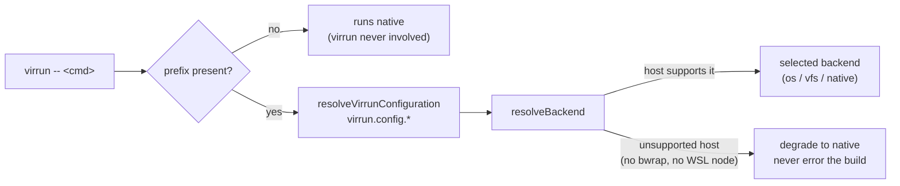

# Adoption

How a repo moves commands from native execution onto the sandbox **one at a time**, with no rewrite and no risk. Adoption is itself a design surface: if switching a command in is harder than the speedup is worth, nobody switches. The bar is near-zero barrier, fully reversible, per-command granularity — never "migrate the repo," always "migrate one command."

## How it works

The `virrun -- <cmd>` prefix **is** the switch: every prefixed command is sandboxed, and opting a command in or out is adding or removing the prefix — a reviewable one-token edit. There is no allowlist and no on/off env flag. The committed config only decides _which backend_ a prefixed command runs through ([configuration](/docs/virrun/configuration)). virrun does inject a vitest-style `VIRRUN=true` into every command's environment (read via `checkIsVirrunEnabled`) so a test or tool can detect it runs under virrun — but that is an output virrun sets, never an input that gates routing.

## Levels (escalating opt-in, each reversible)

1. **Explicit prefix** — wrap a single invocation (`virrun -- pnpm test`). Nothing else changes; this is how every command is first tried and benchmarked. Drop the prefix → native again.
2. **package.json script** — bake the prefix into one script (`"test": "virrun -- vitest"`) so collaborators get it for free. Granularity is per-script: adopt `test` first, leave `build` native until measured.
3. **Config backend selection** — commit `virrun.config.*` to pin which backend prefixed commands run through, reviewable in one place instead of implied by the host's `auto` default.

There is no fourth level that drops the prefix. A transparent `PATH` shim cannot work: pnpm prepends `./node_modules/.bin` (and the workspace `.bin`) to the **front** of `PATH` before running a script, so a shim directory never intercepts a script-local binary — `vitest`, `eslint` and `tsc` all resolve from `.bin`. Transparent routing is also the only mechanism that would need a committed allowlist, which is why virrun carries none. The idea that could still get there is [whole-repo routing](/docs/virrun/deferred/whole-repo-routing).

## Auto-fallback (the safety net)

Adoption is only zero-risk if a sandbox path that cannot run becomes native: an unsupported host (no bubblewrap, or WSL without a Linux Node.js) degrades backend _selection_ to native before a run starts — the worst case of adopting a command is "no speedup," never "broken build." The `os` backend never falls back **at run time**, though: once selected, an in-run failure is a hard error, because a silent un-isolated run would be a wrong answer disguised as success ([execution backends](/docs/virrun/execution-backends)).

## CLI subcommands

The CLI is built on citty, so every command has `--help`. The bare `virrun -- <cmd>` prefix is shorthand for `virrun run`.

| Command                      | What it does                                                                                                                                                                                    |
| ---------------------------- | ----------------------------------------------------------------------------------------------------------------------------------------------------------------------------------------------- |
| `virrun -- <cmd>`            | Default passthrough — forks a warm snapshot on the `os` backend (write-back on), else execs natively. Alias of `virrun run`.                                                                    |
| `virrun run -- <cmd>`        | Explicit form of the default; `--ephemeral` keeps the vanishing fork, `--no-cache` skips the task cache.                                                                                        |
| `virrun exec -- <cmd>`       | Forced plain exec — runs the command directly, skipping any warm-cache fork (the cold sibling of `run`).                                                                                        |
| `virrun warm`                | Provisions the `os` backend's warm cache (dependency snapshot + prepare layer) for the current lockfile ahead of time.                                                                          |
| `virrun doctor`              | Probes each `os`-backend prerequisite (bubblewrap ≥ 0.10.0, WSL Linux node, python3, host tar, the real overlay-mount verdict) and prints an aligned per-check report; exits non-zero on a gap. |
| `virrun init [--backend]`    | Writes the JSON config variant selecting the backend (`--force` to overwrite); hand-write `virrun.config.ts` for platform branching.                                                            |
| `virrun cache ls`            | Lists the repo-local dependency store and host-global warm snapshots / prepare layers / task cache.                                                                                             |
| `virrun cache clean [--all]` | Removes the repo-local `.virrun` cache; `--all` also clears the host-global snapshots, prepare layers, task cache, and win32 source mirrors.                                                    |

## Dogfooding (this repo)

Esposter is the first consumer — dogfooding _is_ the test corpus, not a separate effort. The committed root `virrun.config.ts` branches win32 → `os`, else `native` ([configuration](/docs/virrun/configuration)). Read-only verification scripts (`eslint .`, `tsc`, `vitest run`) carry the prefix — on win32 they get caching + isolation and never need the network. The mutating dev-loop siblings (`lint:fix` → `oxlint --fix`/`eslint --fix`) carry it too, wrapping each underlying step so their edits flow back to the host ([write-back](/docs/virrun/write-back)). `oxfmt` is off the ladder in both directions — it is a standalone binary that reads source files and nothing else, with no module resolution to isolate and no `.nuxt` to be wrong about, so the prefix bought it neither of the two things the sandbox is for and charged it the source-mirror + write-back round trip anyway. That is also what lets `format` be the one 🏗️ CI check with no `needs: build-packages`: with no `virrun` binary in the command there is nothing in the job that has to be built first. Watch-mode `watch:packages` and network commands (`outdated:dependencies`) run native: the sandbox can't cache them and would only add the prepare-rebuild + mirror tax. `build:packages` runs native too, and the split against `build:app` is the whole reason the prefix exists — the app build is the one that needs the Linux-generated `.nuxt` prepare layer, while no `packages/*` build touches Nuxt at all. Their output is platform-neutral and every downstream consumer reads it from host disk, so sandboxing it would buy an isolation nothing wanted and pay the mirror tax to hand the same `dist` back. `pnpm install` is never on the ladder — the os install feeds the fork snapshot, not host disk ([materialize node_modules](/docs/virrun/rejected/materialize-node-modules)).

## Key files

Paths relative to `packages/virrun/src/`.

| File                                                   | Role                                                    |
| ------------------------------------------------------ | ------------------------------------------------------- |
| `services/cli/` (citty commands)                       | `run`/`exec`/`warm`/`init`/`cache`/`doctor` subcommands |
| `services/cli/doctor/probeOsBackendChecks.ts`          | the per-prerequisite doctor probes                      |
| `services/configuration/resolveVirrunConfiguration.ts` | config discovery + loading (unconfig)                   |
| `services/configuration/checkIsVirrunEnabled.ts`       | reads the injected `VIRRUN=true` signal                 |

## Notes

- One token to opt in, one token to opt out — symmetry is the whole point. What's adopted lives in version control as the prefix on a script; the backend choice lives in the config — both reviewable and revertible like any code change.
- The package-facing how-to lives in `packages/virrun/readme/getting-started.md` (published npm docs) — including the CLI's provisioning output behavior (one-time stderr provisioning line, stdout kept clean for piped callers); this page is the design rationale.
