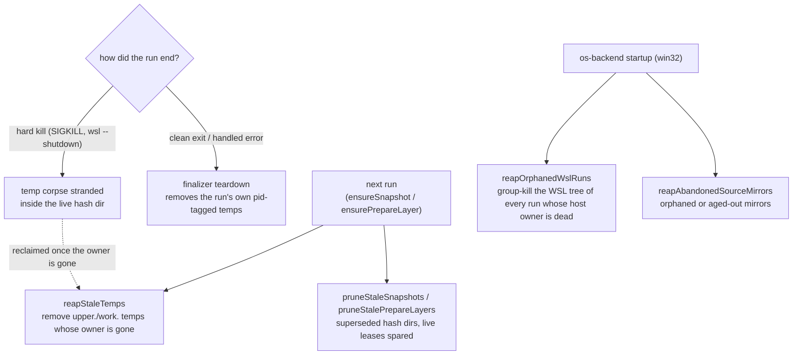

# Cache

Everything virrun materializes on disk to make sandboxed runs fast. Local, machine-specific, fully disposable — deleting it only forces the next routed run to repopulate. Never committed.

## Layout

```text
<repo>/.virrun/        # repo-local, gitignored (virrun adds the ignore line on first write)
  store/pnpm/          # shared content-addressable pnpm dep store
  store/corepack/      # corepack home — where the sandbox bootstraps the repo's pinned packageManager

~/.virrun/             # host-global (VIRRUN_CACHE_HOME override), shared across repos/CI
  snapshots/<hash>/    # warm post-install snapshots, keyed by environment (lockfile + sandbox node major)
    upper/  work/       # overlayfs layers — upper persists the install, work is overlay scratch
    leases/<pid>        # live-user leases — a superseded dir is spared while a concurrent run holds one
  prepare/<key>/       # source-keyed prepare layers (.nuxt); key = environment + source-tree + prepare step
  tasks/<key>/         # task cache — one recorded exit-0 persist run per key
  sources/<hash>/      # win32 only — ext4 source mirrors, keyed by sha256(host cwd)
  capability.json      # persisted os-backend capability probe verdict

# win32 only — Windows-side (%USERPROFILE%\.virrun), NOT the WSL-ext4 ~/.virrun above
  wsl-login-environment.json    # persisted WSL interactive-login PATH + that PATH's node version
  wsl-cache-root.json           # persisted WSL native ext4 cache root
```

- **`store/pnpm/`** (repo-local) — deps download once; the `os` backend bind-mounts `<repo>/.virrun/store/pnpm` writable into each sandbox and exposes it through pnpm env. Repo-local is fine because it is a **bind** mount, and binds may overlap the working-dir overlay. Package imports use copy — hardlinks cannot cross from the on-disk store into the RAM overlay.
- **`store/corepack/`** — bound writable into **every** sandboxed run as `COREPACK_HOME`. The sandbox mounts `/` read-only, so a command that shells out to `pnpm` runs the node manager's corepack shim, which downloads the repo's pinned `packageManager` version whenever the host's own corepack cache doesn't hold it — writing under `$HOME/.cache` and dying `EROFS`. Binding it here makes that bootstrap writable once and reused by every later run. On win32 it lives under the WSL-native ext4 root with the pnpm store, not on `/mnt/c`.
- **`snapshots/`** and **`prepare/`** (host-global) — the warm-fork layers; keying, publish, and eviction are covered in [snapshot and fork](/docs/virrun/snapshot-and-fork). They live in `~/.virrun`, not the repo, because a fork stacks them as **overlay lowers** beside the source, and overlayfs rejects a lower that nests inside another.
- **`tasks/`** (host-global) — the [task cache](/docs/virrun/task-cache).
- **`sources/`** (host-global, win32) — the [WSL source mirrors](/docs/virrun/wsl-source-mirror).
- **`capability.json`** — the persisted verdict of the os-backend capability probe (`checkIsOsBackendSupported`), keyed by `platform:kernel-release`. Every `virrun -- <cmd>` is a fresh process; without this each command would re-run the probe — a bwrap overlay mount on Linux, three `wsl.exe` round-trips on win32. The key self-invalidates on a kernel change; a change it can't see (bwrap just installed) is covered by `VIRRUN_FORCE_PROBE` or `cache clean --all`. A verdict the probe never reached is not written at all: on win32 it comes from `wsl.exe` calls under a timeout, and a distro that was merely cold answers nothing about whether the host can sandbox, so the probe returns "unanswered" rather than `false` and `shouldPersist` drops it — the next process re-probes against a warm distro instead of inheriting one stall as a capability fact. On top of that it carries the same **6-hour age bound** as the login capture, as the backstop for a verdict that was answered and has since stopped being true.
- **`wsl-login-environment.json` / `wsl-cache-root.json`** (win32, Windows-side) — the persisted results of the two WSL environment probes: the interactive-login capture (`PATH` plus the node version that `PATH` resolves — a login-shell spawn, the expensive one), and the WSL native ext4 cache root. Stored Windows-side rather than in the WSL-ext4 `~/.virrun` because locating that root _is_ `getWslNativeCacheRoot` — caching it there would be circular. Only a **successful** probe is persisted, and for the login capture that means one that answered **both** questions: a capture holding a `PATH` but no node version fails every run keyed on it, so persisting it would pin that failure for the whole age bound. A transient WSL failure returns the degraded default and re-probes next run rather than caching the miss. The login capture also carries a **6-hour age bound**: the key is `platform:kernel-release`, which cannot see a node-manager version switch, so without an expiry a capture taken before a node upgrade would pin every sandbox to the old node until a manual clean.

All three probe caches run through one primitive, `createProbeCache` — in-process memo → fingerprint-keyed persisted cache (`VIRRUN_FORCE_PROBE` bypasses this tier, never the memo, which is always sound) → probe, persisting only the values its `shouldPersist` predicate selects, so a transient failure re-probes next process instead of caching the miss. The tier ordering and force-probe semantics live in exactly one place; each probe keeps what is its own — filename, value schema, age bound, which side the cache is stored on, and whether a failed probe degrades (the WSL environment probes) or throws (the cache root). A probe that throws leaves both tiers unset, so the next call re-probes.

## Cleanup and self-healing

Every cache write is disposable, but it must not accumulate. All cleanup runs off the command's critical path — detached, best-effort, a failure never aborts the run — and all of it is **concurrency-safe via owner identity**: every temp and lease carries its owning pid, and a sweep reclaims only what a _dead_ owner left behind — where an owner is the process that started before the entry was written, since the OS recycles a dead process's pid onto whatever starts next. The host-global cache is shared across repos, worktrees, and mid-run branch switches, so "two live runs at once" is the normal case, not an edge one.



- **Finalizer teardown (clean exit)** — each run captures into a private pid-tagged `mkdtemp` sibling (`upper.<pid>.<rand>` + `work.<pid>.<rand>`); its finalizer removes that temp on success and handled error. The published layer is promoted by an atomic `renameSync`, so the temp never survives a normal exit.
- **Stale-entry prune (next run)** — only the current environment key / source key is reused, so `ensureSnapshot`/`ensurePrepareLayer` sweep every superseded `snapshots/<hash>` and `prepare/<key>` before hitting or minting the live one. A superseded dir may still be _another_ live run's current one, so each is spared while it holds a live **lease** — a `leases/<pid>` file written on mount and dropped on dispose; dead-pid leases are reaped in passing, so a hard-killed run's lease self-heals.
- **Temp-corpse reap (next run)** — a hard kill skips the finalizer, stranding a temp inside the live hash dir, which the prune deliberately skips. `reapStaleTemps` removes an `upper.`/`work.`-prefixed sibling **only when its owner is gone** (`parseTempOwnerPid` → `checkIsOwnerAlive`), never the published bare `upper`/`work` or `leases/`. The task cache's recorder temps use the same owner-gated reaper.
- **Abandoned-mirror reap (win32, once per cwd per run)** — the source mirror is the one cache entry keyed on a live repo path rather than a lockfile/source hash, so nothing supersedes it; `reapAbandonedSourceMirrors` instead sweeps entries whose `origin` marker points to a now-absent host path (deleted worktree, moved repo). A blank marker is spared — that is a first-run partial mid-write. A **missing** marker is spared only until the entry is a day old: the marker is published the instant the entry dir is created, so an aged unmarked entry is the corpse of a sync that died in that instant, and sparing it forever would leak one entry per aborted run. It runs from the command builder rather than backend construction, because the aged-unmarked arm rests on the marker republish that happens in the planning call beside it — and is memoised per cwd there, so the several command builds one run performs (deps install, prepare layer, the run itself) pay the `sources/` walk once.
- **Orphaned-WSL-run reap (win32, startup)** — a hard kill also skips the SIGINT/SIGTERM reaper that group-kills the run's WSL-side bwrap tree, so `sh`+bwrap can outlive the run and keep the store/snapshot pinned open. The orphan test is **owner liveness**, the same fact every other sweep here turns on: each run writes `runs/<host pid>.<marker>` under the local cache root as it builds its WSL command (`registerWslRun`), and the startup sweep group-kills the marker of every entry whose host process is dead — a live owner is a concurrent run, so no sweep can kill a tree anyone is still waiting on. A live _pid_ is not yet a live owner: the OS recycles a dead run's pid onto whatever starts next, so the sweep also asks when the holder started, and a holder that started after the entry was written is a stranger whose corpse it is. Nothing releases an entry: a run that ends normally leaves its own behind and the next sweep drops it, exactly as a hard-killed one does, so there is no teardown step that a kill can skip. It was once keyed on the WSL process tree's shape instead — a shell whose parent was not the `wsl.exe` `Relay(<pid>)` read as orphaned — which is not what a corpse looks like: a killed client leaves its relay alive for as long as the tree beneath it lives, so the shape spared every real corpse while staying free to misfire on a live run, whose group kill then surfaced as a bogus sandbox-setup failure. The sweep now also spawns nothing at all unless an entry's owner is dead, where before it launched a `wsl.exe` on every startup.

The prune and the reaps share one primitive, `sweepStaleEntries(dir, isStale)` — list a cache dir's child directories and hand every entry the predicate selects to a single batched `removeSnapshotDirectoriesDetached` — so "iterate + guarded detached teardown" lives in exactly one place. The batch is load-bearing on win32: WSL-side teardown costs one `wsl.exe` launch **per sweep**, not per entry, because each launch is a service RPC plus a relay process and a fan-out of a hundred wedges the WSL service for every later call. The pid-gated selectors build on one ownership check, `checkIsOwnerAlive(pid, entryPath)`: the pid must be alive (`process.kill(pid, 0)`) **and** the process holding it must have started no later than the entry's mtime — the owner was running when it wrote the entry, while any process that inherited its pid started after it exited. The start time comes from `/proc/<pid>/stat` on Linux and one `Get-Process` PowerShell call on win32, spawned only for a live pid that is not the sweep's own, which is to say only while another run is actually concurrent. An identity the platform cannot read keeps the old answer — alive is live — so the check errs toward sparing a run for one more sweep, never toward killing one.

Teardown has exactly three call styles, classified by ownership, and they are not interchangeable:

| Entry point                         | Failure is | Use for                                                                                             |
| ----------------------------------- | ---------- | --------------------------------------------------------------------------------------------------- |
| `removeSnapshotDirectoriesDetached` | swallowed  | sweeps of entries this run never touches — batched into one `wsl.exe` launch, off the critical path |
| `removeSnapshotDirectoryBestEffort` | swallowed  | on the critical path, where a leftover directory is tolerable                                       |
| `removeSnapshotDirectory`           | thrown     | the caller depends on the removal — `cache clean`, capture-time prunes whose output would be wrong  |

Every `wsl.exe` call that runs inside the distro is bounded by `execWsl`, which defaults to `PROBE_TIMEOUT_MS`; a call doing real work (`removeSnapshotDirectory`'s `rm -rf`) overrides it to `WSL_WORK_TIMEOUT_MS`, which is why the bound lives in `execWsl` rather than at each site. Two removals are deliberately unbounded: the detached sweep, which goes through `spawnBackground` and outlives this process; and `cache clean`, which passes `removeSnapshotDirectory` a `CACHE_CLEAN_TIMEOUT_MS` override — the work cap is sized for one cache entry, while a clean unlinks the whole cache, and a SIGTERM mid-`rm -rf` would leave it half-swept with no record of which roots survived. The bound exists so a wedged WSL service can't hang an implicit background prune; an explicit, user-invoked clean may block until it finishes. Which bound any one child gets — including the write-back's own `OVERLAY_WRITE_BACK_TIMEOUT_MS`, sized by what the run wrote rather than by a cache entry — is decided by [subprocess timeouts](/docs/virrun/subprocess-timeouts).

## Key files

Paths relative to `packages/virrun/src/`.

| File                                              | Role                                                                          |
| ------------------------------------------------- | ----------------------------------------------------------------------------- |
| `services/exec/util/getGlobalCacheDirectory.ts`   | host-global cache root (`VIRRUN_CACHE_HOME` override; WSL ext4 root on win32) |
| `services/exec/snapshot/sweepStaleEntries.ts`     | the shared iterate + guarded detached-teardown primitive                      |
| `services/exec/util/createProbeCache.ts`          | the shared three-tier probe-cache primitive (memo → persisted cache → probe)  |
| `services/exec/snapshot/reapStaleTemps.ts`        | pid-gated temp-corpse reaper                                                  |
| `services/exec/snapshot/createLease.ts`           | `leases/<pid>` live-user lease written on mount                               |
| `services/exec/os/checkIsOsBackendSupported.ts`   | the capability probe behind `capability.json`                                 |
| `services/exec/wsl/registerWslRun.ts`             | `runs/<pid>.<marker>` registration of this run's WSL shell                    |
| `services/exec/wsl/reapOrphanedWslRuns.ts`        | startup group-kill of the WSL trees whose host owner is dead                  |
| `services/exec/wsl/reapAbandonedSourceMirrors.ts` | startup sweep of origin-dead source mirrors                                   |

## Notes

- The `os.tmpdir()` git/files source-clone root is deliberately outside this scoping — it has no per-entry owner and is left to the OS's tmp reaping (reboot / systemd-tmpfiles).
- `cache ls` inspects, `cache clean` removes the repo-local `.virrun`, `cache clean --all` additionally drops the host-global snapshots, prepare layers, task cache, win32 source mirrors, and the persisted probe caches (`capability.json`, the two WSL probes) — so a host whose toolchain moved underneath a fingerprint-keyed verdict re-probes on the next run.
- A clean on win32 runs the orphan sweep **first and blocking**, before it removes anything: a hard-killed run's surviving WSL tree holds the store and snapshot dirs open, so a clean that ran ahead of it would be asked to remove what something still has mounted. Blocking is the half that makes the ordering mean anything — TERM only asks, so the startup sweep's fire-and-forget reaper returns while the tree is still unwinding and hands the removals the very race the ordering closes. The clean's reaper therefore runs synchronously and waits, bounded (`WSL_REAP_WAIT_TIMEOUT_SECONDS`), for the process **groups** it killed to empty — not for its markers to stop matching, since only the run's shell carries the marker and TERM takes that shell down first, while the `bwrap` actually holding the dirs open is still unwinding; a wait that times out **is** a failed reap — the script exits nonzero rather than reporting a wait it never saw finish — so the removals proceed anyway, no worse off than the unwaited removal, while the corpse keeps its registry entries and the next sweep re-reaps a tree that is still alive. A reaper also skips every **other** reaper it matches, not merely its own shell: the markers ride each reaper's argv, so a peer carrying the same marker matches the same `pgrep -f`, and group-killing it is how a startup sweep would take down this very blocking reaper mid-wait and hand the removals back the race. `$0` is `virrun-reaper` on every reaper and nothing else, which is the one cmdline test that excludes peers and self alike. That is also the only thing a clean does to the run registry — **nothing ever deletes a live owner's entry**, not even a clean. The entry is the sole record of a tree still to be reaped should that run be killed later, so dropping it would strand the tree with nothing left to find it by; a dead owner's entry the sweep takes with it as usual.
