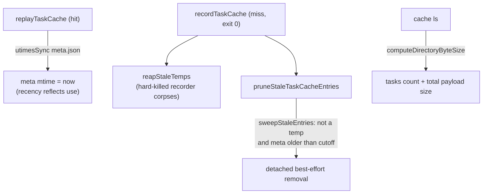

# Task-Cache Eviction

The host-global `~/.virrun/tasks/` directory is the one cache surface with no superseded-entry sweep. Every other tier self-prunes — `snapshots/` and `prepare/` evict superseded hash dirs on each run, source mirrors reap on origin death — but each `(lockfile, working-tree, command)` state mints a fresh `tasks/<key>` entry carrying a full produced-file payload (a `pnpm build` entry carries `dist/`), and nothing but `cache clean --all` would ever remove one. An age-based prune bounds it.

## Why age-based, not superseded-based

Snapshots prune "everything but the current hash" because only the current lockfile's snapshot is ever forked. Task keys don't work that way: switching branches flips the working-tree hash **back** to an earlier value, so an "old" key can become current again — there is no well-defined superseded set. The honest signal is recency: an entry not replayed within `TASK_CACHE_MAX_AGE_DAYS` (default 14) is dead weight, and losing a live one costs only one re-run — the cache is a pure accelerator, so replay correctness never depends on an entry existing.

## How it works

- **Touch on hit** — `replayTaskCache` bumps the entry's `meta.json` mtime with `utimesSync` so recency reflects use, not creation; a hot entry stays live however old. Best-effort — a failed touch only risks an earlier prune, i.e. one re-run. `resolveTaskCacheLocation` stays pure.
- **Prune on record** — beside the existing `reapStaleTemps` call, `recordTaskCache` runs `pruneStaleTaskCacheEntries`, which reuses `sweepStaleEntries(tasksRoot, isStale)`. The predicate is "not a temp (the `.tmp.` prefix), and `meta.json` mtime older than the cutoff". A `meta.json` that can't be stat'd keeps its entry rather than evicting on a blind guess. Detached, best-effort, off the critical path — exactly like the snapshot prunes.
- **No lease needed** — a replay reads an entry in-process within milliseconds and the cutoff is days; unlike snapshot lowers (mounted for a run's whole duration), there is no long-lived reader to protect. A concurrent replay racing a prune loses at worst one hit and re-runs.
- **`cache ls`** — reports the tasks entry count plus total payload size (`computeDirectoryByteSize` + `formatByteSize`), so the bound is observable at a glance.

## Key files

Paths relative to `packages/virrun/src/`.

| File                                                | Role                                            |
| --------------------------------------------------- | ----------------------------------------------- |
| `services/exec/cache/constants.ts`                  | `TASK_CACHE_MAX_AGE_DAYS`                       |
| `services/exec/cache/replayTaskCache.ts`            | touch `meta.json` mtime on hit                  |
| `services/exec/cache/recordTaskCache.ts`            | run the age-prune beside the temp reap          |
| `services/exec/cache/pruneStaleTaskCacheEntries.ts` | the `sweepStaleEntries` predicate wrapper       |
| `services/exec/util/computeDirectoryByteSize.ts`    | recursive best-effort byte total for `cache ls` |
| `services/cli/cache/formatByteSize.ts`              | human-readable binary byte size                 |
| `services/cli/cache/formatCacheListing.ts`          | renders the tasks count + payload size          |

## Notes

- Failure semantics inherit the cache's rules: the prune is best-effort and never aborts the run; a torn removal is re-swept next record.
- A size budget (LRU to a byte cap) was considered and dropped: it needs a full-directory stat walk on the hot path to know the total, while the age cutoff is a single mtime comparison per entry during an already-off-path sweep. Add a budget only if a measured workload keeps 14 days of entries too large.
- The days→ms cutoff is a `Temporal.Duration`, like every other duration in the repo — never raw millisecond arithmetic.
