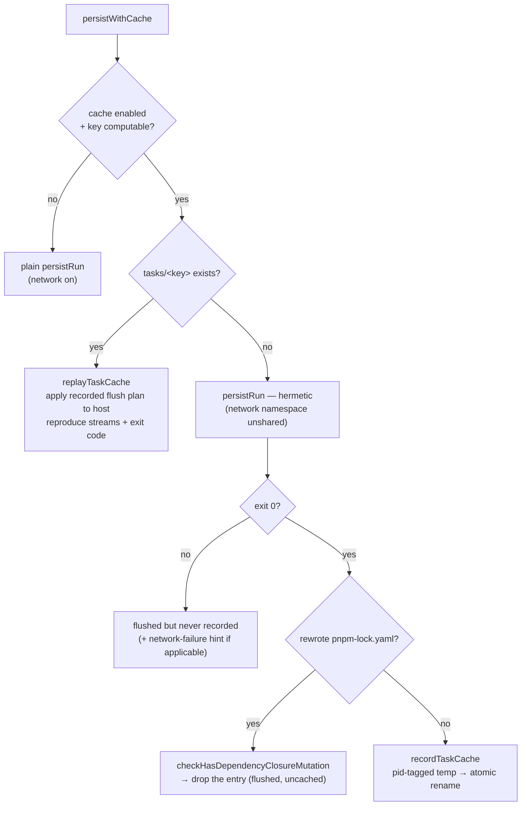

# Task cache

Skip a persist run whose inputs are unchanged. Each entry records one exit-0 persist run under `~/.virrun/tasks/<key>`; a hit **skips the sandbox entirely**, replaying an observably identical result — the recorded flush plan reconciled onto the host plus the recorded stdout/stderr/exit code. A dev-loop lever: default-on for persist runs, **off in CI** (a fresh commit changes the working-tree hash, so hits are ~0 there and the per-command source hashing would only add cost) and under `virrun --no-cache` / `VIRRUN_NO_CACHE`.

## How it works

The key is `sha256(environment-key + working-tree-hash + command + write-back mask)` (`computeTaskCacheKey`, where the environment key is the lockfile digest plus the sandbox node major — the same key the warm snapshot uses); the working-tree hash is git-based (`git ls-files -s` + `git diff --binary` + untracked walk, `computeSourceTreeHash`). Two runs share a key iff all four match, so a hit is safe to replay verbatim. The [mask](/docs/virrun/write-back) is in the key because a hit replays a recorded plan instead of rebuilding one, so it never passes the mask again — an entry recorded under a looser mask (a worktree registered since, or anything predating the mask) would flush exactly the ghosts the mask exists to stop, on every hit until it aged out. When the key can't be computed (not a git repo, no lockfile), the run falls back to a plain uncached persist rather than keying on partial state.

Each entry holds `meta.json` (recorded exit code, stdout, stderr, and the write-back flush plan) and `upper/` (the produced-file payload the replay reconciles onto the host — only the copy ops carry payload; deletes are recreated from the plan). Publish is atomic, mirroring `createSnapshot`: build in a pid-tagged temp, one `renameSync` promotes it; a race-loser keeps the winner's entry and drops its own temp.

## Honest keys — the two guards

The key is only honest if the command is deterministic in the inputs it names — and the network is not one of them. Two guards keep it so, neither needing a second "replay" run to compare:

- **Read-network → hermetic execution.** A cacheable command's fork runs with the network namespace **unshared** (`isNetworkEnabled: false` — the sandbox is `--unshare-all` by default and virrun simply stops re-adding network for the cached run; deps are already provisioned, so `createSnapshot`/`createPrepareLayer` keep network). This doesn't _detect_ network use; it _removes_ network as a hidden input, so the key becomes complete by construction. A pure task (`tsc`/`eslint`/`vitest`) is unaffected; a read-network command (`pnpm outdated`/`audit`) can't reach the registry, exits non-zero, and is never recorded. virrun makes that failure legible: `checkIsNetworkFailure` matches the network-error signature (undici's `fetch failed`, `getaddrinfo`/`ENETUNREACH`, …) in the failed run's streams and prints a "did you mean `--no-cache`" hint (`formatVirrunNetworkHint`). A command _known_ to need the registry simply runs native — no prefix.
- **Write-network → dependency-closure guard.** `pnpm install`/`add`/`update` rewrite `pnpm-lock.yaml` — and a warm store lets them succeed **offline**, so the hermetic gate alone won't stop them. Recording one would replay a stale dependency closure. `checkHasDependencyClosureMutation` inspects the miss's flush plan and, if it rewrote the lockfile, drops the entry — the run is still flushed and correct, merely uncached. The lockfile op is the whole signal: `node_modules` never reaches a flush plan (structurally masked by the snapshot lower). Installs are the snapshot layer's job anyway, never the task cache's.

One accepted caveat: a command that makes a _soft/optional_ network call and still exits 0 caches its **offline** output — self-consistent (virrun always runs it offline) but possibly narrower than a native online run.

## Key files

Paths relative to `packages/virrun/src/services/exec/cache/`.

| File                                   | Role                                                                                 |
| -------------------------------------- | ------------------------------------------------------------------------------------ |
| `computeTaskCacheKey.ts`               | sha256 over environment key + source-tree hash + command + mask; null → run uncached |
| `computeSourceTreeHash.ts`             | git-based working-tree hash (also keys the prepare layer)                            |
| `checkIsTaskCacheEnabled.ts`           | default-on, off in CI / `--no-cache` / `VIRRUN_NO_CACHE`                             |
| `persistWithCache.ts`                  | the orchestration above — hit replay, hermetic miss, record on exit 0                |
| `resolveTaskCacheLocation.ts`          | resolve `tasks/<key>` — pure addressing + existence                                  |
| `recordTaskCache.ts`                   | materialize payload + meta in a pid-tagged temp, atomic rename publish               |
| `replayTaskCache.ts`                   | apply the recorded flush plan to the host, reproduce streams + exit code             |
| `checkHasDependencyClosureMutation.ts` | the lockfile-rewrite guard                                                           |
| `checkIsNetworkFailure.ts`             | network-error signature match for the `--no-cache` hint                              |
| `taskCache.equivalence.test.ts`        | replay must be observably identical to a real re-run                                 |

## Notes

- Recording is gated on **exit 0**; the write-back flush is not ([write-back](/docs/virrun/write-back)) — a failed run is flushed like native but never replayed.
- Output capture respects the caller's stdio convention: a bare `virrun -- <cmd>` still streams live (tee) while capturing for the record; a hit prints a cache-hit label then the recorded streams.
- Entries accumulate per tree-state — unlike snapshots, an old key can become current again on a branch switch, so there is no superseded set. They are instead age-pruned on record, with recency touched on each hit; see [task-cache eviction](/docs/virrun/task-cache-eviction).
- The native backend records nothing today — `persist` there is a plain exec; see [native task-cache recording](/docs/virrun/deferred/native-task-cache).
