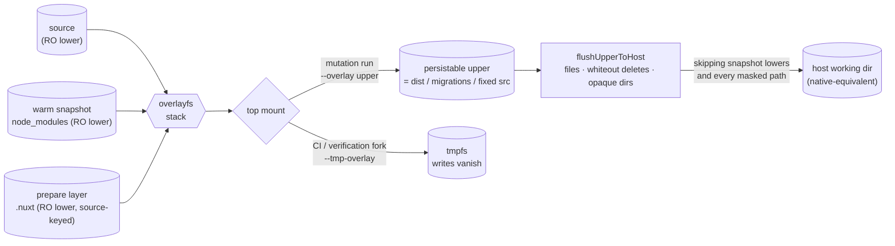

# Write-back

Flush a sandboxed command's produced files back to the host working tree, so `virrun -- <cmd>` leaves disk exactly as native `<cmd>` would. Verification commands (`vitest run`, `eslint .`) want writes to vanish; **mutation** commands (`eslint --fix`, `oxfmt`, `db:gen`, `pnpm build`) need their output on disk. Write-back is the default for a bare `virrun -- <cmd>`; `run --ephemeral` keeps the vanishing fork.

## Principle: native-equivalence, not a guessed file set

A name-based filter — gitignore-aware, or a denylist — cannot hold: `pnpm build` writes `dist/`, gitignored yet wanted, and any such rule guesses wrong eventually. The only stable rule is **leave disk as native would**. The overlay upper already _is_ the native diff — changed/new files, whiteouts for deletes, opaque markers for replaced dirs — so persisting the upper (minus what a lower layer supplies) reproduces the native on-disk result without virrun ever deciding which files "matter".

## How it works

Every os run forks the warm snapshot; the only thing that varies is the top mount — persist vs vanish:

Two facts make this native-equivalent without guessing:

- **The upper _is_ the native diff** — overlayfs records changed/new files, char-dev `0:0` whiteouts for deletes, and (in rootless userxattr mode) `user.overlay.opaque` markers for replaced dirs. Replaying it onto the host reproduces native's result.
- **`node_modules` is structurally excluded** — it lives in the RO snapshot lower, so it is never in the top upper's flush set. Upper entries that shadow a snapshot-lower path (a postinstall patch, `node_modules/.vite`) are skipped by layer membership, not a name guess. A prepare layer's outputs (`.nuxt`) are excluded the same structural way.

### The flush set is bounded by the source set

Native-equivalence is a statement about a sandbox that saw the host's tree. Where the sandbox's source view is _narrower_ than the host's — on win32 it reads the [source mirror](/docs/virrun/wsl-source-mirror), which the mirror excludes were filtered out of — a path outside that view has no host original the command could have edited, so an upper entry under one is not a mutation to reconcile. It is a ghost: content the mirror still held from before the exclude existed, which a tool (`eslint --fix`, `oxfmt`) rewrote in place and copied up. Flushing it **creates** on the host a tree the host does not have.

So the persist call takes `maskedPaths` — prepare outputs everywhere, and on win32 the whole mirror exclude set (a superset of them) — matched by the same `checkIsExcludedPath` the mirror walk uses, so the two directions of the boundary cannot drift. `resolveMirrorExcludes` requires the run's resolved prepare outputs and never re-reads the config for them, since it cannot tell an absent `environment` from one passed programmatically — so the mask (`createVirrun`) and the mirror walk (`createWslOsBackend`) resolve from the same `environment` and cannot describe different trees; both shapes are root-anchored, since an output naming one directory (`.nuxt`) would otherwise mask that name at every depth. This is not a name-based smart filter: the rule is still structural (_did the sandbox receive this path from the host?_), and the excluded set is derived, never enumerated per command.

The mask is applied when a flush plan is **built**, and a [task-cache](/docs/virrun/task-cache) hit does not build one — it replays a recorded plan verbatim. So the mask is part of the cache key (`computeTaskCacheKey`): an entry recorded under a looser mask, including any entry predating the mask itself, misses instead of flushing the ghosts today's mask forbids. Keying it retires those entries rather than filtering twice, which keeps the mask applied in exactly one place.

Without the mask, a `--fix` run materializes those ghosts on the host: the mirror hands the sandbox a stale copy, the tool rewrites it in place, and the flush creates it. Why the mirror can still be carrying one is the [exclude reconciliation](/docs/virrun/wsl-source-mirror); how virrun decides which directories those are is [derived from git, not named](/docs/virrun/derived-not-named).

## Overlay upper format (empirically confirmed)

Probed on a rootless-bubblewrap overlay (kernel 6.6, ext4). Inside a user namespace the overlay uses **userxattr** — markers live in `user.overlay.*`, readable unprivileged:

| Upper entry                         | On-disk representation                                          | Detection                                                     |
| ----------------------------------- | --------------------------------------------------------------- | ------------------------------------------------------------- |
| deleted path (whiteout)             | character device, `rdev` 0:0, mode 0                            | `lstat`: `S_ISCHR(mode) && rdev === 0` — no xattr read needed |
| dir removed-then-recreated (opaque) | directory with xattr `user.overlay.opaque="y"`                  | xattr read of `user.overlay.opaque`                           |
| dir modified in place (merge)       | directory with `user.overlay.origin`/`impure` but **no** opaque | absence of opaque → recurse, do not clear                     |
| created / copied-up file            | regular file                                                    | default → copy                                                |

A `build` that cleans its output dir (`rm -rf dist && rebuild`) produces an **opaque** `dist`, so opaque handling is required, not optional.

## Flush algorithm

After the command exits — **whatever the exit code** — reconcile the top upper into the host working directory:

1. **Walk the upper**, classifying each entry per the table (`parseOverlayEntryKind`): regular file/dir → copy over; whiteout → remove the host path; opaque dir → clear the host dir, then copy the upper's children.
2. **Skip snapshot-lower-shadowing paths** and `maskedPaths` — prepare outputs, plus the mirror excludes on win32 (structural, above). Source-tree paths and genuinely new repo content always flush.
3. **Bulk copy-out, last** — sequential over the (small) diff, far cheaper than the random I/O the toolchain did in RAM.

The flush runs on non-zero exits too, because native-equivalence taken literally means the host is left exactly as the tool left it: `eslint --fix`/`oxfmt` exit non-zero when unfixable errors remain yet still rewrote the files they could fix, and a failed build can leave a partial `dist/` — native persists both, so the flush does too. Only the [task cache](/docs/virrun/task-cache) is gated on exit 0 (`onPersist` fires only then), so a failed run is flushed but never replayed.

## Execution locus and the xattr seam

The flush walks overlay internals (char-dev whiteouts, `user.overlay.*` xattrs) which a Windows host cannot see over the `\\wsl.localhost` 9p bridge — so on win32 the reconciliation runs **inside WSL**; on Linux it runs in-process. Node has no xattr API, so the probe/apply seam shipped as a python3 script pair (`runOverlayScript` with `OVERLAY_PROBE_SCRIPT`/`OVERLAY_APPLY_SCRIPT`), unprivileged in userxattr mode; `python3` is a documented prerequisite beside bubblewrap (checked by `virrun doctor`).

## Equivalence gate

Write-back is unprovable by inspection — it is covered by an **equivalence test** (`persistRun.equivalence.test.ts`), parked as `describe.todo` for its wall-clock cost and run by hand when this path changes ([correctness](/docs/virrun/correctness)): capture one warm snapshot, run commands with `persistRun`, and assert the produced host files match a native run while `node_modules` never reaches the host. The corpus exercises the flush **mechanism** one overlay-entry shape per case: a new top-level file, an in-place edit (the `oxfmt`/`eslint --fix` shape), a nested create under a new directory (the ctix-barrel/`db:gen` shape), a whiteout delete, the `node_modules` drop, a write under a masked path (the stale-mirror ghost shape — the same run's unmasked write still lands), and the partial write a non-zero exit still flushes. Every fixed bug becomes a golden regression case.

## Key files

Paths relative to `packages/virrun/src/`.

| File                                                    | Role                                                                                                                |
| ------------------------------------------------------- | ------------------------------------------------------------------------------------------------------------------- |
| `models/exec/snapshot/OverlayEntryKind.ts`              | enum `Regular`/`Whiteout`/`OpaqueDir` — the classification result                                                   |
| `services/exec/snapshot/parseOverlayEntryKind.ts`       | pure: classify an upper entry from a parsed manifest entry + opaque flag                                            |
| `services/exec/snapshot/buildFlushPlan.ts`              | pure: turn an upper walk into an ordered `FlushOp[]`, skipping snapshot-lower paths                                 |
| `services/exec/snapshot/checkIsUnderSnapshotLower.ts`   | pure: the skip predicate — snapshot-lower membership, any `node_modules` tree, and `maskedPaths`                    |
| `services/exec/util/checkIsExcludedPath.ts`             | pure: the one exclude matcher, shared with the source-mirror walk so the boundary's two directions agree            |
| `services/exec/snapshot/runOverlayScript.ts`            | run the probe/apply python3 seam (direct on Linux; via `wsl.exe` on win32)                                          |
| `services/exec/snapshot/parseOverlayManifest.ts`        | zod-validate the probe script's JSON manifest into typed entries                                                    |
| `services/exec/snapshot/flushUpperToHost.ts`            | probe the upper → classify + order in TS → apply the plan to the host Linux-side                                    |
| `services/exec/snapshot/persistRun.ts`                  | orchestrate: fork with a persistable upper → exec → flush (any exit code) → record task cache on exit 0 → tear down |
| `services/exec/snapshot/persistRun.equivalence.test.ts` | the write-back equivalence corpus asserting host parity vs native                                                   |

## Notes

- **Always warm; persist is the only axis.** A cold-install-per-mutation design would defeat "speedup everywhere", and re-flushing `node_modules` would defeat "never touches disk" — both avoided by forking the snapshot and flushing only the top upper.
- **`pnpm install` is the snapshot-creation path, not a persist run.** Its output is the warm snapshot, not host `node_modules` ([materialize node_modules](/docs/virrun/rejected/materialize-node-modules)).
- The persist-vs-ephemeral choice lives in the orchestrator (`persistRun` parallels `forkSnapshot`), not an `ExecOptions` flag — the backend stays a pure executor of an `overlayLayers` shape.
- **No new config or per-command list.** Persist is the default for a normal `virrun -- <cmd>`; the prefix remains the sole switch, consistent with the adoption model.
- **Concurrency**: the snapshot lower is RO and shared safely; the only remaining race is two persist runs flushing the same host path at once — last-writer-wins, exactly as native.
