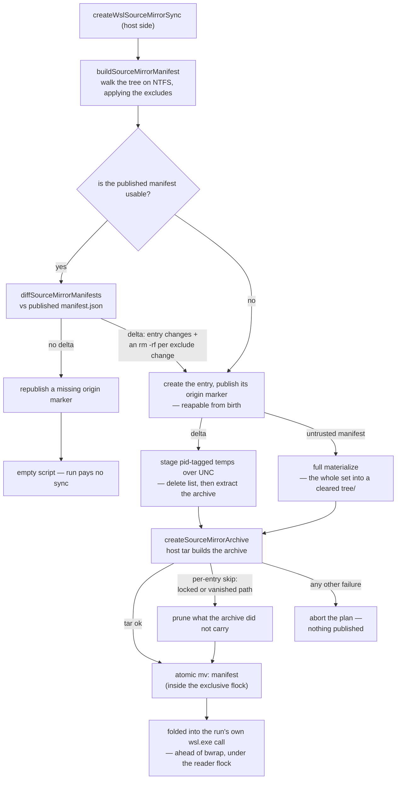

# WSL source mirror

On win32, the sandbox reads the repo source from a WSL-native ext4 mirror instead of straight from `/mnt/c`, so an `os` run stops paying the v9fs read tax on every source file — and the mirror is kept fresh by a **host-side manifest delta** whose data plane is a **host-staged tar archive**, so the sync itself never stat-walks _or copies_ the tree over v9fs file-by-file.

## Why it exists

The write-heavy caches (pnpm store, snapshot layers) live on ext4 for the same reason, but the source lower is what the toolchain actually reads: every fork re-reads the source tree, and tsc, vitest and eslint each walk it again. Over 9p/v9fs that is an order of magnitude slower than ext4 or worse, and it is the whole win32 gap — enough to hold `os/wsl` at a fraction of native while Linux runs in a near-native band ([benchmarking](/docs/virrun/benchmarking) holds the figures).

Everything below follows from one rule: **the 9p bridge is crossed a bounded number of times per run, never once per file.** Both cheap-looking designs break it. A per-run `rsync -a --delete` quick-check stat-walks every source file over 9p, which on a repo of thousands of files costs more with zero changes than all the remaining sandbox overhead — so the change detector is a host-side manifest diff, walking NTFS at native speed. Applying a copy list file-by-file breaks it the same way from the other side, and worse: the tax scales with file count, so a cold materialize of a large repo runs past its own timeout and hard-fails the command it was serving. So the data plane is one archive — host `tar` (bsdtar, shipped with Windows) reads the copied paths at native NTFS speed, the bridge carries a single sequential write, and the Linux side extracts locally on ext4.

## How it works

The mirror is a self-contained entry `<wslCacheRoot>/sources/<sha256(hostCwd)>/` holding the synced tree in `tree/`, an `origin` marker (the host cwd it was cloned from), and a `manifest.json` (the tree state the mirror holds, plus the exclude set it was walked under). The `tree/` leaf is the `--overlay-src` read-only lower — but the overlay is mounted at, and `--chdir` goes to, the repo's **logical `/mnt/c` path**, not the mirror path (`buildBwrapArgs` takes a `sourceDir` decoupled from `cwd` for exactly this). Reads hit ext4 at native speed while `pwd` and every absolute path a tool emits match the native baseline. Write-back's _target_ is unaffected: its flush path derives independently from `options.cwd`, and the mountpoint equals that host path, so the upper diff maps back 1:1. Its _set_ is not — the mirror narrows what the sandbox can see, so the flush masks the same excludes (below).

- **Manifest delta** — the planner walks the working tree on the host FS (posix relative path → type/size/mtimeMs/symlink target — rsync's classic quick-check signal; a symlink's signal is its _own_ lstat plus its link target, since the archive ships it as a link) and diffs it against the published manifest. The walk is synchronous, unconditional, and on the hot path deliberately: it _is_ the change detector, and off-threading it would add IPC without cutting wall time.
- **Archive data plane** — `createSourceMirrorArchive` feeds the copy list to host `tar` (`--no-recursion --null -T`, so entries mirror the manifest's per-entry bookkeeping and any filename survives; symlinks are archived as symlinks, since the repo's intra-tree links carry position-dependent relative targets that dereferencing would break — note host `tar` strips the drive letter from an _absolute_ NTFS target, so `C:\repo\x` arrives in the guest as `/c/repo/x` and dangles; repo links are relative, and anything virrun stages itself copies rather than links), which reads the sources at native NTFS speed and writes one archive over the UNC. The Linux script applies deletes (`xargs -0 rm -rf`), extracts the archive locally on ext4, and `chmod -R 777`s the tree to keep drvfs parity (bsdtar records NTFS entries as 644/755, which would strip exec bits). No source file ever crosses 9p individually; a full materialize clears `tree/` first and extracts the complete manifest set, which is also the drift self-heal.
- **Per-entry skips are never fatal** — the walk and the archive spawn cannot be atomic, so a listed path may be unreadable by the time tar reaches it: Windows-locked (a live sqlite db) or simply gone (a build output, an editor temp). Tar skips it, archives the rest, exits non-zero. Only that class is tolerated (`checkIsTolerableArchiveFailure`); anything else aborts the plan, since an untrustworthy archive must never be published. The skips are then attributed from **the archive's own members** (`tar -tf`) — not the stderr, which names no path at all on bsdtar's vanished-entry report (`tar: : Couldn't visit directory`) — and every listed path the members lack is pruned from the published manifest. The mirror never claims a state it doesn't hold; a locked path retries until readable, a vanished one is simply absent from the next walk.
- **Excludes** — `node_modules` (supplied by the snapshot lower), `.git` (large, churns every commit, unread by dev-loop commands), this repository's **linked worktrees nested inside the tree** (each is a whole parallel checkout and its own virrun cwd with its own mirror entry, so without the exclude a delta is tens of thousands of worktree paths dwarfing a few hundred real ones), and an active `environment` preset's prepare outputs (`.nuxt` — owned by the prepare layer; the host's platform-specific copy must stay out of the sandbox or it shadows the layer). Everything else is mirrored: **over-copy is correctness-safe, under-copy is a bug.** The walk's manifest is the single source of truth for the mirrored set — the archive carries exactly its paths, so the two sides agree by construction.
- **Two pattern shapes, and a derived path always carries its anchor** — a bare name (`node_modules`, `.git`) matches that segment at any depth; anything derived from the tree names one place and is written `./<path>` (`toRootAnchoredExclude`). Without the anchor the shape is inferred from "does it contain a slash", so a single-segment derived path — `git worktree add app` at the repo root, or a workspace-root `nuxt.config`'s `.nuxt` — reads as a bare name and drops **every** `packages/*/app` from the mirror and masks them out of the write-back. The anchor is deliberately still a valid relative path, because the delete list spends the pattern as one (`rm -rf` with the mirror tree as cwd). Which shape a pattern is lives in `checkIsBareNameExclude`, called by the matcher, the rebuild trigger and the delete derivation alike.
- **Worktrees are read from git, not named** — which nested directories are parallel checkouts is a property of the repository, so `readLinkedWorktreePaths` derives them from `<commonDir>/worktrees/<name>/gitdir` rather than hardcoding whatever directory an agent tool happens to use ([derived, not named](/docs/virrun/derived-not-named)). An unregistered directory is just files and mirrors normally; a submodule is another repository's tree and stays in. Two facts git records make that reading safe, and both are read rather than inferred from a path's shape: **which registry** — a `.git` file's target holds a `commondir` when it is a worktree entry and none when it is a submodule's own git dir, so a submodule's worktrees resolve against the submodule, not the superproject whose registry lists none of them. And **whether the entry is live** — a registry entry outlives `rm -rf <worktree>` until a `git worktree prune` that only runs under gc, so the exclude requires the worktree's `.git` file to still be there pointing back at that entry. Without the back-link check a stale entry excludes whatever real source later takes the path, out of the mirror _and_ out of the mask: the sandbox sees nothing there and everything written under it is dropped — the under-copy this page calls a bug, and silent.
- **The exclude set is published with the manifest, and a change to it is reconciled by deletes** — `manifest.json` records the tree state _and_ the excludes it was walked under, because the excludes bound what the entries can say. A path on either side of an exclude change is in **neither** manifest — the old one excluded it, the new walk doesn't produce it — so an entries-only diff can never emit a delete, and the mirror's copy outlives every later sync: still read by the sandbox as source, and still copied up into the upper the [write-back](/docs/virrun/write-back) flushes by any `--fix` tool that rewrites it — which is how a deleted worktree reappears on the host holding stale files. Every path the two sets disagree on is deleted outright (`diffSourceMirrorManifests`) — an `rm -rf` that is a no-op on a mirror that never held it — in both directions, since a worktree can be added _or_ removed. Deliberately **not** a rebuild: worktrees come and go constantly, and a full re-materialize per change would tax the whole dev loop. Ordering is ignored, so a reordered set is not a change. The one shape a delete list can't express is a **bare-name** change, which matches at any depth — that alone (and a pre-publication manifest, which records no set at all) falls back to the clearing full materialize.
- **Excluding is symmetric with the write-back mask** — the same set feeds `maskedPaths` (`createVirrun`), matched by the same `checkIsExcludedPath`. A path the sandbox never received from the host is one it may never hand back, so even a mirror that _is_ carrying residue cannot push it onto the host. Symmetric by construction, not by habit: `resolveMirrorExcludes` takes the run's resolved prepare outputs and never derives them, because it cannot tell an absent `environment` from one passed programmatically — so the walk (`createWslOsBackend`) and the mask (`createVirrun`) both resolve from the one `environment` the run was given, and neither can answer for a preset the other did not see.
- **Folded invocation** — a non-empty sync script rides the run's own `wsl.exe` invocation as a preamble ahead of bwrap, not a separate spawn. A failed sync prints the `WSL_SOURCE_MIRROR_SYNC_FAILURE_MARKER` line and exits before the sandbox starts; `createBwrapBackend` keys on that marker so the failure surfaces as a sync failure instead of masquerading as "bubblewrap failed to set up the sandbox" (no status block reaches stderr on this path). Never a stale mirror, never an `os` → native fallback. On success the sync is silent, so the child's streams stay byte-exact vs native for the differential/task-cache captures.
- **Concurrency** — one per-mirror lock file, two sides. The whole mutation runs under the **exclusive** `flock`, so concurrent syncs serialize and a manifest is never published for a half-applied delta. Every run then holds the **shared** side for bwrap's whole duration, so a concurrent same-cwd sync waits for live readers to drain instead of tearing the source lower out from under a running sandbox — while concurrent clean-tree runs stay fully parallel. `flock -w` + `timeout` bound a stalled lock or ext4 volume (`SOURCE_MIRROR_TIMEOUT_SECONDS`) as pure hang guards — the bounded work is one local extract, not a cross-boundary copy — and the host `tar` spawn has its own bound (`SOURCE_MIRROR_ARCHIVE_TIMEOUT_MS`); both fail loudly rather than corrupting a reader.
- **Reaping** — `reapAbandonedSourceMirrors` sweeps entries whose `origin` points to a now-absent host path once per cwd per run, plus entries that aged out carrying no marker at all; `reapStaleSourceMirrorTemps` unlinks staged temps whose host owner pid is dead. Both best-effort, off the critical path ([cache](/docs/virrun/cache)). The aged-unmarked arm is only safe because **every** planning pass republishes a missing marker — the no-delta early return included, which is the path a live repo takes on nearly every run — so an absent marker means no pass has completed for that entry since it died. The marker publish itself stays best-effort (its rename crosses 9p, where a concurrent reaper's open handle can fail it), and that republish is what keeps one swallowed failure from aging a live mirror into the sweep.

## Key files

Paths relative to `packages/virrun/src/services/exec/wsl/`.

| File                                | Role                                                                                                           |
| ----------------------------------- | -------------------------------------------------------------------------------------------------------------- |
| `getSourceMirrorKey.ts`             | pure `sha256(hostCwd)` entry key, shared by the Linux-path and UNC-path resolvers                              |
| `getWslSourceMirrorPath.ts`         | pure `<entry>/tree` resolver — the `--overlay-src` lower                                                       |
| `buildSourceMirrorManifest.ts`      | host-FS walk → manifest, applying the excludes; unreadable entries drop out and self-heal                      |
| `diffSourceMirrorManifests.ts`      | pure manifest diff → sorted copy/delete lists; a type flip lands in both so the extract recreates it cleanly   |
| `readSourceMirrorPublication.ts`    | UNC read + zod parse of the tree state plus its exclude set; undefined on missing/torn/drifted/pre-publication |
| `resolveMirrorExcludes.ts`          | the one exclude source feeding the walk (whose manifest defines the mirrored set) and the write-back mask      |
| `../util/checkIsExcludedPath.ts`    | the shared pattern matcher — bare name at any depth vs root-anchored path, whole subtree either way            |
| `../util/checkIsBareNameExclude.ts` | the one home of "does this pattern float at any depth", read by the matcher, the rebuild trigger and the diff  |
| `../util/toRootAnchoredExclude.ts`  | tree path → `./`-anchored pattern, so a single-segment derived exclude can never read as a bare name           |
| `createSourceMirrorArchive.ts`      | host `tar` staging: copy list → one archive written over the UNC (native NTFS reads, one sequential 9p write)  |
| `checkIsTolerableArchiveFailure.ts` | classify a failed archive tar: per-entry skips it archived past (prune) vs anything else (abort)               |
| `readSourceMirrorArchiveMembers.ts` | `tar -tf` → the paths the archive actually captured, the one honest source for what to prune                   |
| `createWslSourceMirrorSync.ts`      | the planner: walk + diff + temp/archive staging → `{ lockPath, mirrorPath, script }` (`""` = skip)             |
| `shellQuote.ts`                     | single-quote shell escaping shared by the planner's script and the backend's lock wrapper                      |
| `createWslOsBackend.ts`             | startup reaps + fold the sync script ahead of bwrap inside the shared reader flock                             |
| `createWslBwrapArgs.ts`             | pass the mirror path as `buildBwrapArgs`' `sourceDir` while keeping the wslpath-translated cwd as mountpoint   |
| `../bwrap/buildBwrapArgs.ts`        | optional `sourceDir` decoupling the lower from the mountpoint + `--chdir` (defaults to `cwd` on Linux)         |

## Notes

- **Goal is closing the v9fs gap, not guaranteed native-beating on win32.** Typecheck-cold stays around half of native because a sub-second native command cannot amortise the fixed sandbox setup. Report measured numbers honestly — never claim a win the bench doesn't show; the [benchmarking](/docs/virrun/benchmarking) page owns the exact figures.
- **Manifest delta over git introspection (decided).** A git-driven delta (`git ls-files` + `git diff`) would miss gitignored-but-mirrored outputs (`dist`, …) and leave them stale — an under-copy bug. The stat-walk is also the change detector rsync itself uses, so delta and fallback agree by construction. Same blind spot as rsync's quick-check (a content change preserving size+mtime), accepted as parity.
- **Rejected: copy source into the snapshot** — the deps snapshot is environment-keyed (lockfile digest + sandbox node major) and reused across many source states; folding mutable source into the immutable install layer breaks the cache model. **Rejected: full copy per run** — a cross-boundary full write each run costs more than the reads it saves; incrementality is load-bearing.
- The differential corpus already runs on win32 and gates this: a stale or mis-synced mirror fails it. The write-back equivalence corpus covers the same ground more directly but is [parked](/docs/virrun/correctness) — run it by hand when the mirror or the flush changes. An unreadable working-tree **root** aborts the plan outright — degrading to an empty manifest would diff as "delete everything".
- Mirror sharing across worktrees of the same repo is unsupported (keyed by exact cwd).
- Native Linux keeps `--overlay-src` on the real source — no mirror, no sync.
