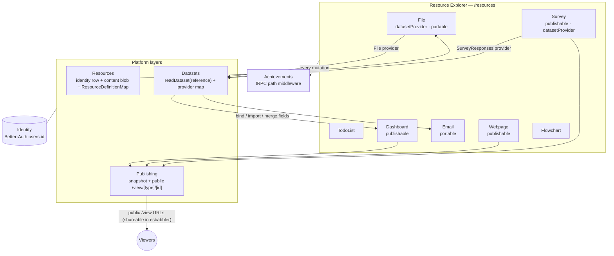

# Platform — Cross-Product Layer Model

How Esposter's products link together. Five layers; the Resources layer carries the products, and the others are capabilities or infrastructure it plugs into. Implementation phases and open decisions live in `features/platform/`.

---

## Principle

> **Everything is a resource; capabilities are opt-in.** A resource exposes and consumes **datasets** if it declares so. Anything publishable gets a **public versioned read**. Every mutation is already an **achievement trigger**.

New products join the platform by adding one `ResourceType` and one `ResourceDefinitionMap` entry, not by adding services or bespoke pages. Games, anime, and the fluid simulator deliberately stay outside (achievements only) — a game save has nothing to gain from naming, sharing, or dataset semantics.

---

## Layer Model

| Layer          | Contract                                                                       | Status                                                                                  |
| -------------- | ------------------------------------------------------------------------------ | --------------------------------------------------------------------------------------- |
| **Identity**   | `users.id` (Better-Auth) keys every row, blob path, session                    | ✅ Shipped — shared by all products                                                     |
| **Resources**  | Postgres identity row + content blob + capability declaration → `resources.md` | 🚧 Standard defined — supersedes documents; migration in `features/platform/roadmap.md` |
| **Datasets**   | Columns + rows served by DatasetProvider types → `datasets.md`                 | ✅ Shipped — providers re-key to `File`/`SurveyResponses` during migration              |
| **Publishing** | Versioned publish copy + public rate-limited read → `publishing.md`            | ✅ Shipped — becomes the Publishable capability; `/view/[type]/[id]` unifies routes     |
| **Events**     | tRPC mutation path = trigger key (`achievementPlugin`)                         | ✅ Shipped — every new procedure is automatically triggerable                           |

---

## Diagram



---

## Business-Logic User Journey

The headline cross-product flow — **create a survey → collect responses → extract/transform → visualise → publish** — runs entirely through resources and their capabilities:

```mermaid
sequenceDiagram
  actor Creator
  actor Respondent
  participant SV as Survey resource<br/>(Editor blade)
  participant AT as Azure Table<br/>(SurveyResponses)
  participant FI as File resource<br/>(Data blade)
  participant DB as Dashboard resource
  participant PUB as Public /view/[type]/[id]

  Creator->>SV: 1. Author survey (SurveyJS autosave → saveResourceContent)
  Creator->>SV: 2. Publish — snapshot model + assets to {id}/published/{n}
  PUB-->>Respondent: 3. Share /view/survey/{id} (email invite block, esbabbler, anywhere)
  Respondent->>AT: 4. Respond → rows (partitionKey = survey resource id)
  Note over SV,AT: Respondents are served the published snapshot; unpublished 404s
  Creator->>FI: 5. Import responses (dataset.readDataset → one-time copy into a File resource)
  FI->>FI: 6. Computed columns — Aggregation / Math / Regex / String
  Creator->>DB: 7. Bind visual to a DatasetReference (live re-resolve on load)
  DB->>PUB: 8. Publish dashboard — bakes dataset snapshots → shareable /view/dashboard/{id}
```

---

## Capability Matrix

The `ResourceDefinitionMap` (`resources.md`) is the authoritative declaration; this is the summary:

| ResourceType | Publishable | DatasetProvider | Portable  | Blades beyond Overview |
| ------------ | :---------: | :-------------: | :-------: | ---------------------- |
| Dashboard    |     ✅      |                 |           | Editor                 |
| Email        |             |                 | ✅ export | Editor                 |
| File         |             |       ✅        |    ✅     | Data, Settings         |
| Flowchart    |             |                 |           | Editor                 |
| Survey       |     ✅      |  ✅ responses   |           | Editor, Responses      |
| TodoList     |             |                 |           | Items, Calendar        |
| Webpage      |     ✅      |                 |           | Editor                 |

Outside the resource model: **Posts** (relational Postgres, social feed semantics), **Esbabbler** (distribution channel for published links), **Achievements** (the events layer itself), **games/anime/fluid** (blob save state or none; achievements only).

---

## Feasibility

Everything is TypeScript + already-installed OSS: SurveyJS (authoring/response), GrapesJS (email/webpage), mathjs (computed columns), SheetJS/CSV parsing (import), FullCalendar, existing chart stack. The consolidation requires **zero new dependencies and zero new Azure services** — one renamed Postgres table, one blob container replacing six, and reshaped tRPC routers. The only capability needing new infrastructure is actually sending email (deferred with trigger in `features/platform/deferred/`).
