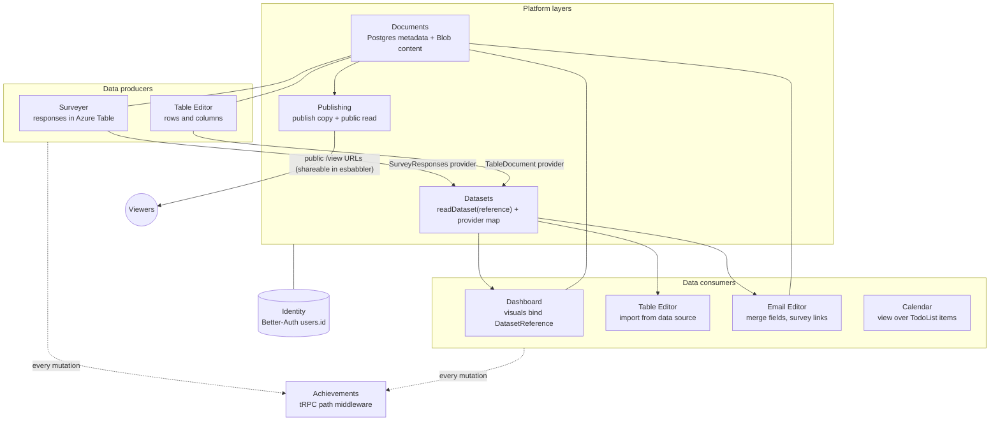

# Platform — Cross-Product Layer Model

How Esposter's products link together. Five layers, each generalizing something that already ships — no new infrastructure category is invented. Each non-shipped layer has its own standard doc in this folder; implementation phases and open decisions live in `features/platform/`.

---

## Principle

> Every product is a **document** editor. Documents **expose and consume datasets**. Every mutation is already an **achievement trigger**. Anything publishable gets a **public versioned read**.

New products join the platform by implementing contracts, not by adding services. Games, anime, and the fluid simulator deliberately stay outside (achievements only) — a game save has nothing to gain from naming, sharing, or dataset semantics.

---

## Layer Model

| Layer          | Contract                                                            | Status                                                                                         |
| -------------- | ------------------------------------------------------------------- | ---------------------------------------------------------------------------------------------- |
| **Identity**   | `users.id` (Better-Auth) keys every row, blob path, session         | ✅ Shipped — shared by all products                                                            |
| **Documents**  | Postgres metadata row + content blob → `documents.md`               | ✅ Shipped — `documents` table + factory across all 5 editors; survey has its own table        |
| **Datasets**   | Columns + rows served by providers → `datasets.md`                  | ✅ Shipped — SurveyResponses + TableDocument providers, table-editor import, dashboard binding |
| **Publishing** | Versioned publish copy + public rate-limited read → `publishing.md` | ✅ Shipped — document publish lifecycle + `/view/{dashboard,webpage}/[id]` with OG meta tags   |
| **Events**     | tRPC mutation path = trigger key (`achievementPlugin`)              | ✅ Shipped — every new procedure is automatically triggerable                                  |

---

## Diagram



---

## Business-Logic User Journey

The headline cross-product flow — **create a survey → collect responses → extract/transform → visualise → publish** — as it runs across products today. Steps marked ⚠ are known breaks tracked in [`features/platform/roadmap.md`](../features/platform/roadmap.md).

```mermaid
sequenceDiagram
  actor Creator
  actor Respondent
  participant SV as Surveyer
  participant AT as Azure Table<br/>(SurveyResponses)
  participant EM as Email editor
  participant TE as Table editor
  participant DB as Dashboard
  participant PUB as Public /view

  Creator->>SV: 1. Author survey (SurveyJS, autosave)
  Creator->>SV: 2. Publish — bumps publishVersion, clones assets
  Note over SV: ⚠ publishedAt never set; ⚠ respondents are served the live draft, not the snapshot
  Creator->>EM: 3. Compose invite email; bind dataset → merge-field blocks
  Note over EM: ⚠ invite link resolves to /surveyer/{id} (auth wall) + never renders (publishedAt filter)
  EM-->>Respondent: 4. Distribute link (email sending deferred → share manually / via esbabbler)
  Respondent->>AT: 5. Fill /survey/{id} → response rows (partitionKey = surveyId)
  Creator->>TE: 6. Import survey responses (one-time snapshot into a table document)
  TE->>TE: 7. Computed columns — Aggregation / Math / Regex / String (the extract/transform layer)
  Creator->>DB: 8. Bind visual to a dataset reference + aggregation (live re-resolve on load)
  DB->>PUB: 9. Publish dashboard — bakes dataset snapshot → shareable public /view URL
```

The **producer → dataset → consumer** contract (steps 6–9) is solid: `dataset.readDataset` + provider map, table-editor import, dashboard binding, and baked publish snapshots all work. The weak links are the **distribution half** (steps 2–5): survey publish/versioning does not reach respondents, and the invite path is doubly broken. See the roadmap for the ordered fixes and the cross-product navigation gaps.

---

## Where Each Product Sits Today

| Product           | Persistence today                                                          | Platform role                                            |
| ----------------- | -------------------------------------------------------------------------- | -------------------------------------------------------- |
| Surveyer          | Postgres `surveys` + model blob (`SurveyAssets`) + responses (Azure Table) | Document + dataset **producer**; publish pattern donor   |
| Table editor      | Single blob per user (`TableEditorAssets`) + localStorage                  | Dataset **producer and consumer**; owns file import      |
| Dashboard         | Single blob per user (`DashboardAssets`) + localStorage                    | Dataset **consumer** (visual binding)                    |
| Email editor      | `documents` row + content blob (`EmailEditorAssets`)                       | Dataset **consumer** (merge fields, personalized export) |
| Webpage editor    | `documents` row + content blob (`WebpageEditorAssets`)                     | Documents + publishing (`/view/webpage/[id]`)            |
| Flowchart editor  | Single blob per user (`FlowchartEditorAssets`) + localStorage              | Documents + publishing only                              |
| Calendar          | None — reads table editor's TodoList store                                 | Existing proof of cross-product consumption              |
| Posts             | Postgres `posts`/`likes`                                                   | Already relational; document embeds deferred             |
| Esbabbler         | Azure Table messages + Postgres rooms                                      | Distribution channel for published links                 |
| Achievements      | Postgres `achievements`/`userAchievements`                                 | The events layer itself                                  |
| Games/anime/fluid | Blob save state or none                                                    | Outside the platform (achievements only)                 |

Single-blob products all use the same factories: `useSave` / `useSaveToLocalStorage` (client), `createReadBlobStateProcedure` / `createSaveBlobStateProcedure` (server), blob key `${userId}/save`. The documents standard replaces this one shared pattern in one place — that is why the migration is tractable.

---

## Feasibility

Everything is TypeScript + already-installed OSS: SurveyJS (authoring/response), GrapesJS (email/webpage), mathjs (computed columns), SheetJS/CSV parsing (import), FullCalendar, existing chart stack. Phases 1–4 of the roadmap require **zero new dependencies and zero new Azure services** — only new Postgres tables, tRPC procedures, and reuse of existing blob containers. The only capability that needs new infrastructure is actually sending email (deferred with trigger in `features/platform/deferred/`).
