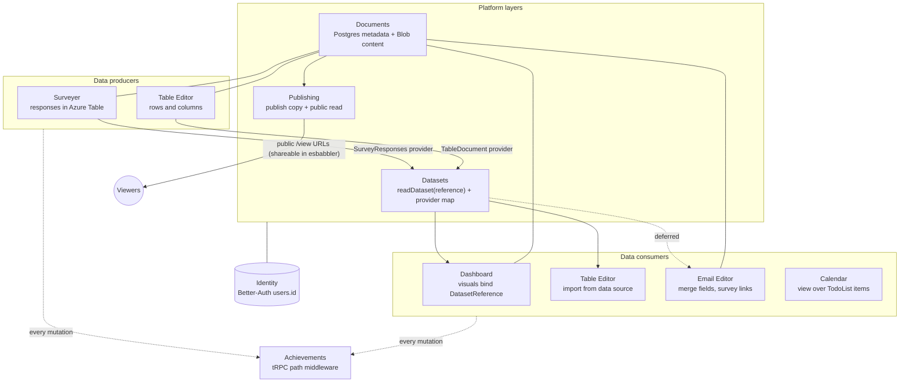

# Platform — Cross-Product Layer Model

How Esposter's products link together. Five layers, each generalizing something that already ships — no new infrastructure category is invented. Each non-shipped layer has its own standard doc in this folder; implementation phases and open decisions live in `features/platform/`.

---

## Principle

> Every product is a **document** editor. Documents **expose and consume datasets**. Every mutation is already an **achievement trigger**. Anything publishable gets a **public versioned read**.

New products join the platform by implementing contracts, not by adding services. Games, anime, and the fluid simulator deliberately stay outside (achievements only) — a game save has nothing to gain from naming, sharing, or dataset semantics.

---

## Layer Model

| Layer          | Contract                                                            | Status                                                             |
| -------------- | ------------------------------------------------------------------- | ------------------------------------------------------------------ |
| **Identity**   | `users.id` (Better-Auth) keys every row, blob path, session         | ✅ Shipped — shared by all products                                |
| **Documents**  | Postgres metadata row + content blob → `documents.md`               | 🟡 Survey only; other editors are single-blob-per-user             |
| **Datasets**   | Columns + rows served by providers → `datasets.md`                  | 🔴 Table editor has the shape internally; no cross-product serving |
| **Publishing** | Versioned publish copy + public rate-limited read → `publishing.md` | 🟡 Survey only                                                     |
| **Events**     | tRPC mutation path = trigger key (`achievementPlugin`)              | ✅ Shipped — every new procedure is automatically triggerable      |

---

## Diagram

---

## Where Each Product Sits Today

| Product           | Persistence today                                                          | Platform role                                          |
| ----------------- | -------------------------------------------------------------------------- | ------------------------------------------------------ |
| Surveyer          | Postgres `surveys` + model blob (`SurveyAssets`) + responses (Azure Table) | Document + dataset **producer**; publish pattern donor |
| Table editor      | Single blob per user (`TableEditorAssets`) + localStorage                  | Dataset **producer and consumer**; owns file import    |
| Dashboard         | Single blob per user (`DashboardAssets`) + localStorage                    | Dataset **consumer** (visual binding)                  |
| Email editor      | Single blob per user (`EmailEditorAssets`), auth-only                      | Consumer (merge fields — later phase)                  |
| Webpage editor    | Single blob per user (`WebpageEditorAssets`), auth-only                    | Documents + publishing only                            |
| Flowchart editor  | Single blob per user (`FlowchartEditorAssets`) + localStorage              | Documents + publishing only                            |
| Calendar          | None — reads table editor's TodoList store                                 | Existing proof of cross-product consumption            |
| Posts             | Postgres `posts`/`likes`                                                   | Already relational; document embeds deferred           |
| Esbabbler         | Azure Table messages + Postgres rooms                                      | Distribution channel for published links               |
| Achievements      | Postgres `achievements`/`userAchievements`                                 | The events layer itself                                |
| Games/anime/fluid | Blob save state or none                                                    | Outside the platform (achievements only)               |

Single-blob products all use the same factories: `useSave` / `useSaveToLocalStorage` (client), `createReadBlobStateProcedure` / `createSaveBlobStateProcedure` (server), blob key `${userId}/save`. The documents standard replaces this one shared pattern in one place — that is why the migration is tractable.

---

## Feasibility

Everything is TypeScript + already-installed OSS: SurveyJS (authoring/response), GrapesJS (email/webpage), mathjs (computed columns), SheetJS/CSV parsing (import), FullCalendar, existing chart stack. Phases 1–4 of the roadmap require **zero new dependencies and zero new Azure services** — only new Postgres tables, tRPC procedures, and reuse of existing blob containers. The only capability that needs new infrastructure is actually sending email (deferred with trigger in `features/platform/deferred/`).
