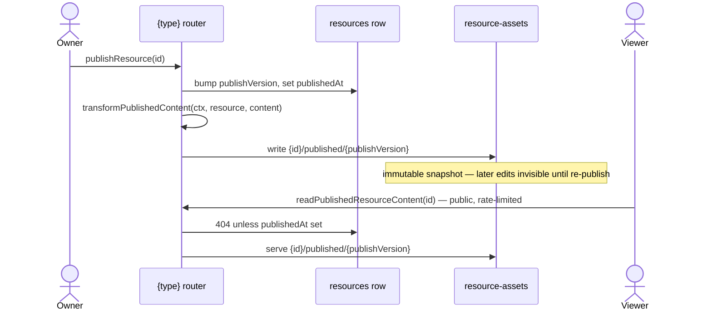

# Publishing

The **Publishable capability** (`architecture/resources.md`): the standard for making a resource publicly shareable — a versioned publish copy plus a public, rate-limited, read-only route. Whenever a product needs "share this with people who aren't logged in", it opts into this capability — never ad-hoc public reads of working data.

Adopters: Dashboard, Survey, Webpage. A type opts in by declaring `publishable: true` in `ResourceDefinitionMap`; the derived `PublishableResourceType` union then _requires_ it to provide a view component and _grants_ it the publish procedures — a non-publishable type has no publish endpoints at the type level.

---

## Mechanism

- **Publish = snapshot copy.** `publishResource` copies the content blob to `{id}/published/{publishVersion}`, bumps `publishVersion`, sets `publishedAt`. Edits after publish are invisible until re-publish — that is the feature (a stable public artifact), not a limitation.
- **Public reads serve only the publish copy**, never the working copy, and are rate-limited with no auth. An unpublished resource 404s publicly.
- **Unpublish** deletes the publish blobs and clears `publishedAt`; the public URL 404s.

| Procedure                      | Auth                 | Purpose                                   |
| ------------------------------ | -------------------- | ----------------------------------------- |
| `publishResource`              | owner                | snapshot copy + version bump              |
| `unpublishResource`            | owner                | delete publish blobs, clear `publishedAt` |
| `readPublishedResourceContent` | public, rate-limited | serve the publish copy                    |

Two hooks on `createResourceProcedures` support publishing needs:

- `transformPublishedContent(ctx, resource, content)` — rewrite content at publish time with the **owner's** authority. Dashboard resolves every bound visual and bakes the result into `VisualDatasetBinding.snapshot` (public viewers render the static snapshot, never resolve references — live viewer data stays deferred, `features/platform/deferred/realtime-dataset-refresh.md`). Survey clones referenced asset blobs into the publish directory and rewrites their URLs.
- `transformReadContent(ctx, resource, content)` — rewrite on owner read (survey refreshes SAS asset URLs).

## Route

One dynamic public page, `pages/view/[type]/[id].vue`, dispatches through `ViewComponentMap: Record<PublishableResourceType, Component>` — a missing renderer is a compile error. The survey respondent experience is simply Survey's published view (an interactive renderer that writes responses). View pages set OG meta tags (`ogTitle`, `ogUrl`) so a published URL unfurls when shared. A published URL is the share unit everywhere: paste it in an esbabbler message, a post, or externally.
