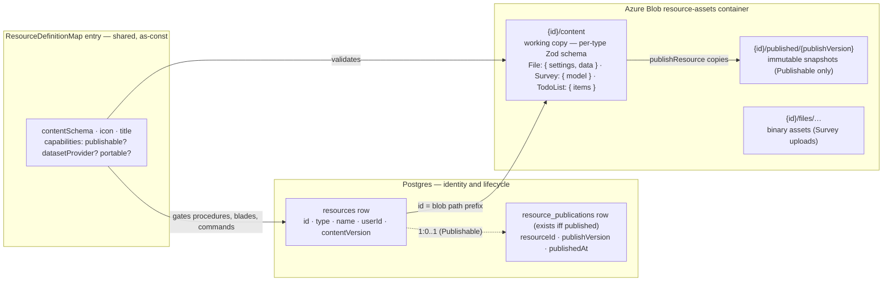
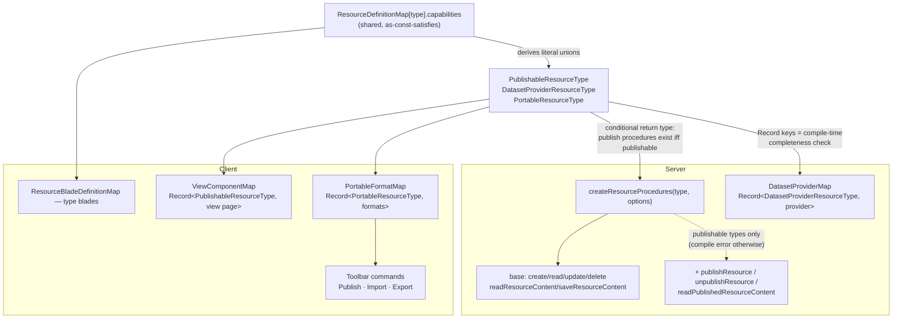

# Resources

The standard for product persistence and product surface. **Everything is a resource**: a file, a survey, a todo list, a dashboard, an email, a webpage, a flowchart. One Postgres table, one blob container, one procedure factory, one explorer UI. Cross-cutting behaviors (publishing, dataset serving, import/export) are opt-in **capabilities**, never baked into the core.

This replaces the documents standard (the `documents` table generalizes into `resources`, absorbing the `surveys` table) — migration is tracked in [`features/platform/roadmap.md`](../features/platform/roadmap.md). Single-blob-per-user state (`useSave` + `createRead/SaveBlobStateProcedure`, blob `${userId}/save`) remains only for genuinely one-per-user saves: clicker and dungeons.

---

## Anatomy

A resource is three things: an identity row (Postgres), a content blob (Azure Blob), and a definition (shared code).



**Settings vs data is a UX separation, not a storage separation.** A resource's parse settings and its actual data are distinct sections of one content blob, edited in distinct blades, saved through one procedure with one `contentVersion`. Never split one artifact across two write paths.

---

## Schema

Drizzle table `resources` in `packages/db-schema` — pure identity + content lifecycle:

| Column           | Type                   | Notes                                                        |
| ---------------- | ---------------------- | ------------------------------------------------------------ |
| `id`             | uuid PK                | becomes the blob path prefix                                 |
| `type`           | `ResourceType` pg enum | Dashboard, Email, File, Flowchart, Survey, TodoList, Webpage |
| `name`           | text + length check    | `createNameSchema` pattern                                   |
| `userId`         | FK → users, cascade    | owner; resources are single-owner                            |
| `contentVersion` | integer                | optimistic concurrency on content saves                      |

Publish state is **normalized into its own table**, `resource_publications` — a row exists iff the resource is currently published. Publishing is a capability, not a base attribute, so `publishedAt`/`publishVersion` do not belong on every resource row:

| Column           | Type                             | Notes                                      |
| ---------------- | -------------------------------- | ------------------------------------------ |
| `resourceId`     | uuid PK, FK → resources, cascade | one publication per resource               |
| `publishVersion` | integer, default 1               | keys the immutable published blob snapshot |
| `publishedAt`    | timestamp, default now           | when the current publish happened          |

Created/updated timestamps come from the shared metadata columns on every table. The Publishable capability owns `resource_publications` (`publishing.md`).

Content blobs live in one container, `AzureContainer.ResourceAssets`, keyed by id only (type lives in the row; ids are UUIDs — a type prefix would duplicate authoritative data into path strings):

```text
{id}/content                      working copy (JSON, validated by the type's content schema)
{id}/published/{publishVersion}   publish snapshots (Publishable only)
{id}/files/…                      type-owned binary assets (e.g. Survey uploads)
```

Ownership is enforced through the Postgres row, never inferred from the blob path. Deleting a resource deletes the row and the `{id}/` blob directory — identically for every type.

Each type owns one content schema (zod interface-first, one export per file) in `packages/app/shared/models/resource/<type>/`. A content schema always produces an **object** (never a bare string/array) so future fields extend without a blob-shape break.

---

## Capabilities

A capability is a cross-cutting mechanism a resource type opts into via its definition. **Admission rule: a capability exists only when ≥2 resource types need the same mechanism, or when the type system must guarantee its absence** (a TodoList must not have publish endpoints). Anything used by exactly one type is type-specific code — promoting a single-consumer mechanism is over-engineering.

| Capability          | Contract                                                                                                | Adopters                                                  |
| ------------------- | ------------------------------------------------------------------------------------------------------- | --------------------------------------------------------- |
| **Publishable**     | versioned snapshot + publish procedures + `/view/[type]/[id]` route + Publish command (`publishing.md`) | Dashboard, Survey, Webpage                                |
| **DatasetProvider** | registers a provider so `dataset.readDataset` resolves the type (`datasets.md`)                         | File, Survey (responses)                                  |
| **Portable**        | import/export via declared formats (serialize/deserialize/accept/mimeType) + Import/Export commands     | File (csv/json/xlsx, both ways), Email (html export only) |

Explicitly **not** capabilities: collecting public responses (Survey-only — stays survey-specific code) and dataset _consumption_ (just calling `dataset.readDataset` from a component; no per-type wiring to declare).

### Declaration — `ResourceDefinitionMap`

One shared as-const-satisfies map is the single source of truth for what a type is:

```typescript
export interface ResourceDefinition<TContentSchema extends z.ZodType = z.ZodType> {
  capabilities: { datasetProvider?: true; portable?: true; publishable?: true };
  contentSchema: TContentSchema;
  icon: string;
  title: string;
}

export const ResourceDefinitionMap = {
  [ResourceType.Dashboard]: {
    capabilities: { publishable: true },
    contentSchema: dashboardSchema,
    icon: "mdi-view-dashboard",
    title: "Dashboard",
  },
  [ResourceType.Email]: {
    capabilities: { portable: true },
    contentSchema: emailSchema,
    icon: "mdi-email",
    title: "Email",
  },
  [ResourceType.File]: {
    capabilities: { datasetProvider: true, portable: true },
    contentSchema: fileResourceSchema,
    icon: "mdi-table",
    title: "File",
  },
  [ResourceType.Flowchart]: {
    capabilities: {},
    contentSchema: flowchartSchema,
    icon: "mdi-chart-timeline-variant",
    title: "Flowchart",
  },
  [ResourceType.Survey]: {
    capabilities: { datasetProvider: true, publishable: true },
    contentSchema: surveySchema,
    icon: "mdi-clipboard-list",
    title: "Survey",
  },
  [ResourceType.TodoList]: {
    capabilities: {},
    contentSchema: todoListSchema,
    icon: "mdi-format-list-checks",
    title: "Todo List",
  },
  [ResourceType.Webpage]: {
    capabilities: { publishable: true },
    contentSchema: webpageSchema,
    icon: "mdi-web",
    title: "Webpage",
  },
} as const satisfies Record<ResourceType, ResourceDefinition>;
```

Derived literal unions turn capability declarations into compile-time enforcement:

```typescript
export type PublishableResourceType = {
  [T in ResourceType]: (typeof ResourceDefinitionMap)[T]["capabilities"] extends { publishable: true } ? T : never;
}[ResourceType]; // = Dashboard | Survey | Webpage
```

(likewise `DatasetProviderResourceType`, `PortableResourceType`). Every capability implementation map is keyed by its derived union — `Record<PublishableResourceType, …>` — so a missing view page or dataset provider is a compile error, and adding one for a non-capable type is also a compile error.

### Wiring



Component wiring cannot live in shared code, so exactly three thin client satellite maps exist: `ResourceBladeDefinitionMap` (type-specific blades), `PortableFormatMap` (import/export formats — an entry with `deserialize` contributes Import, with `serialize` contributes Export), and `ViewComponentMap` (public view renderers). Server-side hooks (publish transform, dataset provider) are passed at router construction because they import server code.

---

## Procedures

One factory, `createResourceProcedures(type, options)` (`server/trpc/procedure/resource/createResourceProcedures.ts`), spread into each type's router. Content schema and container come from `ResourceDefinitionMap[type]` — callers never pass them. Publish procedures are spread **conditionally with a conditional return type**, so a non-publishable type's router has no publish endpoints at the type level (compile error on the client `$trpc` type, 404 on the wire):

```typescript
export const createResourceProcedures = <TType extends ResourceType>(
  type: TType,
  options: ResourceProcedureOptions<TType>, // publish hooks required iff TType extends PublishableResourceType
): BaseResourceProcedures<TType> & (TType extends PublishableResourceType ? PublishResourceProcedures : unknown) => ...
```

| Procedure                                                                | Auth                | Purpose                                          |
| ------------------------------------------------------------------------ | ------------------- | ------------------------------------------------ |
| `readResources`                                                          | owner               | offset-paginated list                            |
| `createResource`                                                         | owner               | metadata row; content blob written on first save |
| `updateResource`                                                         | owner               | rename                                           |
| `deleteResource`                                                         | owner               | row + `{id}/` blob directory                     |
| `readResourceContent` / `saveResourceContent`                            | owner               | blob read/write with `contentVersion` check      |
| `publishResource` / `unpublishResource` / `readPublishedResourceContent` | see `publishing.md` | Publishable types only                           |

Two optional hooks, both proven by Survey: `transformPublishedContent(ctx, resource, content)` (rewrite content at publish time with owner authority — dashboard bakes dataset snapshots, survey clones asset blobs into the publish directory) and `transformReadContent(ctx, resource, content)` (rewrite on owner read — survey refreshes SAS asset URLs).

Ownership middleware: `getOwnerProcedure(type, schema, resourceIdKey)` in `server/trpc/procedure/resource/`, querying `resources`; a typeless overload backs the cross-type `resource.readResource`.

### Router topology

Router-per-type plus one thin cross-type router:

| Router                                                           | Contents                                                                                  |
| ---------------------------------------------------------------- | ----------------------------------------------------------------------------------------- |
| `resource`                                                       | `readResource` (single row by id, cross-type), `readResources` (explorer list, all types) |
| `file`, `todoList`, `dashboard`, `email`, `webpage`, `flowchart` | `createResourceProcedures(type, …)`                                                       |
| `survey`                                                         | factory + type-specific procedures (responses, SAS files)                                 |

Router-per-type is load-bearing, not cosmetic: achievement `triggerPath`s key off the literal tRPC path (`"flowchart.saveResourceContent"`), and type-specific procedures need a home.

---

## Client

- **Explorer** (`/resources`) is an Azure-portal-faithful shell: a **Home** landing (search + quick-create tiles + recent resources), a full list at `/resources/all`, and a dedicated create flow (`/resources/create` gallery → `/resources/create/[type]` form). All three read `resource.readResources` directly (different sort/limit/filter) — a server-paginated table needs no composable. Full UX in [`features/platform/specs/resource-explorer.md`](../features/platform/specs/resource-explorer.md).
- **`useResource(id)`** (`app/composables/resource/useResource.ts`) — loads the row (`resource.readResource`) + typed content (`{type}.readResourceContent`), exposes `save` (optimistic `contentVersion`), `rename`, `remove`, and capability actions (`publish`/`unpublish` gated by `PublishableResourceType`).
- Resource pages are auth-gated. There is no unauthenticated/localStorage editing path — one persistence mechanism, not two ([`deferred/unauth-local-resources.md`](../features/platform/deferred/unauth-local-resources.md)).

The explorer UX shell (list, blade page, Overview, toolbar commands) is product surface, not a repo-wide mechanism — it is specified in [`features/platform/specs/resource-explorer.md`](../features/platform/specs/resource-explorer.md).
