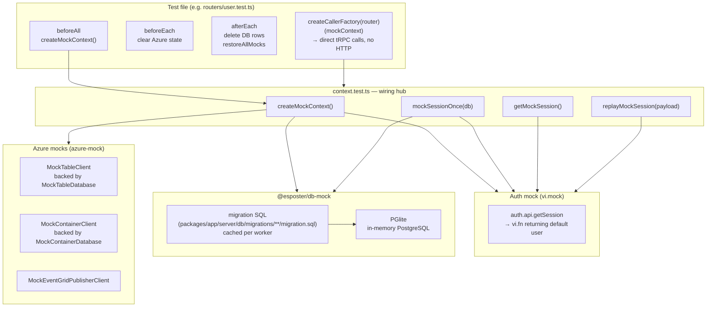

# Server-Side Testing — Architecture

How tRPC router tests wire up an in-memory database, mocked Azure services, and a controlled auth session so procedures can be called directly without HTTP or real cloud resources.

---

## Overview



---

## Components

### 1. `@esposter/db-mock` — In-Memory PostgreSQL

`createMockDb()` in `packages/db-mock/src/createMockDb.ts`:

1. Creates a fresh `PGlite` instance (WebAssembly PostgreSQL, runs in-process).
2. Manually creates the `message` schema (`CREATE SCHEMA "message"`).
3. Calls `generateDrizzleJson({})` (empty baseline) and `generateDrizzleJson(schema)` (current schema) from `drizzle-kit/api-postgres` to produce snapshot JSON.
4. Calls `generateMigration(previousJson, currentJson)` to compute the minimal SQL diff from empty → current schema.
5. Applies each statement to PGlite via `db.execute`.
6. Returns the drizzle-orm `db` instance cast to `PostgresJsDatabase<typeof relations>`.

**Why PGlite instead of a real PostgreSQL?** No external process, no port, no cleanup — each test suite gets an isolated in-memory database that vanishes when the worker exits.

**Why `generateMigration` instead of applying the historical migration files?** `generateMigration` produces the minimal SQL to reach the current schema state from scratch, keeping the statement count small and staying in sync with the live schema automatically. The hookTimeout in `getVitestConfiguration` is set to 60 s to accommodate the schema introspection time under parallel test load.

### 2. `azure-mock` — In-Memory Azure Services

`packages/azure-mock` ships three mock implementations:

| Mock class                     | Replaces                                  | In-memory store                        |
| ------------------------------ | ----------------------------------------- | -------------------------------------- |
| `MockTableClient`              | `CustomTableClient` (Azure Table Storage) | `MockTableDatabase` (static `Map`)     |
| `MockContainerClient`          | `BlockBlobClient` (Azure Blob Storage)    | `MockContainerDatabase` (static `Map`) |
| `MockEventGridPublisherClient` | `EventGridPublisherClient`                | none (fire-and-forget no-op)           |

The static maps persist across calls within a test run. Clear them in `afterEach`:

```ts
afterEach(() => {
  MockContainerDatabase.clear();
  MockTableDatabase.clear();
});
```

### 3. `context.test.ts` — Wiring Hub

`packages/app/server/trpc/context.test.ts` is the central test utility file. It:

- Installs `vi.mock` for all Azure composables and auth before any test runs.
- Exports helpers consumed by every tRPC router test.

**`createMockContext()`** — builds a full `Context`:

```
PGlite DB  +  mocked Azure clients  +  mocked auth  →  Context
```

The default user (base user) is inserted into PGlite and always available via `getMockSession()`. This user becomes the owner for all rooms created in tests.

**Session helpers:**

| Helper                       | What it does                                                                                                                                                           |
| ---------------------------- | ---------------------------------------------------------------------------------------------------------------------------------------------------------------------- |
| `getMockSession()`           | Returns the current queued session (or default). `user.id` is stable; `session.id` is a new UUID each call.                                                            |
| `mockSessionOnce(db, user?)` | Inserts a new test user into PGlite (if no `user` given) and queues their session for the **next** API call only. After that call the default (owner) session resumes. |
| `replayMockSession(payload)` | Re-queues an existing session payload without inserting a new user. Use when the same non-owner user must make multiple sequential calls.                              |

### 4. tRPC Caller

Tests call procedures directly without HTTP:

```ts
const caller = createCallerFactory(userRouter)(mockContext);
await caller.readStatuses([userId]);
```

`createCallerFactory` (from `@@/server/trpc`) returns a factory that binds a `Context` to a router, producing a callable object that matches the router's procedure signatures.

---

## Test Lifecycle

```
beforeAll
  └─ createMockContext()     ← one DB + auth + Azure mocks for the whole suite
  └─ createCallerFactory()   ← bind router to context

beforeEach
  └─ MockContainerDatabase.clear()
  └─ MockTableDatabase.clear()

[ test body ]
  └─ mockSessionOnce(db)     ← when a non-owner user is needed
  └─ caller.someProc(input)

afterEach
  └─ db.delete(affectedTable)
  └─ vi.restoreAllMocks()    ← restores spy implementations + clears call history
```

Prefer `afterEach` for cleanup over `beforeEach` so leaked state from a failing test remains visible in the output.

---

## File Map

| File                                                                                  | Role                                                                     |
| ------------------------------------------------------------------------------------- | ------------------------------------------------------------------------ |
| `packages/db-mock/src/createMockDb.ts`                                                | PGlite setup + migration application                                     |
| `packages/azure-mock/src/`                                                            | `MockTableClient`, `MockContainerClient`, `MockEventGridPublisherClient` |
| `packages/app/server/trpc/context.test.ts`                                            | `createMockContext`, session helpers, `vi.mock` wiring                   |
| `packages/app/server/composables/azure/table/useTableClient.test.ts`                  | `useTableClientMock` export                                              |
| `packages/app/server/composables/azure/container/useContainerClient.test.ts`          | `useContainerClientMock` export                                          |
| `packages/app/server/composables/azure/eventGrid/useEventGridPublisherClient.test.ts` | `useEventGridPublisherClientMock` export                                 |
| `packages/app/server/composables/azure/queue/useQueueClient.test.ts`                  | `useQueueClient` mock export                                             |

---

## Adding a New Router Test

1. Add `// @vitest-environment nuxt` as the first line (required for tRPC router tests).
2. Import `createMockContext`, session helpers, and your router from their canonical locations.
3. Follow the `beforeAll → createMockContext → createCallerFactory` pattern.
4. Use the base user (from `getMockSession()`) as the room/resource owner.
5. Use `mockSessionOnce(db)` only when a non-owner perspective is needed.
6. Clean up DB rows in `afterEach` (not `beforeEach`).
