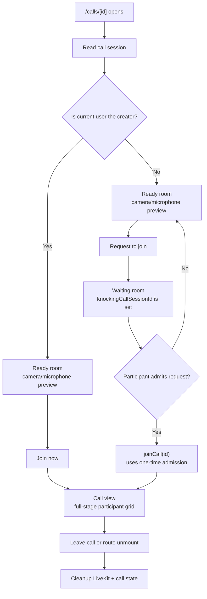

# Call View UI — Standalone Call Page & Reusable Call Component

Full-screen call experience for `/calls/[id]`, with `/calls` as the standalone call lobby/start page. Components are shared with the inline room call view.

---

## Layout

### Current — Audio, camera, and screenshare

```text
┌─────────────────────────────────────────────────────────┐  bg-background, full available view
│                                                         │
│  ┌───────────────────────────────────────────────────┐  │  ← StyledCard stage
│  │  ┌──────────────┐  ┌──────────────┐ ┌──────────┐ │  │     responsive tile grid
│  │  │              │  │              │ │          │ │  │
│  │  │    Avatar    │  │    Video     │ │  Avatar  │ │  │
│  │              │  │              │  │              │  │
│  │  Name 🔇     │  │  Name ◉     │  │  Name        │  │  ← speaking ring (◉ animated green outline)
│  └───────────────────────────────────────────────────┘  │
│                                                         │
│         ┌────────────────────────────────┐              │  ← absolute bottom center
│         │   🎤    │    🎧    │    📞     │              │    StyledCard pill
│         └────────────────────────────────┘              │
└─────────────────────────────────────────────────────────┘
```

Grid tile: theme-backed `StyledCard`. Camera stream renders when available; otherwise the avatar is centered. Name + badges sit bottom-left.

Grid distributes by participant count while taking the full stage: 1 participant uses one full-stage column, 2 participants use up to two columns, and 3+ participants use the wider responsive grid. Do not reserve a side panel for people in the default view.

### Camera tracks

Same `CallView` — replace avatar fallback with `<video>` element when camera track is available.

### Screenshare

Switch `CallView` to presenter layout: screenshare fills the main stage, participant tiles become a secondary grid strip below the share. See `specs/screenshare.md`.

### Prejoin / ready room

Every standalone call visitor sees prejoin before entering the call. The creator gets a **Join now** action that directly calls `joinCall(id)`; non-creators get **Request to join** and enter the waiting room until admitted. Do not auto-join the creator on page mount, because prejoin is where users verify microphone/camera state.

The outer container is `flex-col` on mobile and `lg:flex-row`, with two columns: a `flex-1` left column (camera preview above the media controls) and a `shrink-0` right column (the side card above an invisible spacer):

```text
┌──────────────────────────────────────┐ ┌────────────┐
│                                      │ │ Ready to   │  ← StyledCard, flex-1: its column
│          Camera preview              │ │ join?      │    mirrors the left one, so the card
│          (flex-1, fills w + h)       │ │ hint line  │    fills the same height as the
│                                      │ │ [ Join ]   │    preview (not preview + controls)
├──────────────────────────────────────┤ ├────────────┤
│            🎤  📷                     │ │ (invisible │  ← controls centered under the
│        (centered under preview)      │ │  spacer)   │    preview; spacer matches their height
└──────────────────────────────────────┘ └────────────┘
```

The camera preview is the hero: the `flex-1` left column fills all remaining width and stretches to full height, and the preview's own `flex-1` fills that height above the media controls. The controls sit in the left column, so `justify-center` centers them **under the preview**, never the full width. The right column mirrors that structure — the card is `flex-1` and beneath it sits a plain spacer whose height is the media controls' measured height (`useElementSize` on the real controls via a template ref) — so the card lines up with the preview's height exactly, not the preview + controls. The column is `shrink-0`, so the card keeps its intrinsic content width. Use no manual widths/heights. Do not duplicate microphone/camera state as text rows in the card; the toggle buttons already convey it through icon and error colour.



---

## Component Tree

```text
pages/calls/index.vue                      call lobby/start page
pages/calls/[id].vue                       fullscreen call route
  └── Call/View.vue                        fills h-screen, reads from store
        ├── Call/Participant/Tile.vue       one tile per participant
        ├── Call/ScreenShare/Stage.vue      presenter view when a screen is shared
        ├── Call/InviteCard.vue             bottom-left share-link panel
        ├── Call/JoinNotice/Index.vue       join notice / knocker queue
        └── Call/Control/Bar.vue            bottom-center overlaid controls

Message/Content/Index.vue
  └── Call/Panel/Index.vue                 compact inline room call entry + fullscreen dialog
```

---

## Components

### `Call/View.vue`

- Theme-backed (`bg-background`) full-size flex column with no decorative header
- Participant grid: full-stage responsive CSS grid; do not add a separate people list in the normal view
- Presenter layout when screenshare is active: `ScreenShareStage` plus horizontal participant strip
- Reads connection/session state from the root call store, media streams from `call/media`, and participant/speaking state from `call/participant`
- `CallControlBar` stays at the bottom of the call surface

### `Call/Participant/Tile.vue`

Props: `participant: CallParticipant`, `isSelf: boolean`, `isSpeaking: boolean`, `isDeafened: boolean`, `isScreenSharing: boolean`, `videoStream?: MediaStream`

- Theme-backed `StyledCard` tile, rounded corners
- Circular `StyledAvatar` centered (size 96px)
- Speaking ring: animated green `outline` when `isSpeaking`
- Bottom-left: name label + mute badge (`mdi-microphone-off` when `participant.isMuted`)
- Raise-hand badge (`mdi-hand-back-right`) when `participant.isHandRaised`; shown on the tile regardless of who raised it
- Screenshare badge (`mdi-monitor-share`) when the participant is presenting
- Self-only deafened badge (`mdi-headphones-off` when `isDeafened`)

### `Call/Control/Bar.vue`

- Centered bottom row, `StyledCard` pill
- Composes single-purpose controls directly: grouped mic + up-caret audio settings, grouped camera + up-caret video settings/backgrounds, deafen, raise hand, screenshare, leave
- Raise hand button (`mdi-hand-back-right`) toggles `isHandRaised` via `callStore.toggleHandRaised()`; highlighted when active
- Moderators (users with `MuteMembers` permission) see a "Lower Hand" option in each participant's action menu when that participant's hand is raised
- Video backgrounds are starter image presets applied through LiveKit track processors; selecting a preset turns the camera on, and turning the camera off resets the processor/background to none

---

## Data Flow

### Id join path

```text
/calls/[id]
  → useCallIdSubscribables(id)                validates call and wires joined/knocking subscriptions
    → useCallJoinedSubscribables()            subscribes when activeCallSessionId is set
    → useCallKnockingSubscribables(id)        subscribes when knockingCallSessionId is set
    → prejoin                                creator can join directly; guests can request to join
    → store.joinCall(id)                      creator/admitted knockers join from explicit user action
      → $trpc.roomCall.joinCall.mutate({ id })
      → LiveKit room.connect(livekitUrl, livekitToken)
      → LiveKit applies microphone/camera preferences from call/knocker.ts
      → activeCallSessionId.value = callSessionId
      → setParticipants(callSessionId, participants)
      → return callSessionId
    → subscribe onJoinCall / onLeaveCall / onHandRaisedChanged / onSetMute / onVideoChanged (callSessionId)
  → <CallView />                              reads callParticipants from store
```

### Cleanup (page unmount)

```text
onUnmounted in useCallIdSubscribables
  → cancelKnock() if the user is waiting but not joined
  → participantJoin/Leave/MuteChanged/VideoChanged.unsubscribe()
  → knockerAdmitted/KnockerDismissed.unsubscribe()
  → store.leaveCall()
    → $trpc.roomCall.leaveCall.mutate({ callSessionId })
    → disconnect LiveKit room
    → reset activeCallSessionId, isDeafened, isForceMuted, local camera/screenshare/background state
```

This differs intentionally from room navigation cleanup. `/calls/[id]` is a dedicated call surface, so leaving the page means leaving the call. A normal room route change is only an observer swap and must not call `store.leaveCall()`.

---

## Differences from Room Call

| Aspect                     | Room call (`useCallSubscribables`)        | Id call (`useCallIdSubscribables`)       |
| -------------------------- | ----------------------------------------- | ---------------------------------------- |
| Entry procedure            | `readCallSessionId({ roomId })` then join | Creator/admitted `joinCall({ id })`      |
| `callRoomId`               | Set (enables admin action room checks)    | Not set (no room membership)             |
| `currentRoomCallSessionId` | Set for the viewed room only              | Not set                                  |
| Component reads            | `roomParticipants` in `CallPanel`         | `callParticipants` in `CallView`         |
| Layout                     | Compact strip inside messages view        | Full-screen (`layout: false`)            |
| Admin moderation actions   | Available (ForceMute, KickFromCall etc.)  | Not available (no room membership check) |
| Route cleanup              | Unsubscribe viewed-room observers only    | Unsubscribe observers and leave call     |
