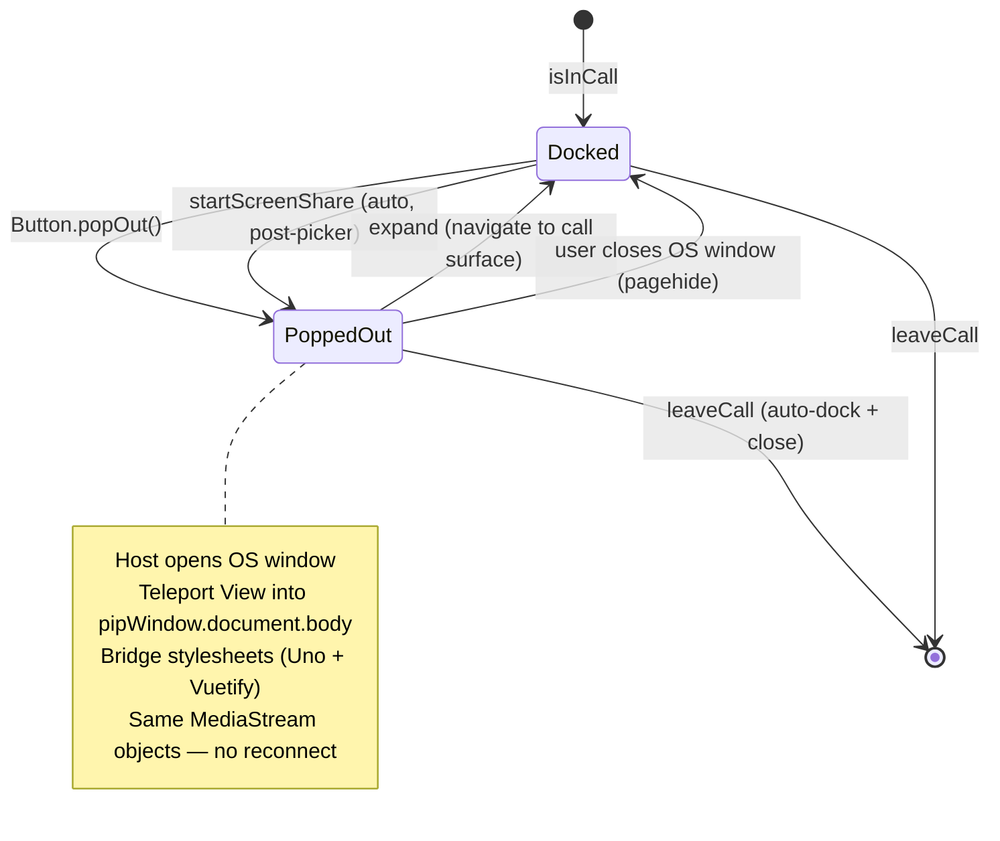
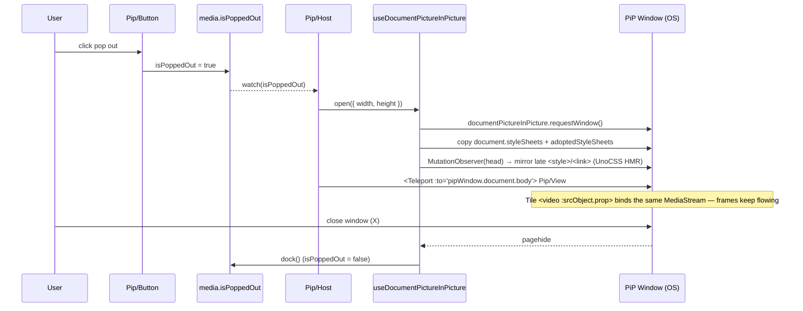

# Calls — Picture-in-Picture (Document PiP)

Pop the active call out into an always-on-top OS window (Google Meet / Discord style) so the user can keep talking and watching video while browsing the rest of the app or another tab.

## Overview

When the user is in a call (`callStore.isInCall`) they can **pop out** a compact, live call view into a real OS-level Picture-in-Picture window using the [Document Picture-in-Picture API](https://developer.chrome.com/docs/web-platform/document-picture-in-picture). Unlike native `<video>` PiP (one `<video>` element, no controls), Document PiP renders arbitrary DOM, so the popped-out window mirrors the full call stage — **shared-screen + side participant tiles** (or the participant grid when nobody is presenting) via the shared `Call/Stage.vue`, a **presenter header** (`{name} is presenting`) when a screen is shared, **and** a compact control bar (mute / camera / screenshare / deafen / raise-hand / expand / leave).

While popped out, the main page still owns the call: `Call/View.vue` swaps the stage for `Pip/Placeholder.vue` (the "call is in a mini player" notice) but **keeps rendering the full `Call/Control/Bar.vue`**, so every primary control stays usable from the placeholder page (Google-Meet parity).

This is a **pure client-side** feature: no DB changes, no tRPC procedures, no new infrastructure. The LiveKit `Room` and every `MediaStream` already live in Pinia stores, independent of where the DOM renders — popping out is a **DOM relocation, not a media reconnection**. It extends the existing "persistent call UI" boundary (`activeCallSessionId` survives navigation; see [`call.md`](call.md) → _Call Lifetime Boundary_).

## Browser Support

| Engine           | Support                           | Behaviour                                                                                           |
| ---------------- | --------------------------------- | --------------------------------------------------------------------------------------------------- |
| Chromium 116+    | `window.documentPictureInPicture` | Full feature                                                                                        |
| Firefox / Safari | Unsupported                       | Pop-out control hidden via feature detection; existing full-page `/calls/[id]` view is the fallback |

Feature-detected with a VueUse-style `isSupported` ref. The control never renders when unsupported — no broken affordance.

## Why not VueUse / native video PiP

- VueUse `14.3.0` ships **no** Document-PiP composable. Its only PiP surface is `useMediaControls().togglePictureInPicture`, which drives the native single-`<video>` API — it cannot show a participant grid or interactive buttons.
- Native video PiP would require compositing all remote streams onto a `<canvas>` + `captureStream()` and would still lose the in-window controls.
- Therefore we hand-roll a small, SSR-safe `useDocumentPictureInPicture` composable in the VueUse return-shape style (`{ isSupported, pipWindow, isActive, open, close }`). `useDraggable` is **not** needed — the OS window is natively movable.

## Components

- `Call/Pip/Host.vue` — **mounted once in the persistent root** (`app.vue`, gated on session), not on any page or feature layout. Owns the `useDocumentPictureInPicture` instance, watches the `isPoppedOut` intent, opens/closes the window, `<Teleport>`s the compact view into it, reverts the intent when `open()` yields no window, and auto-docks when the call ends.
- `Call/Stage.vue` — **shared** call stage (presenter layout): screen-share video + side participant tiles when someone is presenting, else the participant grid. An `isDense` prop tightens padding / tile size for the small PiP window. Rendered by both `Call/View.vue` (full) and `Call/Pip/View.vue` (`isDense`), so the two surfaces never diverge.
- `Call/Pip/View.vue` — compact call surface rendered **inside** the PiP window: a presenter header (`{presenterName} is presenting`, shown only while a screen is shared) + the shared `Call/Stage.vue` (`isDense`) + a trimmed control row. Presenter name comes from the shared `useCallParticipantTiles` composable.
- `Call/Pip/Placeholder.vue` — shown in the **main** page (not the PiP window) while popped out: the "call is in a mini player" notice + a "bring call back" button. It renders above the always-present `Call/Control/Bar.vue`, so the placeholder page keeps the full control bar.
- `Call/Pip/ControlBar.vue` — Meet-style compact controls inside the PiP window, reusing the shared `Control/ActionButton` (which already self-anchors its tooltip in the PiP document): `Audio/MuteButton`, `Camera/Button`, `ScreenShare/Button`, `Audio/DeafenButton`, `Control/HandButton`, an **expand** action (close PiP + return to the call surface), and `Control/LeaveButton`. Laid out as a flat row rather than a `⋯` overflow menu — a Vuetify `v-menu` mis-anchors against the main window inside the PiP document (same root cause as the tooltip fix), so the connection/`HealthButton` (menu-only) is intentionally omitted here.
- `Call/Pip/Button.vue` — the pop-out toggle; hidden when `!isSupported`. Placed in `Call/Control/Bar.vue`.

## Key Files

| File                                                           | Role                                                                                                                                        |
| -------------------------------------------------------------- | ------------------------------------------------------------------------------------------------------------------------------------------- |
| `shared/types/documentPictureInPicture.d.ts`                   | **New.** Ambient types for the Document PiP API (not yet in lib.dom)                                                                        |
| `app/composables/useDocumentPictureInPicture.ts`               | **New.** SSR-safe wrapper over `documentPictureInPicture.requestWindow`; style bridge + cleanup                                             |
| `app/composables/message/room/call/useCallParticipantTiles.ts` | **New.** Shared `{ callParticipantMap, getParticipantTileProps, presenterName, sessionId }` — used by `Call/Stage.vue` and `Pip/View.vue`   |
| `app/components/Message/Content/Call/Stage.vue`                | **New.** Shared presenter/grid stage (`isDense` prop); reused by `Call/View.vue` and `Pip/View.vue`                                         |
| `app/store/message/room/call/media.ts`                         | **Modified.** Adds the `isPoppedOut` flag (reset by `resetCallMedia`) — the single pop-out intent                                           |
| `app/components/Message/Content/Call/Pip/Host.vue`             | **New.** Persistent window owner + teleport target                                                                                          |
| `app/components/Message/Content/Call/Pip/View.vue`             | **New.** Compact tiles + controls rendered in the PiP window                                                                                |
| `app/components/Message/Content/Call/Pip/ControlBar.vue`       | **New.** Mute / camera / screenshare / deafen / raise-hand / expand / leave inside PiP                                                      |
| `app/components/Message/Content/Call/Pip/Button.vue`           | **New.** Feature-detected pop-out toggle                                                                                                    |
| `app/components/Message/Content/Call/View.vue`                 | **Modified.** Renders shared `Call/Stage.vue`; swaps it for `Pip/Placeholder.vue` when popped out but always keeps `Control/Bar.vue`        |
| `app/components/Message/Content/Call/Pip/Placeholder.vue`      | **Modified.** Main-page "mini player" notice; now sits above the always-rendered control bar                                                |
| `app/components/Message/Content/Call/Control/Bar.vue`          | **Modified.** Adds `Call/Pip/Button.vue`                                                                                                    |
| `app/store/message/room/call/index.ts`                         | **Modified.** `toggleScreenShare` sets `isPoppedOut` **after** the picker resolves (auto-pop on share); a cancelled/failed share never pops |
| `app/components/Message/LeftSideBar/StatusBar.vue`             | **Modified.** In-call item now also surfaces **standalone** active calls so a docked call is always reachable                               |
| `app/app.vue`                                                  | **Modified.** Mounts `Call/Pip/Host.vue` so the window survives all route changes                                                           |
| `app/composables/message/room/call/useCallIdSubscribables.ts`  | **Modified.** Skips `leaveCall()` on unmount when `isPoppedOut` (standalone pop-out — see Constraints)                                      |

## Architecture

### Where the window lives

The PiP window's content must outlive any single page **and** any feature layout (the user can pop out on `/calls/[id]` then navigate to `/messages`, which use different layouts). So `Call/Pip/Host.vue` mounts in `app.vue` — the persistent root outside `<NuxtPage>` — gated on session, next to `StyledAlertList` / the achievement snackbar list.

The pop-out **intent** is a single `isPoppedOut` boolean on the existing `call/media.ts` store (reset by `resetCallMedia`, so leaving the call clears it for free). `Pip/Button.vue` toggles it and `toggleScreenShare` (in `call/index.ts`) sets it on share start; `Pip/Host.vue` watches it to open/close the window and writes it back to `false` when the window is closed externally, when the call ends, or when `open()` produced no window. No new store — this matches the existing local call-UI flags (`isDeafened`, `pinnedParticipantId`, …) and the direct-ref-mutation pattern already used for `pinnedParticipantId`.

### Pop-out / dock flow



### Teleport + style bridge



The teleport target is the **element** `pipWindow.document.body` (not a selector string) because Vue must teleport across documents. The component instance, reactivity, and event handlers are unchanged — only the DOM host moves, which is why `<video :srcObject.prop="stream">` in `Tile.vue` keeps playing without re-attaching tracks.

### Style bridge detail

The PiP window opens with an empty document — no Vuetify theme, no UnoCSS utilities, no layout height. On open the composable:

1. Rebuilds every entry of `document.styleSheets` **and** `document.adoptedStyleSheets` into a fresh `<style>` by serialising `styleSheet.cssRules` (`rule.cssText`). This is deliberate: Vuetify's theme stylesheet and UnoCSS's runtime sheet inject rules via the CSSOM (`insertRule`), leaving the `<style>` node's `textContent` **empty** — a naive `cloneNode` would copy nothing. Cross-origin sheets throw on `cssRules` access, so those fall back to a re-linked `<link href>`.
2. Adds the active `v-theme--*` class to the PiP `<body>` (not the whole `.v-application` className, to avoid its flex layout CSS). Vuetify scopes `--v-theme-*` variables to that class, so without it `bg-background` and theme colours resolve to nothing.
3. Sets `<html>`/`<body>` `height: 100%` (and `body` `margin: 0`); the fresh document has no layout height, so `size-full` content would otherwise collapse.
4. Attaches a `MutationObserver` on `document.head` to mirror **late-added** stylesheets (`node.sheet` → rebuild) — covers UnoCSS dev-time runtime injection so PiP-only utility classes are not missing during HMR.

**Tooltips:** Vuetify positions tooltips with JS measured against the **main** window, so a `v-tooltip` on a button inside the PiP window mis-anchors (CSS alone can't override the inline `top/left` Vuetify writes). `Call/Control/ActionButton.vue` wraps the button in a `relative` `.call-pip-tooltip-wrapper`; at mount it detects teleportation (`wrapper.ownerDocument !== document`) and sets the tooltip's `attach` to that wrapper. A small **global** style block then overrides `.call-pip-tooltip-wrapper .v-overlay`/`.v-overlay__content` to anchor the tooltip to the button via CSS. In the main window `attach` stays undefined, the overlay teleports to the global container (outside the wrapper), so the descendant overrides don't match and normal tooltips are unaffected — no conditional classes needed. Because attaching nests the overlay inside the control-bar pill (which is a `v-card` with default `overflow: hidden`), `Call/Pip/ControlBar.vue` sets `overflow-visible="!"` (important — Vuetify's `.v-card` overflow rule wins on order in the bridged PiP document otherwise) on its `StyledCard` so the anchored tooltip is not clipped.

## Component Tree

```text
app.vue
  └── Call/Pip/Host.vue                       persistent; owns the PiP window
        └── <Teleport :to="pipWindow.document.body">
              └── Call/Pip/View.vue            compact call surface (in OS window)
                    ├── presenter header           "{name} is presenting" (when screen shared)
                    ├── Call/Stage.vue (dense)      shared screen + side tiles / grid
                    │     ├── Call/ScreenShare/Stage.vue
                    │     └── Call/Participant/Tile.vue   per participant
                    └── Call/Pip/ControlBar.vue     mute / camera / screenshare / deafen / hand / expand / leave

Call/View.vue                                  full call surface (main page)
  ├── Call/Pip/Placeholder.vue   (when popped out)   "mini player" notice
  ├── Call/Stage.vue             (else)               shared screen + side tiles / grid
  └── Call/Control/Bar.vue       (always)             full controls — present even on the placeholder

Call/Control/Bar.vue      → + Call/Pip/Button.vue   (pop-out toggle, full call view)
LeftSideBar/StatusBar.vue → in-call item now also links standalone calls (reachability)
```

## Constraints / Notes

- **No media reconnection.** Pop-out/dock only relocates DOM. The LiveKit `Room` and `MediaStream`s stay owned by `liveKit.ts` / `call/media.ts`. Never disconnect/reconnect LiveKit on pop-out.
- **Single window.** The browser allows exactly one Document PiP window per document; `open()` is a no-op (or re-focus) when one is already active. `isPoppedOut` is a single boolean.
- **Standalone-call leave interaction.** `/calls/[id]` unmount currently calls `leaveCall()` (the page _is_ the call context — see [`call-view-ui.md`](call-view-ui.md) → _Cleanup_). Popping out a **standalone** call means the user navigates away while staying connected, so `useCallIdSubscribables` **skips `leaveCall()` on unmount when `isPoppedOut`**. Room calls already persist across navigation and need no change. The **expand** action (`Pip/ControlBar.vue`) docks and navigates back to the call surface — `RoutePath.Messages(callRoomId)` for room calls, `RoutePath.Calls(activeCallSessionId)` for standalone.
- **Docked-call reachability.** Once popped out, a standalone call has no on-page surface, so closing the PiP window could otherwise strand the user in an invisible call. `LeftSideBar/StatusBar.vue` therefore surfaces **any** active call (not just room calls) and links to the correct call route, guaranteeing a docked call is always one click away.
- **Auto-dock on leave.** No dedicated watcher — `leaveCall`'s finalizer calls `resetCallMedia`, which clears `isPoppedOut`; the `isPoppedOut` watch then closes the window. The `pipWindow` watcher skips navigation because `isInCall` is already false by then (participant removed before the finalizer runs).
- **Requires a user gesture — and only one activation-consuming call per gesture.** `documentPictureInPicture.requestWindow()` must be called from a transient user activation, **and it consumes that activation** — exactly like `getDisplayMedia()`. So the two **cannot** share a single click: opening the PiP first steals the activation and the screen-share picker then fails (and vice-versa) — this was the original "PiP flashes open then closes, share never starts" bug. The fix relies on the picker itself granting a **fresh** activation: `toggleScreenShare` `await`s `setScreenShare(true)` **first** (the picker consumes the click's activation; the user choosing a screen grants a new one), and only **after** it resolves sets `isPoppedOut = true`, so `requestWindow` runs on the fresh activation. Sanctioned triggers: (1) the explicit pop-out **button** click; (2) **starting a screen share** (post-picker, as above). Re-trigger always requires another gesture.
- **Failed open reverts the intent.** `open()` no-ops on unsupported browsers and swallows `requestWindow` rejections (activation lost, user denied). `Pip/Host` therefore checks `pipWindow` after `await open()`: if no window materialised it resets `isPoppedOut = false`, so the main view never shows a PiP placeholder for a call that didn't actually pop out. A cancelled/failed share never reaches the `isPoppedOut = true` line (it throws out of `setScreenShare` first), so the picker-cancelled case needs no extra revert.
- **Shared screen is non-interactive in the PiP window.** Fullscreen isn't worth wiring inside a Document PiP window (the API is unavailable there, and Meet's PiP screen isn't clickable either). So `Pip/View.vue` renders `Call/Stage.vue` with `isDense`, which passes `isInteractive = false` to `ScreenShare/Stage.vue` — no cursor / click / hover-ring affordance. Click-to-fullscreen stays a main-view-only behavior: `Call/View.vue` maps `Stage`'s `fullscreen` event to `requestFullscreen()` on the `callView` root.
- **SSR safety.** Composable guards `import.meta.client` and `"documentPictureInPicture" in window`; `pipWindow` is a `ShallowRef<Window | null>`. Cleanup via `tryOnScopeDispose`.
- **Reuse, don't fork.** `Pip/View.vue` and `Call/View.vue` both render the **same** `Call/Stage.vue` (PiP passes `isDense`), so the presenter/grid layout, screen-share stage, and tile logic live in exactly one place. The PiP control bar is a trimmed subset of `Call/Control/Bar.vue`, not a re-implementation. Never inline a second copy of the stage layout — extend `Call/Stage.vue` (e.g. another size flag) instead.
- **Placeholder keeps the controls.** `Call/View.vue` renders `Control/Bar.vue` unconditionally (outside the popped-out branch), so the main page still exposes mute / camera / screenshare / leave / etc. while the call lives in the PiP window — the placeholder is just a stage swap, not a control loss.
