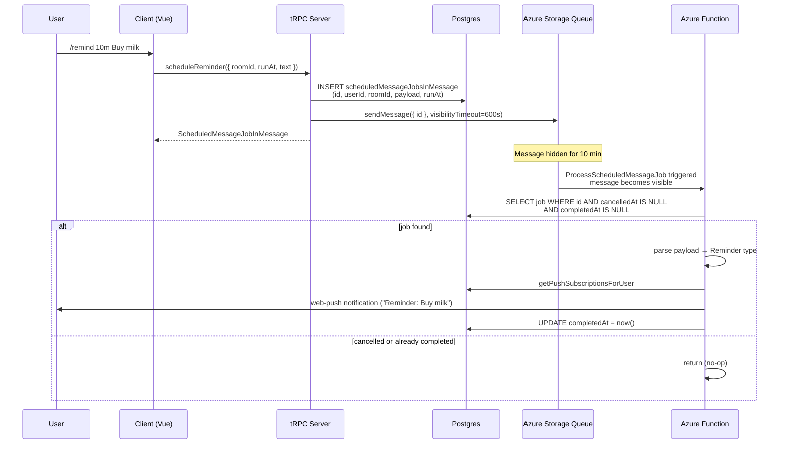
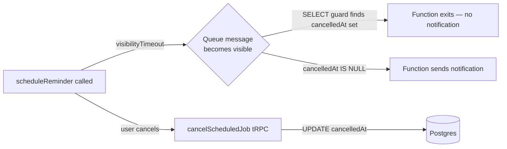
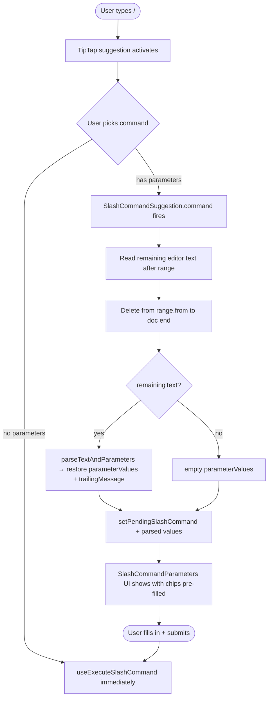
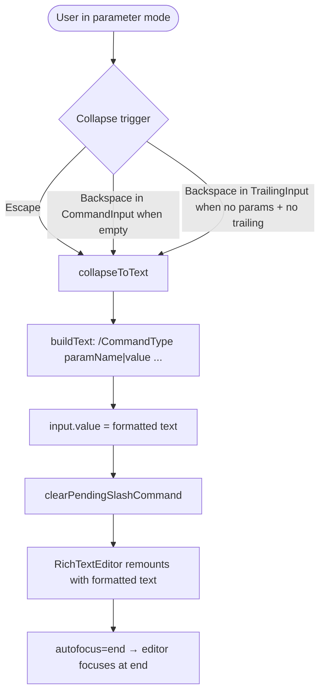

# Esbabbler — Slash Command Architecture

Triggered by `/` in the message input. TipTap suggestion API powers the picker. Definitions in `SlashCommandDefinitionMap`.

---

## Command Categories

| Command     | Type             | Backend                                                                       |
| ----------- | ---------------- | ----------------------------------------------------------------------------- |
| `/flip`     | Immediate client | —                                                                             |
| `/me`       | Immediate client | —                                                                             |
| `/roll`     | Immediate client | —                                                                             |
| `/shrug`    | Immediate client | —                                                                             |
| `/tablefip` | Immediate client | —                                                                             |
| `/unflip`   | Immediate client | —                                                                             |
| `/topic`    | Immediate tRPC   | `room.updateRoom`                                                             |
| `/poll`     | Dialog → tRPC    | `message.createMessage`                                                       |
| `/remind`   | Dialog → tRPC    | `message.scheduledMessageJob.scheduleReminder` → Azure Queue → Azure Function |
| `/schedule` | Dialog → tRPC    | `message.scheduledMessageJob.scheduleMessage` → Azure Queue → Azure Function  |

---

## Folder Structure

```
packages/app/app/
  models/message/slashCommands/
    SlashCommand.ts                    # interface SlashCommand
    SlashCommandParameter.ts           # interface SlashCommandParameter + Zod schema
    SlashCommandParameterError.ts      # parameter validation error type
    SlashCommandParameters.ts          # mapped type: { [P in SlashCommandType]: Record<paramName, string> }
    SlashCommandType.ts                # enum SlashCommandType
    SlashCommandTypeWithoutParameters.ts  # utility type: commands with no parameters

  composables/message/slashCommand/
    useSlashCommandExtension.ts        # TipTap Extension — mirrors useMentionExtension
    useExecuteSlashCommand.ts          # dispatches by SlashCommandType via switch; calls tRPC or builds createMessageInput

  services/message/slashCommands/
    SlashCommandDefinitionMap.ts       # Record<SlashCommandType, SlashCommand> — titles, icons, parameter defs
    SlashCommandSuggestion.ts          # TipTap suggestion config (items, render, command handler)
    constants.ts                       # ID_SEPARATOR, MAX_PARAMETERS, etc.
    parseTextAndParameters.ts          # reconstructs parameterValues from serialised text

  store/message/input/
    slashCommand.ts                    # Pinia store: pendingCommand, parameterValues, trailingMessage
    scheduledMessageJobDialog.ts       # Pinia store: schedule/reminder dialog mode + open state
```

---

## Core Types

### `SlashCommandType.ts`

```typescript
export enum SlashCommandType {
  Flip = "Flip",
  Me = "Me",
  Poll = "Poll",
  Remind = "Remind",
  Roll = "Roll",
  Schedule = "Schedule",
  Shrug = "Shrug",
  TableFlip = "TableFlip",
  Topic = "Topic",
  Unflip = "Unflip",
}
```

### `SlashCommand.ts`

```typescript
export interface SlashCommand extends Description, ItemEntityType<SlashCommandType> {
  icon: string; // MDI icon name
  parameters: SlashCommandParameter[];
  title: string;
}
```

### `SlashCommandParameter.ts`

```typescript
export interface SlashCommandParameter extends Description {
  isRequired: boolean;
  name: string;
}
```

### `SlashCommandDefinitionMap.ts`

```typescript
export const SlashCommandDefinitionMap = {
  [SlashCommandType.Remind]: {
    description: "Set a reminder",
    icon: "mdi-bell-outline",
    parameters: [],
    title: "Remind",
    type: SlashCommandType.Remind,
  },
  [SlashCommandType.Schedule]: {
    description: "Schedule a message",
    icon: "mdi-send-clock",
    parameters: [],
    title: "Schedule",
    type: SlashCommandType.Schedule,
  },
  // ... other commands
} as const satisfies Record<SlashCommandType, SlashCommand>;
```

---

## Execution Model

All execution happens in `useExecuteSlashCommand.ts` via a `switch` on `SlashCommandType`. No `execute()` method on the command definition — the definition is static metadata only (icon, description, parameters).

Two execution paths:

**Client-only** — builds `createMessageInput` inline, passes to `storeSendMessage`:

- `Flip`, `Me`, `Roll`, `Shrug`, `TableFlip`, `Unflip` → set `createMessageInput`, fall through to `storeSendMessage`

**Server call** — calls a tRPC mutation directly, no `createMessageInput`:

- `Topic` → `$trpc.room.updateRoom.mutate({ id: roomId, topic })`
- `Poll` → sets `pollDialogStore.isOpen = true` (dialog handles its own submit)
- `Remind` → `$trpc.message.scheduledMessageJob.scheduleReminder.mutate({ roomId, runAt, text })`

---

## `/remind` — Azure Resource Flow



### Cancellation window



---

## User Interaction Flow

### Typing a slash command



### Collapsing parameters back to text



---

## Text Format for Parameter Serialisation

When collapsing parameter mode back to normal text:

```text
/CommandType parameterName1|value1 parameterName2|value2 trailingMessage
```

- Separator between parameter name and value: `ID_SEPARATOR` (`|`)
- Parameters separated by space
- Last parameter's value is greedy (captures trailing spaces until end)
- `trailingMessage` appended after all parameters
- Re-parsing uses prefix matching per parameter in definition order

`/remind`, `/schedule`, and `/poll` skip inline parameter mode and open dialogs so richer inputs can use normal form controls.

---

## Per-Command Reference

| Command     | Parameters           | Result                                                |
| ----------- | -------------------- | ----------------------------------------------------- |
| `/flip`     | —                    | Posts `🌝 **Heads**` or `🌚 **Tails**`                |
| `/me`       | `message` (required) | Posts `*message*` (italic emphasis)                   |
| `/poll`     | —                    | Opens poll dialog; on submit posts `MessageType.Poll` |
| `/remind`   | —                    | Opens scheduled-job dialog for reminder text + time   |
| `/roll`     | —                    | Posts `🎲 Rolled a **N**` (1–100)                     |
| `/schedule` | —                    | Opens scheduled-job dialog for message text + time    |
| `/shrug`    | `text` (optional)    | Posts `text¯\_(ツ)_/¯`                                |
| `/tablefip` | —                    | Posts `(╯°□°）╯︵ ┻━┻`                                |
| `/topic`    | `text` (optional)    | Calls `room.updateRoom` to set/clear topic            |
| `/unflip`   | —                    | Posts `┬─┬ノ( º _ ºノ)`                               |

---

## What Does Not Change

`sendMessage`, `RichTextEditor`, `useMentionExtension`, mention suggestion — untouched. Client-only commands call `storeSendMessage` after building `createMessageInput`. Server commands call tRPC directly.
