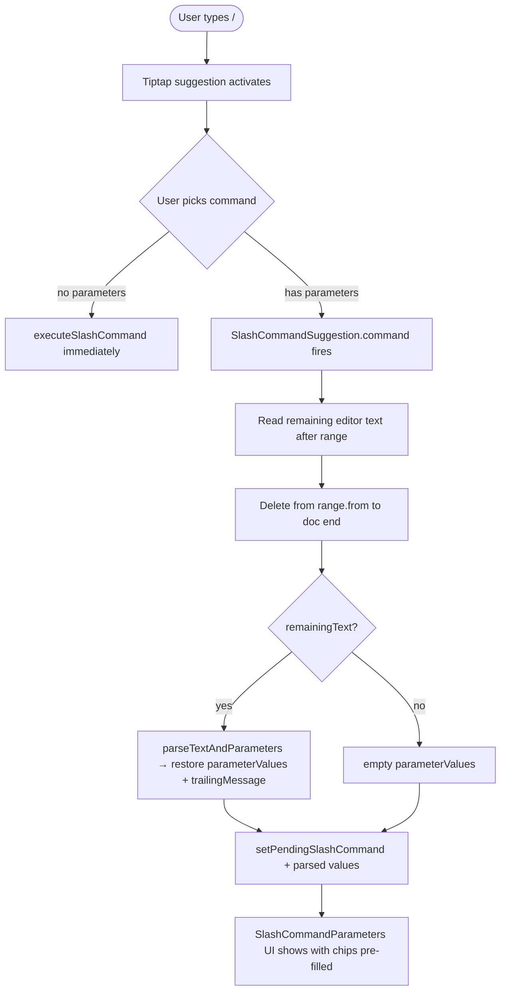
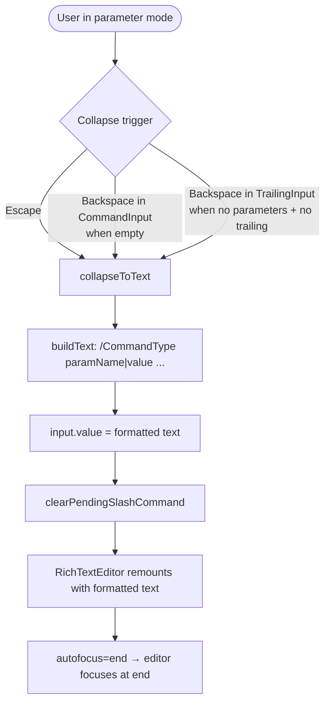
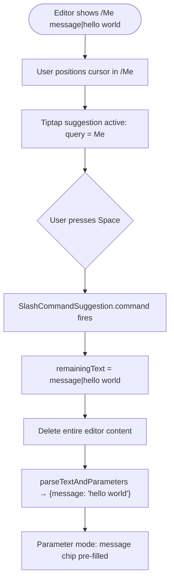

# Esbabbler — Slash Command Architecture

Triggered by `/` in the message input. Tiptap suggestion API powers the picker. Definitions in `SlashCommandDefinitionMap`.

- **Immediate** — execute on selection (e.g. `/roll`)
- **Dialog** — open form dialog before sending (e.g. `/poll`)

## Folder Structure

```
packages/shared/
  models/message/
    slashCommands/
      SlashCommand.ts          # interface SlashCommand + SlashCommandContext
      SlashCommandType.ts       # enum SlashCommandType { Poll, Roll }
    poll/
      PollMessageContent.ts     # interface PollMessageContent { question, options, votes }
  constants/message/
    SlashCommandDefinitionMap.ts  # Record<SlashCommandType, SlashCommand>

packages/app/
  app/
    composables/message/
      useSlashCommandExtension.ts   # Tiptap Extension (mirrors useMentionExtension)
    services/message/
      slashCommands/
        SlashCommandSuggestion.ts   # suggestion config (mirrors suggestion.ts)
        executeRoll.ts              # immediate: posts RNG result as a message
    components/Message/
      SlashCommand/
        Suggestion.vue              # picker dropdown (mirrors Mention suggestion UI)
      Model/Message/Type/
        Poll.vue                    # renders a poll message with vote buttons
      Input/
        PollDialog.vue              # form dialog: question + options input
  server/trpc/routers/message/
    vote.ts                         # createVote / deleteVote mutations
```

## Core Types

### `SlashCommandType.ts`

```typescript
export enum SlashCommandType {
  Poll = "Poll",
  Roll = "Roll",
}
```

### `SlashCommand.ts`

```typescript
export interface SlashCommandContext {
  roomId: string;
}

export interface SlashCommand extends ItemEntityType<SlashCommandType> {
  title: string;
  description: string;
  icon: string; // MDI icon name
  execute(context: SlashCommandContext): Promise<void>;
}
```

### `SlashCommandDefinitionMap.ts`

```typescript
export const SlashCommandDefinitionMap = {
  [SlashCommandType.Poll]: { ... },
  [SlashCommandType.Roll]: { ... },
} as const satisfies Record<SlashCommandType, SlashCommand>;
```

## Poll Message Type

`/poll` → `MessageType.Poll`. Poll data serialised as JSON in the existing `message` field.

### `PollMessageContent.ts`

```typescript
export interface PollOption {
  id: string; // nanoid — stable across edits
  label: string;
}

export interface PollMessageContent {
  question: string;
  options: PollOption[];
}
```

Votes: separate `votes` Azure Table (`roomId` partition, `messageRowKey|userId` row key). One row per user per poll, value = `optionId`.

### New `MessageType`

```typescript
enum MessageType {
  EditRoom = "EditRoom",
  Message = "Message",
  PinMessage = "PinMessage",
  Poll = "Poll", // new
  Webhook = "Webhook",
}
```

## Tiptap Integration

Mirrors `@` mention flow. Trigger: `/`. Items: `Object.values(SlashCommandDefinitionMap)`. On select: `command.execute(context)` then clears input. Pass `useSlashCommandExtension` via `extensions` prop on `Message/Model/Message/Input/Index.vue`.

## Per-Command Specs

### `/roll`

- **Type**: Immediate
- **Execute**: Calls `createMessage` tRPC mutation with `type: MessageType.Message`, `message: "🎲 Rolled a **N**"` where N is generated server-side (RNG in the mutation handler, not client-side)
- **No dialog needed**

### `/poll`

- **Type**: Dialog
- **Execute**: Opens `PollDialog.vue` (a `StyledEditFormDialog`) with:
  - Question field (string, required)
  - Options list (minimum 2, max 10 — add/remove rows, same drag pattern as column reorder)
- **On submit**: Calls `createMessage` with `type: MessageType.Poll`, `message: JSON.stringify(pollContent)`
- **Rendered by**: `Message/Model/Message/Type/Poll.vue` — shows question, option buttons, live vote counts, highlights the user's current vote
- **Vote**: `createVote` / `deleteVote` tRPC mutations in `server/trpc/routers/message/vote.ts`

## User Flow Diagram

### Typing a slash command



### Collapsing parameters back to text



### Re-selecting an existing command from formatted text



## Text Format for Parameter Serialisation

When collapsing parameter mode back to normal text, parameters are serialised as:

```
/CommandType paramName1|value1 paramName2|value2 trailingMessage
```

- Separator between parameter name and value: `ID_SEPARATOR` (`|`)
- Parameters separated by space
- Last parameter's value is greedy (captures trailing spaces and text until next `paramName|` or end)
- `trailingMessage` appended after all parameters

Re-parsing uses prefix matching per parameter in definition order, so multi-word values for the last parameter round-trip correctly.

## What Does Not Change

`sendMessage`, `RichTextEditor`, `suggestion.ts` for mentions — untouched. `execute()` calls `createMessage` directly, bypassing normal send flow.
