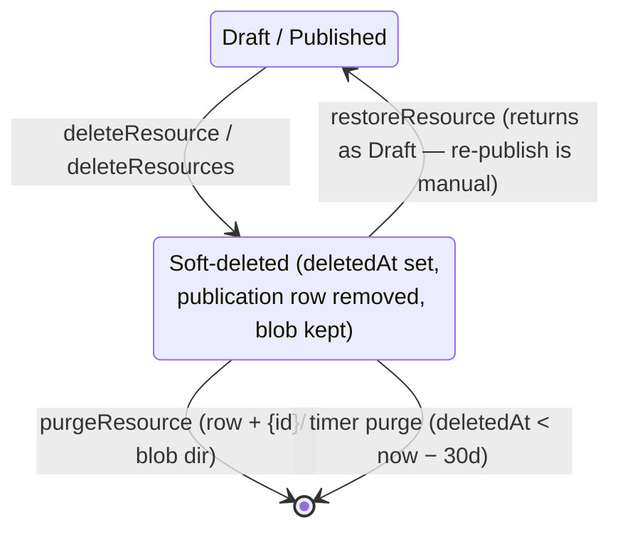

# Platform — Recycle Bin

Soft delete with restore: deleting a resource marks it `deletedAt` instead of destroying it, a Recycle bin surface lists deleted resources for restore or permanent purge, and a timer auto-purges after 30 days.

## Overview

Azure's equivalent is per-service soft delete; for a platform where a File or Survey can hold hours of work behind a single Delete button, an undo window has clear value even with the type-the-name guard. Soft delete is one column: every read path already funnels through `createResourcesWhere`, so exclusion is one predicate.

## Data Model Changes

- `resources.deletedAt`: nullable timestamp. Null = live. Publications are deleted at soft-delete time (a deleted resource must not stay publicly served); the content blob and `{id}/` directory survive until purge.

## Lifecycle

- `createResourcesWhere` gains `isNull(deletedAt)` by default and an internal `deletedOnly` mode for the bin.
- `getOwnerProcedure` rejects soft-deleted ids for normal procedures (a deleted resource's page 404s), restore/purge use the `deletedOnly` lookup.
- Auto-purge: an Azure Functions **timer** (existing function app, the Service-Bus/timer pattern already in place) purging rows where `deletedAt < now − 30d` — batch delete rows + blob dirs, before-persist failures rethrow for retry.

## Procedures / API

| Procedure                                            | Auth                  | Input      | Purpose                                              |
| ---------------------------------------------------- | --------------------- | ---------- | ---------------------------------------------------- |
| `<type>.deleteResource` / `resource.deleteResources` | owner                 | unchanged  | become soft: set `deletedAt`, delete publication row |
| `resource.readDeletedResources`                      | authed                | pagination | the bin list (`deletedOnly`)                         |
| `resource.restoreResource`                           | owner (`deletedOnly`) | `{ id }`   | clear `deletedAt`                                    |
| `resource.purgeResource`                             | owner (`deletedOnly`) | `{ id }`   | hard delete row + blob dir                           |

## Components

- `/resources/recycle-bin` page (linked from the `/all` toolbar overflow): `StyledDataTableServer` of deleted resources (type, name, deleted at, "purges in {n}d"), row commands **Restore** / **Delete forever** (purge keeps the type-the-name guard); empty state
- Delete confirmations reworded: "moves to the Recycle bin for 30 days"
- Post-delete notification gains a **Restore** action ([notifications.md](notifications.md)) — the undo toast

## Key Files

| File                                                              | Role                                             |
| ----------------------------------------------------------------- | ------------------------------------------------ |
| `packages/db-schema/src/schema/resources.ts`                      | `deletedAt` column                               |
| `server/trpc/routers/resource.ts`                                 | bin/restore/purge procedures + `where` predicate |
| `packages/azure-functions/src/functions/purgeDeletedResources.ts` | 30-day timer purge                               |
| `app/pages/resources/recycle-bin.vue`                             | bin page                                         |

## Constraints / Notes

- Publication removal at soft-delete is deliberate — restore returns a **Draft**; silently resurrecting a public URL would be surprising.
- Dataset references to a soft-deleted source fail identically to hard delete (dangling-reference behavior unchanged — [deferred/dangling-dataset-references.md](../deferred/dangling-dataset-references.md)); restore heals them.
- Names are not unique, so restore never conflicts.
- 30 days is a named constant; no per-resource retention setting until someone asks.
