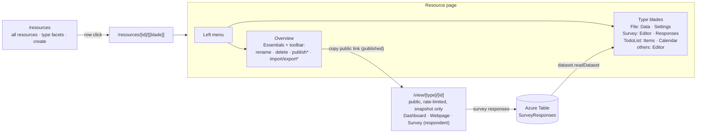

# Platform — Resource Explorer

The single Azure-portal-like UI for every resource: one list, one resource page with capability-aware blades, one public view route. Replaces the documents hub and all per-editor top-level pages.

## Overview

Today each product rolls its own page (`table-editor.vue`, `surveyer/*`, `email-editor.vue`, …) with its own list/picker/header. The explorer collapses them into one shell driven by `ResourceDefinitionMap` (`/architecture/resources.md`): the list shows every resource, the resource page composes Overview + type blades + capability commands. Azure Portal is the UX reference — deliberately literal.

| Azure portal             | Resource Explorer                                         |
| ------------------------ | --------------------------------------------------------- |
| All resources list       | `/resources`                                              |
| Resource menu (left nav) | blade menu on `/resources/[id]/[[blade]]`                 |
| Overview + Essentials    | Overview blade with Essentials panel                      |
| Toolbar commands         | Rename/Delete always; Publish/Import/Export by capability |
| Breadcrumbs              | `AppBreadcrumbs`: Resources → {name} → {blade}            |

## Routes

| Route                       | Page                                        | Purpose                                                                           |
| --------------------------- | ------------------------------------------- | --------------------------------------------------------------------------------- |
| `/resources`                | `pages/resources/index.vue` (auth)          | explorer list                                                                     |
| `/resources/[id]/[[blade]]` | `pages/resources/[id]/[[blade]].vue` (auth) | resource page; omitted blade = Overview; blade validated in route middleware      |
| `/view/[type]/[id]`         | `pages/view/[type]/[id].vue` (public)       | published view, dispatched via `ViewComponentMap` (`/architecture/publishing.md`) |

Blades are path segments (not query params) so they deep-link. `RoutePath.Survey(id)` aliases `View(Survey, id)` so email invite blocks keep working. Nav: `ProductListLinkItems` gets one **Resources** entry replacing the seven editor entries.

## Explorer list — `/resources`

`StyledDataTableServer` over `resource.readResources` (cross-type, owner, offset-paginated):

- Columns: name, type (icon + label from `ResourceDefinitionMap`, facet filter), status (Draft/Published chips), updatedAt.
- Toolbar: **+ Create** (type picker dialog listing `ResourceDefinitionMap` entries with icon + title), search.
- Row click → `/resources/{id}`.
- Empty state: `StyledEmptyState` with a Create action.

## Resource page — `/resources/[id]/[[blade]]`

- **Left menu** (`v-navigation-drawer`): Overview first, then the type's blades from `ResourceBladeDefinitionMap: Record<ResourceType, BladeDefinition[]>`.
- **Overview blade**: Essentials panel (name, type, created/updated, publish status + version, copyable public link when published) + type-specific summary (row/response/item counts).
- **Toolbar commands**: Rename + Delete always; Publish/Unpublish/Copy-link for `PublishableResourceType`; Import/Export for `PortableResourceType` (contributed by `PortableFormatMap` entries — `deserialize` ⇒ Import, `serialize` ⇒ Export).
- **Breadcrumbs** via the shell-cohesion primitives (`StyledPageHeader`, `AppBreadcrumbs`).
- State via `useResource(id)` (`/architecture/resources.md`).

Blades per type (also in `/architecture/platform.md`'s capability matrix):

| Type      | Blades after Overview                                                                         |
| --------- | --------------------------------------------------------------------------------------------- |
| File      | Data (grid editor), Settings (parse configuration form)                                       |
| Survey    | Editor (SurveyJS creator, owns its internal Designer/Preview tabs), Responses (dataset table) |
| TodoList  | Items (todo table), Calendar (FullCalendar over this list)                                    |
| Dashboard | Editor (canvas incl. bind-to-data)                                                            |
| Email     | Editor (GrapesJS)                                                                             |
| Webpage   | Editor (GrapesJS)                                                                             |
| Flowchart | Editor (VueFlow)                                                                              |

## Navigation map

## Components

Blade components live under `app/components/Resource/<Type>/`, absorbing today's editor component trees (`TableEditor/File/*` → `Resource/File/*`, etc.).

- `pages/resources/index.vue` — explorer list
- `pages/resources/[id]/[[blade]].vue` — resource page shell (menu + blade outlet + toolbar)
- `components/Resource/Overview.vue` — generic Overview blade (Essentials + type summary slot)
- `components/Resource/CreateResourceDialog.vue` — type picker + name
- `components/Resource/<Type>/…` — per-type blades registered in `ResourceBladeDefinitionMap`

## Key Files

| File                                                  | Role                                          |
| ----------------------------------------------------- | --------------------------------------------- |
| `app/pages/resources/index.vue`                       | explorer list                                 |
| `app/pages/resources/[id]/[[blade]].vue`              | resource page shell                           |
| `app/pages/view/[type]/[id].vue`                      | unified public view                           |
| `app/services/resource/ResourceBladeDefinitionMap.ts` | type → blade components                       |
| `app/services/resource/PortableFormatMap.ts`          | portable type → formats (Import/Export)       |
| `app/services/resource/ViewComponentMap.ts`           | publishable type → view renderer              |
| `app/composables/resource/useResource.ts`             | row + typed content + save/capability actions |

## Constraints / Notes

- The shell reuses the shell-cohesion primitives ([specs/shell-cohesion.md](shell-cohesion.md)); styling follows the `styling`/`vuetify` skills.
- One list mechanism: the explorer replaces `DocumentPicker`, the surveyer CRUD list, and the documents hub — no per-editor pickers survive.
- Deleted routes/pages: `/documents`, `/table-editor`, `/surveyer`, `/surveyer/[id]`, `/survey/[id]`, `/dashboard`, `/dashboard/editor`, `/email-editor`, `/webpage-editor`, `/flowchart-editor`, `/calendar`, `/view/dashboard/[id]`, `/view/webpage/[id]`.
