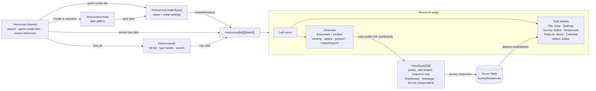
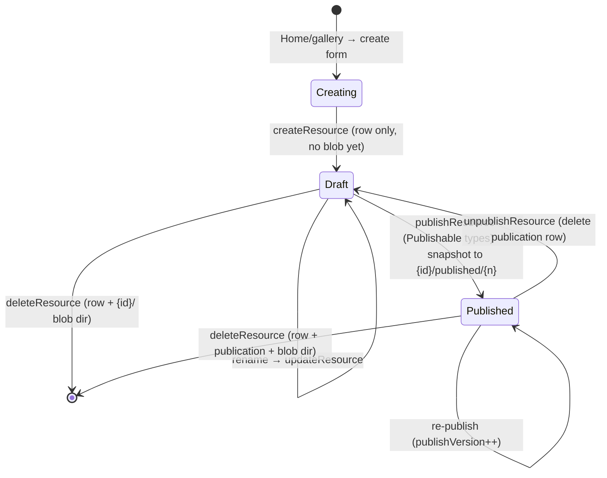
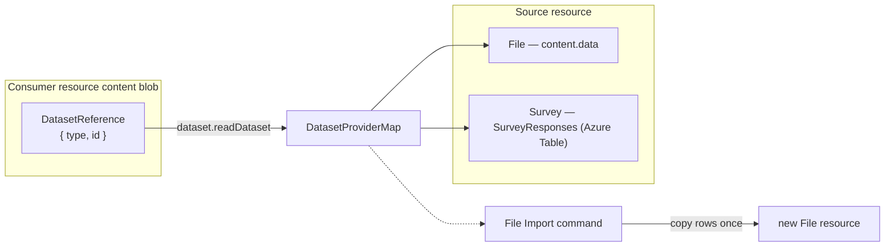

# Platform — Resource Explorer

The single Azure-portal-like UI for every resource: one list, one resource page with capability-aware blades, one public view route. Replaces the documents hub and all per-editor top-level pages.

## Overview

Today each product rolls its own page (`table-editor.vue`, `surveyer/*`, `email-editor.vue`, …) with its own list/picker/header. The explorer collapses them into one shell driven by `ResourceDefinitionMap` (`/architecture/resources.md`): a Home landing (search + recents + create), a full list, a dedicated create flow, and a resource page composing Overview + type blades + capability commands. Azure Portal is the UX reference — deliberately literal: Home mirrors the portal landing, Create mirrors the marketplace (a page per resource type, not a modal).

| Azure portal                    | Resource Explorer                                         |
| ------------------------------- | --------------------------------------------------------- |
| Home (search + recents)         | `/resources`                                              |
| All resources list              | `/resources/all`                                          |
| Create a resource (marketplace) | `/resources/create` gallery → `/resources/create/[type]`  |
| Resource menu (left nav)        | blade menu on `/resources/[id]/[[blade]]`                 |
| Overview + Essentials           | Overview blade with Essentials panel                      |
| Toolbar commands                | Rename/Delete always; Publish/Import/Export by capability |
| Breadcrumbs                     | `AppBreadcrumbs`: Resources → {name} → {blade}            |

## Routes

| Route                       | Page                                        | Purpose                                                                           |
| --------------------------- | ------------------------------------------- | --------------------------------------------------------------------------------- |
| `/resources`                | `pages/resources/index.vue` (auth)          | Home — search + quick-create + recent resources                                   |
| `/resources/all`            | `pages/resources/all.vue` (auth)            | full list (all types, facets, search)                                             |
| `/resources/create`         | `pages/resources/create/index.vue` (auth)   | create gallery — type picker (marketplace)                                        |
| `/resources/create/[type]`  | `pages/resources/create/[type].vue` (auth)  | per-type create form (name + initial settings) → `/resources/[id]`                |
| `/resources/[id]/[[blade]]` | `pages/resources/[id]/[[blade]].vue` (auth) | resource page; omitted blade = Overview; blade validated in route middleware      |
| `/view/[type]/[id]`         | `pages/view/[type]/[id].vue` (public)       | published view, dispatched via `ViewComponentMap` (`/architecture/publishing.md`) |

`all` and `create` are static segments so they win over the dynamic `[id]` sibling. Blades are path segments (not query params) so they deep-link. `RoutePath.Survey(id)` aliases `View(Survey, id)` so email invite blocks keep working. Nav: `ProductListLinkItems` gets one **Resources** entry (landing on Home) replacing the seven editor entries.

## Home — `/resources`

The Azure-portal landing. Not a table — a dashboard of entry points:

- **Search bar** (top): resource search; submitting routes to `/resources/all` pre-filtered by the query.
- **Quick-create tiles**: `ResourceDefinitionMap` entries as icon + title tiles (the portal "Azure services" row) → `/resources/create/[type]`.
- **Create a resource**: primary button → `/resources/create` gallery.
- **Recent resources**: `resource.readResources` sorted by `updatedAt` desc and capped (rows: name, type icon + label, updatedAt); a **See all** link → `/resources/all`. Row click → `/resources/{id}`.
- Empty state (no resources yet): `StyledEmptyState` with a **Create a resource** action.

## All resources — `/resources/all`

`StyledDataTableServer` over `resource.readResources` (cross-type, owner, offset-paginated) — the full list the Home **See all** deep-links to:

- Columns: type (icon + label from `ResourceDefinitionMap`, facet filter), name, createdAt, updatedAt. Publish status is deliberately **not** a list column — it is a capability surfaced per-resource on the Overview blade, not mixed into a cross-type list.
- Toolbar: search (accepts the query forwarded from Home), **Create a resource** → `/resources/create`.
- Row click → `/resources/{id}`.
- Empty state: `StyledEmptyState` with a Create action.

## Create flow — `/resources/create` → `/resources/create/[type]`

Create is a **page per resource type**, mirroring the Azure marketplace + create blade — never a modal:

- **Gallery** (`/resources/create`): tiles for every `ResourceDefinitionMap` entry (icon, title, description). Selecting one routes to `/resources/create/[type]`.
- **Create form** (`/resources/create/[type]`): a `StyledPageHeader`-framed form collecting the name (`createNameSchema`) plus any type-specific initial settings. Submit calls `createResource(type, …)` and routes to the new `/resources/[id]` (Overview blade). The content blob is written on the first save inside the editor blade, not at create time.
- Type-specific initial settings stay minimal — most types are name-only; anything a type genuinely needs up front (rather than editable later in a Settings blade) lives on its create form. Revisit if a real type needs a richer create wizard.

Azure-portal-faithful **blade** experience: clicking a resource opens a per-resource shell — a left blade nav + a content pane for the active blade, framed by the breadcrumb and a resource-level command bar. It reads as a panel layered over the list (breadcrumb `Home › Resource Explorer › {name}`), with a **close (✕)** that returns to `/resources/all`.

- **Left blade nav** (`v-list`, surface panel with an inline-end border): **Overview** first, then **Editor**, then the type's blades from `ResourceBladeDefinitionMap: Record<ResourceType, BladeDefinition[]>`. Each item deep-links to `/resources/[id]/[[blade]]`; the active blade is highlighted.
- **Overview blade**: Essentials panel (type, created/updated). **Publish status + version and the public link render only for `PublishableResourceType`** — a non-publishable resource (Table/Email/Flowchart/TodoList) shows no status row at all. Plus a type-specific summary slot (row/response/item counts).
- **Editor blade**: an Azure "Advanced Tools"-style launch panel — type icon, a one-line description, and an **Open editor →** link. In Phase 2 it deep-links to the type's still-external editor (`ResourceTypeRoutePathMap`); as editors migrate (Phase 3-5) the editor renders inline as the blade content.
- **Command bar** (`StyledPageHeader` `#actions`): Rename + Delete always; Publish/Unpublish for `PublishableResourceType` (`StyledButton`; Delete stays `color="error"`); Import/Export for `PortableResourceType` (contributed by `PortableFormatMap` entries — `deserialize` ⇒ Import, `serialize` ⇒ Export); a trailing close (✕).
- **Breadcrumbs** via the shell-cohesion primitives (`StyledPageHeader`, `AppBreadcrumbs`).
- State via `useResource(id)` (`/architecture/resources.md`).

Blades per type land as each editor migrates off its top-level page (Phase 3-5); until then every resource has the built-in **Overview** + **Editor**(launch) blades. Target per-type blades (also in `/architecture/platform.md`'s capability matrix):

| Type      | Blades after Overview                                                                         |
| --------- | --------------------------------------------------------------------------------------------- |
| File      | Data (grid editor), Settings (parse configuration form)                                       |
| Survey    | Editor (SurveyJS creator, owns its internal Designer/Preview tabs), Responses (dataset table) |
| TodoList  | Items (todo table), Calendar (FullCalendar over this list)                                    |
| Dashboard | Editor (canvas incl. bind-to-data)                                                            |
| Email     | Editor (GrapesJS)                                                                             |
| Webpage   | Editor (GrapesJS)                                                                             |
| Flowchart | Editor (VueFlow)                                                                              |

## Screen layouts

Azure-portal-faithful wireframes for each screen (structure, not pixels — styling per the `styling`/`vuetify` skills).

**Home — `/resources`** (portal landing: search, quick-create, recents)

```text
┌──────────────────────────────────────────────────────────────┐
│  🔍  Search resources…                                         │
├──────────────────────────────────────────────────────────────┤
│  Create a resource                                             │
│  ┌────┐ ┌────┐ ┌────┐ ┌────┐ ┌────┐ ┌────┐ ┌────┐              │
│  │File│ │Surv│ │Todo│ │Dash│ │Mail│ │Web │ │Flow│  quick-create│
│  └────┘ └────┘ └────┘ └────┘ └────┘ └────┘ └────┘   (per type) │
├──────────────────────────────────────────────────────────────┤
│  Recent resources                                  See all →   │
│  ───────────────────────────────────────────────────────────  │
│  📄  Q3 Report        File       2h ago                        │
│  📋  NPS Survey       Survey     yesterday       • Published    │
│  ✅  Launch tasks     TodoList   3d ago                         │
└──────────────────────────────────────────────────────────────┘
```

**All resources — `/resources/all`** (full server-paginated table)

```text
┌──────────────────────────────────────────────────────────────┐
│  Resources                                                     │  breadcrumb
│  🔍 Search        Type ▾              [ + Create a resource ]  │
├──────────────────────────────────────────────────────────────┤
│  Type      Name           Created      Updated                │
│  ───────────────────────────────────────────────────────────  │
│  📄 File   Q3 Report      2d ago       2h ago                 │
│  📊 Dash   Sales board    1w ago       yesterday              │
│  🌐 Web    Landing page   3w ago       3d ago     ‹ 1 2 3 ›   │
└──────────────────────────────────────────────────────────────┘
```

**Create gallery — `/resources/create`** (marketplace: pick a type)

```text
┌──────────────────────────────────────────────────────────────┐
│  Resources › Create                                           │
│  Create a resource                                            │
│  ┌───────────────┐ ┌───────────────┐ ┌───────────────┐        │
│  │ 📄 File       │ │ 📋 Survey     │ │ ✅ Todo List  │        │
│  │ Tabular data  │ │ Collect resp… │ │ Track tasks   │        │
│  └───────────────┘ └───────────────┘ └───────────────┘        │
│  ┌───────────────┐ ┌───────────────┐ ┌───────────────┐        │
│  │ 📊 Dashboard  │ │ ✉ Email       │ │ 🌐 Webpage    │        │
│  └───────────────┘ └───────────────┘ └───────────────┘        │
└──────────────────────────────────────────────────────────────┘
```

**Create form — `/resources/create/[type]`** (name + initial settings)

```text
┌──────────────────────────────────────────────────────────────┐
│  Resources › Create › File                                    │
│  Create File                                                  │
│  Name   [ Q3 Report                              ]            │
│  …type-specific initial settings (usually none)…              │
│                                  [ Cancel ]   [ Create ]      │
└──────────────────────────────────────────────────────────────┘
```

**Resource page — `/resources/[id]/[[blade]]`** (blade nav + command bar + blade outlet, layered over the list)

```text
┌────────────┬─────────────────────────────────────────────────┐
│  Q3 Report │  Resources › Q3 Report                           │  breadcrumb
│            │  [Rename] [Delete]              [Import] [Export] [✕]│  command bar (by capability)
│ ▸ Overview ├─────────────────────────────────────────────────┤
│   Editor   │  Essentials                                      │
│            │   Type      File                                 │
│            │   Created   … ago          Updated  2h ago       │
│            │  ──────────────────────────────────────────────  │  (Status row only for publishable)
│            │  Summary    1,240 rows                           │
└────────────┴─────────────────────────────────────────────────┘
        (Editor blade → Advanced-Tools-style launch panel: “Open editor →”)
```

A **publishable** resource additionally shows a `Status  Draft/Published v{n}` + `Public link` row in Essentials and a `[Publish]` command; a non-publishable one shows neither.

## Navigation map



## Resource lifecycle

Every resource follows one lifecycle regardless of type — the type only decides which blades and capability commands appear. States (Postgres row + blob), driven by the procedures in `/architecture/resources.md`:



**Create → first write.** `createResource` writes only the Postgres identity row; the content blob does not exist until the first `saveResourceContent` inside an editor blade. So a freshly created resource opens on Overview with an empty type summary until edited — no half-written blob to reconcile.

**Update = one write path.** Settings and Data are separate blades but one content blob with one `contentVersion` — never two write paths for one artifact (`/architecture/resources.md`). Optimistic concurrency: a stale `contentVersion` rejects the save.

**Linking to other resources** is the dataset capability (`/architecture/datasets.md`), not a resource-to-resource foreign key. A consumer holds a `DatasetReference` ( `{ type, id }` ) and either **copies** (File import — one-time row copy) or **references** (Dashboard visual / Email merge fields — re-resolved on load via `dataset.readDataset`):



**Delete.** `deleteResource` removes the row, the `resource_publications` row (if any), and the whole `{id}/` blob directory — identical for every type. Because links are stored as bare `DatasetReference` ids (not FKs), deleting a **source** leaves any consumer's stored reference dangling; the consumer re-resolves on load and `dataset.readDataset` fails/returns empty rather than cascading. Referenced published snapshots are unaffected (they baked the data in at publish time). Surfacing a "source no longer available" state on the consumer is a follow-up, not a Phase 2 blocker ([deferred/dangling-dataset-references.md](../deferred/dangling-dataset-references.md)).

## Components

Blade components live under `app/components/Resource/<Type>/`, absorbing today's editor component trees (`TableEditor/File/*` → `Resource/File/*`, etc.).

- `pages/resources/index.vue` — Home (search + quick-create + recents)
- `pages/resources/all.vue` — full list
- `pages/resources/create/index.vue` — create gallery (type picker)
- `pages/resources/create/[type].vue` — per-type create form
- `pages/resources/[id]/[[blade]].vue` — resource page shell (menu + blade outlet + toolbar)
- `components/Resource/Overview.vue` — generic Overview blade (Essentials + type summary slot; status/public-link only when publishable)
- `components/Resource/EditorLaunch.vue` — Editor blade launch panel (icon + description + Open editor link)
- `components/Resource/CreateGallery.vue` — type-picker tiles for the create gallery
- `components/Resource/<Type>/…` — per-type blades registered in `ResourceBladeDefinitionMap`

## Key Files

| File                                                  | Role                                          |
| ----------------------------------------------------- | --------------------------------------------- |
| `app/pages/resources/index.vue`                       | Home (search + quick-create + recents)        |
| `app/pages/resources/all.vue`                         | full list                                     |
| `app/pages/resources/create/index.vue`                | create gallery (type picker)                  |
| `app/pages/resources/create/[type].vue`               | per-type create form                          |
| `app/pages/resources/[id]/[[blade]].vue`              | resource page shell                           |
| `app/pages/view/[type]/[id].vue`                      | unified public view                           |
| `app/services/resource/ResourceBladeDefinitionMap.ts` | type → blade components                       |
| `app/services/resource/PortableFormatMap.ts`          | portable type → formats (Import/Export)       |
| `app/services/resource/ViewComponentMap.ts`           | publishable type → view renderer              |
| `app/composables/resource/useResource.ts`             | row + typed content + save/capability actions |

## Constraints / Notes

- The shell reuses the shell-cohesion primitives ([specs/shell-cohesion.md](shell-cohesion.md)); styling follows the `styling`/`vuetify` skills.
- One list mechanism: the explorer replaces `DocumentPicker`, the surveyer CRUD list, and the documents hub — no per-editor pickers survive. Recents on Home and the full list at `/resources/all` are both `resource.readResources` (different sort/limit), not two data paths.
- One create mechanism: the `/resources/create` gallery + `/resources/create/[type]` form replace every per-editor "new" button and modal. Create is a page (marketplace parity), never a dialog.
- **Editors are pure editors.** The resource lifecycle (create / select / rename / delete / publish) lives only in the Explorer + the resource Overview blade — never in an editor's `StyledPageHeader`. Editor headers keep only editing tools (type select, search, dataset picker, export, add-visual). The shared `ResourcePicker` / `ResourcePublishButton` and the `StyledPageHeader` `#identity` slot were removed with this consolidation; editors save independently (autosave / edit-dialog), so they need no resource controls in-header.
- Deleted routes/pages: `/documents`, `/table-editor`, `/surveyer`, `/surveyer/[id]`, `/survey/[id]`, `/dashboard`, `/dashboard/editor`, `/email-editor`, `/webpage-editor`, `/flowchart-editor`, `/calendar`, `/view/dashboard/[id]`, `/view/webpage/[id]`.
