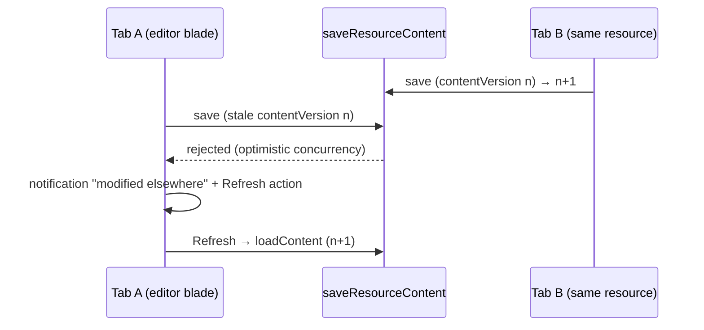

# Platform — Resource Page Parity

Azure command-bar and destructive-operation parity on `/resources/[id]/[[blade]]`: labeled toolbar commands with overflow, Refresh, type-the-name delete confirmation, and a Duplicate command.

## Overview

The portal command bar is a row of icon+label text buttons with group dividers that collapses into a `…` overflow menu when narrow, always includes Refresh, and guards destructive operations by making you type the resource name. Ours is a row of icon-only dialog buttons. This spec upgrades `BladeToolbar`/`BladeActions` in place — same commands, same capability gating, portal presentation.

## Command bar

- **Presentation**: `variant="text"` buttons with `prepend-icon` + label (Rename, Delete, Publish/Unpublish, Import, Export, Refresh), `v-divider vertical` between lifecycle / capability / view groups; Delete keeps `color="error"`.
- **Overflow**: below a container width threshold, trailing commands collapse into a `…` `v-menu` (labels always visible in the menu); the close ✕ never collapses.
- **Refresh**: re-fetches the row + publication via `useResource` (and the active blade's content where the blade exposes a reload). Portal toolbars always have it; ours has no way to re-sync without a full reload.
- **Duplicate**: `resource.duplicateResource` — copies the row as `{name} (copy)` + the content blob; never the publication (a copy starts as Draft). Routes to the new resource's Overview. Capability-independent (every type supports it).

## Destructive-operation guard

`StyledDeleteFormDialog` gains an optional `confirmName` prop: a text field whose value must equal the resource name before Delete enables (Azure's "type the resource name to confirm"). Used by the blade Delete command and by bulk delete on `/all` ([list-filters-and-views.md](list-filters-and-views.md) — there the guard is the selection count, e.g. type `delete 4`).

## Save-conflict surface

A `saveResourceContent` rejected for a stale `contentVersion` currently fails quietly per store. Route the failure into the notifications store ([notifications.md](notifications.md)) as "'{name}' was modified elsewhere — refresh to load the latest", with a Refresh action that re-runs `loadContent`.

## Procedures / API

| Procedure                    | Auth                | Input    | Purpose                                                                  |
| ---------------------------- | ------------------- | -------- | ------------------------------------------------------------------------ |
| `resource.duplicateResource` | `getOwnerProcedure` | `{ id }` | copy row (`{name} (copy)`, fresh id, no publication) + copy content blob |

## Key Files

| File                                         | Role                                                         |
| -------------------------------------------- | ------------------------------------------------------------ |
| `app/components/Resource/BladeActions.vue`   | labeled buttons, dividers, overflow menu, Refresh, Duplicate |
| `app/components/Styled/DeleteFormDialog.vue` | `confirmName` guard prop                                     |
| `app/composables/resource/useResource.ts`    | refresh action, duplicate action, conflict → notification    |

## Constraints / Notes

- Commands stay capability-gated exactly as today — this spec changes presentation and adds Refresh/Duplicate, not the gating model.
- Publish history (list `{id}/published/{n}` snapshots, view/rollback) is a separate roadmap investigation — blob retention across re-publishes must be verified first.
- JSON view / export-template parity is [out of scope](../out-of-scope/json-config-parity.md).
