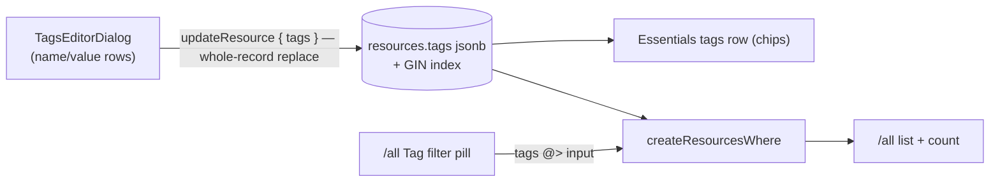

# Platform — Resource Tags

Azure tag parity: name:value pairs on every resource, shown in Essentials, editable in place, filterable on `/all`.

## Overview

Azure tags are `Record<string, string>` metadata attached to any resource, surfaced as chips in Essentials and as a list filter. They are the lightweight organization layer that keeps [resource groups deferred](../deferred/resource-groups.md) — cross-cutting labels without a grouping entity.

## Data Model Changes

- `resources.tags`: `jsonb` `Record<string, string>`, `notNull().default({})`, GIN index for containment queries.
- Zod: `resourceTagsSchema` — record with `MAX_TAGS_COUNT` entries, `MAX_TAG_NAME_LENGTH` / `MAX_TAG_VALUE_LENGTH` (named constants per convention), names non-empty via the `normalizeString` pipe.

## Procedures / API

| Procedure                          | Auth   | Input                             | Purpose                                                        |
| ---------------------------------- | ------ | --------------------------------- | -------------------------------------------------------------- |
| `<type>.updateResource` (factory)  | owner  | + `tags?`                         | replace-whole-record update (Azure semantics)                  |
| `resource.readResources` / `count` | authed | + `tags?: Record<string, string>` | containment filter (`tags @> input`) in `createResourcesWhere` |

## Flow

## Components

- Essentials gains a **Tags** row: `{name}: {value}` chips + an Edit link opening a tag editor dialog (rows of name/value fields, add/remove)
- `/all` filter pill **Tag** ([list-filters-and-views.md](list-filters-and-views.md)): name + optional value; tag chips could later render as an opt-in column via the column chooser

## Key Files

| File                                           | Role                  |
| ---------------------------------------------- | --------------------- |
| `packages/db-schema/src/schema/resources.ts`   | `tags` column + index |
| `app/components/Resource/TagsEditorDialog.vue` | name/value editor     |
| `app/components/Resource/Overview.vue`         | Essentials tags row   |

## Constraints / Notes

- Flat name:value only (faithful to Azure) — no hierarchies, no typed values.
- Free-text tag search inside global search is out of the first cut; the `/all` filter pill is the retrieval path. Revisit alongside `pg_trgm`.
- If tag usage grows into "give me a folder", that is the [resource-groups](../deferred/resource-groups.md) revisit trigger, not more tag features.
