# virrun — Architecture Reference

High-level system map for the virtual runner. Read alongside the specs in [specs/](specs).

---

## System overview

```mermaid
flowchart TB
    subgraph pkg["virrun (one package today; → packages/virrun* later)"]
        cli["virrun -- &lt;cmd&gt; CLI"]
        api["createVirrun()\norchestrator API"]
        cli --> api

        subgraph src["source loaders → working dir"]
            direction LR
            dir["dir"]
            files["files"]
            git["git"]
        end
        api --> src

        api --> pick{"BackendType\nselect"}
        pick -->|Auto / Native| native["Native backend\nspawn on host"]
        pick -->|Vfs · opt-in| vfs["Vfs backend\nin-process node -e / node &lt;file&gt;"]
        pick -->|Os · Phase 2| os["Os backend\nisolated process exec"]
    end

    native --> disk[("REAL disk\n(subprocesses see this)")]
    vfs --> fsp["FsProvider\n→ @platformatic/vfs (reuse)\n→ node:vfs swap"]
    fsp --> vmem[("in-process virtual FS\n(only this process sees it)")]
    os --> sandboxprim["bubblewrap\nLinux direct / Windows WSL2"]
    sandboxprim --> ram[("tmpfs + overlayfs\nRAM FS — every process sees it")]
    os -.-> snap["snapshot + warm-fork\nPhase 3 · CRIU / microVM"]

    classDef planned stroke-dasharray:4 4,opacity:0.75;
    class snap planned;
```

One entrypoint (`createVirrun` / the `virrun -- <cmd>` CLI) resolves a **source** to a working dir, picks an **exec backend**, and routes every command through it. The backend is the only axis that changes what actually runs — and it is the only place the **subprocess wall** (below) is solved differently. Solid = shipped, dashed = planned.



Why the three FS endpoints differ is the **subprocess wall** — the single fact that splits the product into backends. See it spelled out below.

---

## The five layers

```text
┌─ orchestrator API (TS, node-compat)   ← public surface — specs/orchestrator-api.md
├─ shell layer (optional)               ← parse/dispatch shell scripts
├─ exec + isolation layer   ★ THE CORE  ← run real processes, sandboxed — specs/exec-isolation.md
├─ snapshot / warm-fork layer           ← freeze + clone warm state — specs/snapshot-fork.md
└─ virtual filesystem layer             ← RAM-backed files — specs/virtual-fs.md
```

| Layer            | Build or reuse                     | Source                                   |
| ---------------- | ---------------------------------- | ---------------------------------------- |
| Orchestrator API | **Build**                          | new                                      |
| Shell            | **Reuse** (optional)               | just-bash (parser + builtins only)       |
| Exec + isolation | **Build — this is the novel work** | new                                      |
| Snapshot / fork  | **Build**                          | new (over CRIU / microVM snapshot)       |
| Virtual FS       | **Reuse**                          | `@platformatic/vfs` → swap to `node:vfs` |

The only layer no existing package solves is **exec + isolation**. Everything else is glue or reuse.

---

## The subprocess wall (the crux)

`node:vfs` and `@platformatic/vfs` intercept the **in-process** JS `fs` module and module loader. They are blind to anything a child process does:

```text
node process ──fs calls──► node:vfs        ✅ sees virtual files
   └─ spawn("pnpm" / "esbuild" / "sharp") ──raw syscalls──► REAL disk   ❌ VFS blind
```

A real toolchain (`pnpm install`, native postinstall like sharp/esbuild) is mostly spawned subprocesses. So an in-process VFS alone **cannot** put a real install in RAM. This single fact splits the product into two execution backends:

- **`vfs` backend** — in-process, node:vfs-backed. Pure-npm, cross-platform, no native subprocess. Good for sandboxing/evaluating pure-JS, module-loading tricks, lightweight runs.
- **`os` backend** — OS-level RAM filesystem (`tmpfs` + `overlayfs`) under an OS sandbox (`bubblewrap` today; `nsjail`/microVM deferred). Every process, including native binaries, sees the RAM FS. This is the **generic any-repo** path. Linux-core; Windows reaches it through WSL2, while macOS still needs a VM bridge.

See [specs/exec-isolation.md](specs/exec-isolation.md) for both.

---

## Where the speed comes from

1. **RAM filesystem** (`tmpfs` upperdir) — `node_modules` never touches disk.
2. **Shared content-addressable store** — deps downloaded once into `.virrun/store/pnpm`, then reused by each sandbox; installs copy from the on-disk store into the RAM overlay until snapshots make hardlink-style imports viable.
3. **Snapshot + warm-fork** — "clone repo + install" happens once; each run `fork()`s the warm state → near-instant repeated runs. The biggest win. See [specs/snapshot-fork.md](specs/snapshot-fork.md).
4. **Task cache** — skip unchanged builds (Turborepo-style), later phase.

---

## Platform reality

| Host              | Fast path                                  |
| ----------------- | ------------------------------------------ |
| Linux             | native: tmpfs + overlayfs + sandbox + CRIU |
| Windows           | WSL2 bridge into Linux bwrap               |
| macOS             | Firecracker or lightweight Linux VM bridge |
| Anywhere, JS-only | `vfs` backend, pure node, no OS features   |

A pure-TS, cross-platform engine that runs **native** binaries against a RAM FS does not exist and cannot — accept Linux core + VM bridge elsewhere. The `vfs` backend is the only truly cross-platform mode, and it is JS-only by nature.
