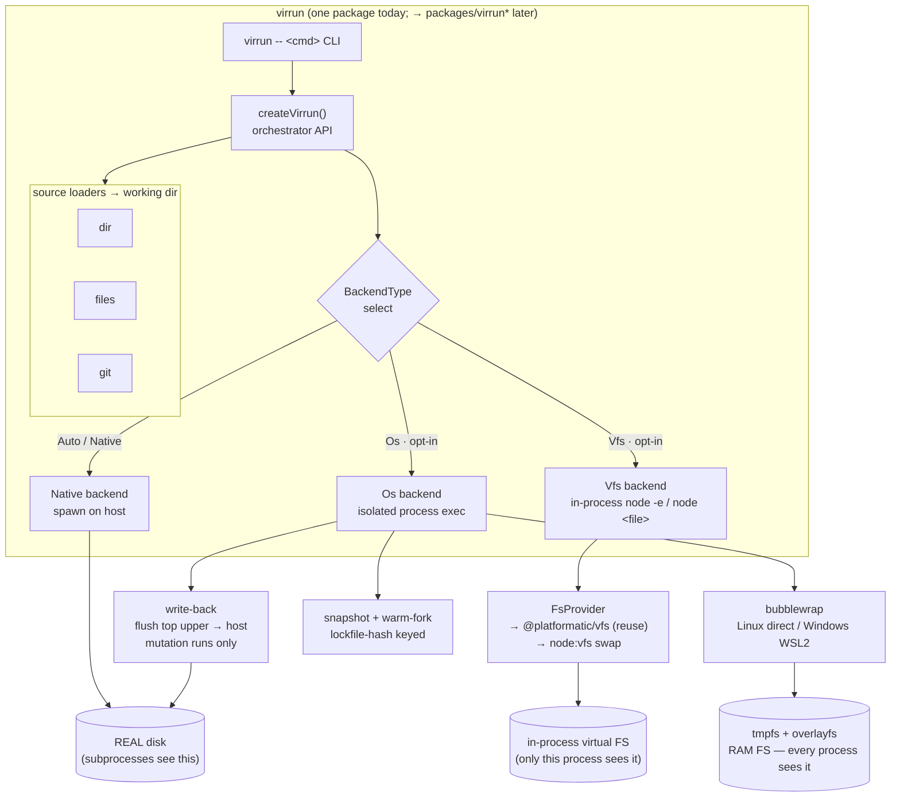
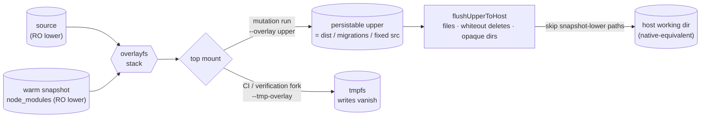

# virrun — Architecture Reference

High-level system map for the virtual runner. Read alongside the specs in [specs/](specs).

---

## System overview

One entrypoint (`createVirrun` / the `virrun -- <cmd>` CLI) resolves a **source** to a working dir, picks an **exec backend**, and routes every command through it. The backend is the only axis that changes what actually runs — and it is the only place the **subprocess wall** (below) is solved differently. Solid = shipped, dashed = planned.



The two os-backend persist paths are the persist axis: a **mutation run** flushes its produced files back to the real disk (`write-back`), while a **verification/CI fork** lets writes vanish in RAM (`snapshot + warm-fork`). Both fork the warm snapshot — only the top mount differs. See [Write-back](#write-back-native-equivalent-persistence) below.

Why the three FS endpoints differ is the **subprocess wall** — the single fact that splits the product into backends. See it spelled out below.

---

## The five layers

```text
┌─ orchestrator API (TS, node-compat)   ← public surface — specs/orchestrator-api.md
├─ shell layer (optional)               ← parse/dispatch shell scripts
├─ exec + isolation layer   ★ THE CORE  ← run real processes, sandboxed — specs/exec-isolation.md
├─ snapshot / warm-fork layer           ← freeze + clone warm state; write-back flush — specs/snapshot-fork.md · specs/write-back.md
└─ virtual filesystem layer             ← RAM-backed files — specs/virtual-fs.md
```

Write-back is a reconciliation step on the snapshot/fork layer: it reuses the same persistable overlay upper the snapshot capture uses, but flushes it to the host working dir instead of freezing it as a cache layer.

| Layer            | Build or reuse                     | Source                                   |
| ---------------- | ---------------------------------- | ---------------------------------------- |
| Orchestrator API | **Build**                          | new                                      |
| Shell            | **Reuse** (optional)               | just-bash (parser + builtins only)       |
| Exec + isolation | **Build — this is the novel work** | new                                      |
| Snapshot / fork  | **Build**                          | new (over CRIU / microVM snapshot)       |
| Virtual FS       | **Reuse**                          | `@platformatic/vfs` → swap to `node:vfs` |

The only layer no existing package solves is **exec + isolation**. Everything else is glue or reuse.

---

## The subprocess wall (the crux)

`node:vfs` and `@platformatic/vfs` intercept the **in-process** JS `fs` module and module loader. They are blind to anything a child process does:

```text
node process ──fs calls──► node:vfs        ✅ sees virtual files
   └─ spawn("pnpm" / "esbuild" / "sharp") ──raw syscalls──► REAL disk   ❌ VFS blind
```

A real toolchain (`pnpm install`, native postinstall like sharp/esbuild) is mostly spawned subprocesses. So an in-process VFS alone **cannot** put a real install in RAM. This single fact splits the product into two execution backends:

- **`vfs` backend** — in-process, node:vfs-backed. Pure-npm, cross-platform, no native subprocess. Good for sandboxing/evaluating pure-JS, module-loading tricks, lightweight runs.
- **`os` backend** — OS-level RAM filesystem (`tmpfs` + `overlayfs`) under an OS sandbox (`bubblewrap` today; `nsjail`/microVM deferred). Every process, including native binaries, sees the RAM FS. This is the **generic any-repo** path. Linux-core; Windows reaches it through WSL2, while macOS still needs a VM bridge.

See [specs/exec-isolation.md](specs/exec-isolation.md) for both.

---

## Where the speed comes from

1. **RAM filesystem** (`tmpfs` upperdir) — `node_modules` never touches disk.
2. **Shared content-addressable store** — deps downloaded once into `.virrun/store/pnpm`, then reused by each sandbox; installs copy from the on-disk store into the RAM overlay until snapshots make hardlink-style imports viable.
3. **Snapshot + warm-fork** — "clone repo + install" happens once; each run `fork()`s the warm state → near-instant repeated runs. The biggest win. See [specs/snapshot-fork.md](specs/snapshot-fork.md).
4. **Task cache** — _shipped._ Skip a persist run whose inputs are unchanged: keyed by `sha256(lockfile-hash + working-tree-hash + command)`, a hit skips the sandbox and replays the recorded output diff + streams. Native content-hash, not Turborepo (which needs a per-repo pipeline graph). A dev-loop lever — off in CI, where a fresh commit means ~0 hits. See [specs/config-and-cache.md](specs/config-and-cache.md#virrun--cache--gitignored).

A persist (write-back) run keeps these wins: the toolchain still does its random I/O in RAM, and persistence is a single bulk copy-out of the final diff at the end — far cheaper than letting the command thrash the disk throughout. See [Write-back](#write-back-native-equivalent-persistence).

---

## Write-back (native-equivalent persistence)

_Shipped._ The last limitation before full adoption. Verification commands (`vitest run`, `eslint .`) want writes to vanish; **mutation** commands (`eslint --fix`, `oxfmt`, `db:gen`, `export:gen`, `build`) need their output on disk. Write-back makes a normal `virrun -- <cmd>` leave disk exactly as native would, so every command can move onto the prefix.

Every os run forks the warm snapshot; **only the top mount differs** — persist vs vanish:



Two facts make this native-equivalent without virrun ever guessing which files matter:

- **The upper _is_ the native diff** — overlayfs records changed/new files, char-dev `0:0` whiteouts for deletes, and (in rootless userxattr mode) `user.overlay.opaque` markers for replaced dirs. Replaying it onto the host reproduces native's on-disk result.
- **`node_modules` is structurally excluded** — it lives in the RO snapshot lower, so it is never in the top upper's flush set. "node_modules never touches disk" survives even while output persists. Upper entries that shadow a snapshot-lower path (a dep-tree write) are skipped — layer membership, not a name guess.

Correctness is proven by **equivalence tests** (native vs `virrun --`, diffing the resulting host file trees), CI-enforced beside the differential suite. Detail: [specs/write-back.md](specs/write-back.md).

---

## CLI output palette

Every stderr diagnostic goes through one helper, `formatVirrunLine(message)` (`services/cli/formatVirrunLine.ts`), which prepends the bold-cyan `[virrun]` tag — the tag's text + styling live in exactly one place, and command writes are colorized identically to the `format*` helpers instead of hardcoding a plain tag. `colorize` is a no-op when color is off (a pipe, `NO_COLOR`, vitest), so lines degrade to plain text and the format tests still assert plain strings.

The semantic color vocabulary is decided once, on the `Color` enum (`models/cli/Color.ts`) — call sites pick by meaning, not by eye:

| Color        | Role                                                                                                                                             |
| ------------ | ------------------------------------------------------------------------------------------------------------------------------------------------ |
| Cyan (+Bold) | the `[virrun]` tag only                                                                                                                          |
| Blue (+Bold) | a fast-route cache/snapshot **hit** label — `snapshot cache hit` / `task cache hit` (via `formatCacheHitLabel`), so the fast path stands out     |
| Yellow       | commands / argv / executables / flags; the "expect a wait" cache-**miss** / one-time-install notice                                              |
| Blue         | concrete values & locations — paths, backend type, lockfile hash, counts                                                                         |
| Green        | success & positive state — exit 0, "present", durations, node version                                                                            |
| Red          | failure & destructive — errors, non-zero exit, "absent", a path being **removed**                                                                |
| Dim          | routine auto-emitted metadata & absence only — doctor note column, "none"/"n/a". **Never dim a path, a cache/snapshot hit, or primary content.** |

The child command's own stdout/stderr is never colorized (raw bytes flow through so correctness diffs stay byte-exact); only virrun's own framing lines are.

## Platform reality

| Host              | Fast path                                  |
| ----------------- | ------------------------------------------ |
| Linux             | native: tmpfs + overlayfs + sandbox + CRIU |
| Windows           | WSL2 bridge into Linux bwrap               |
| macOS             | Firecracker or lightweight Linux VM bridge |
| Anywhere, JS-only | `vfs` backend, pure node, no OS features   |

A pure-TS, cross-platform engine that runs **native** binaries against a RAM FS does not exist and cannot — accept Linux core + VM bridge elsewhere. The `vfs` backend is the only truly cross-platform mode, and it is JS-only by nature.
