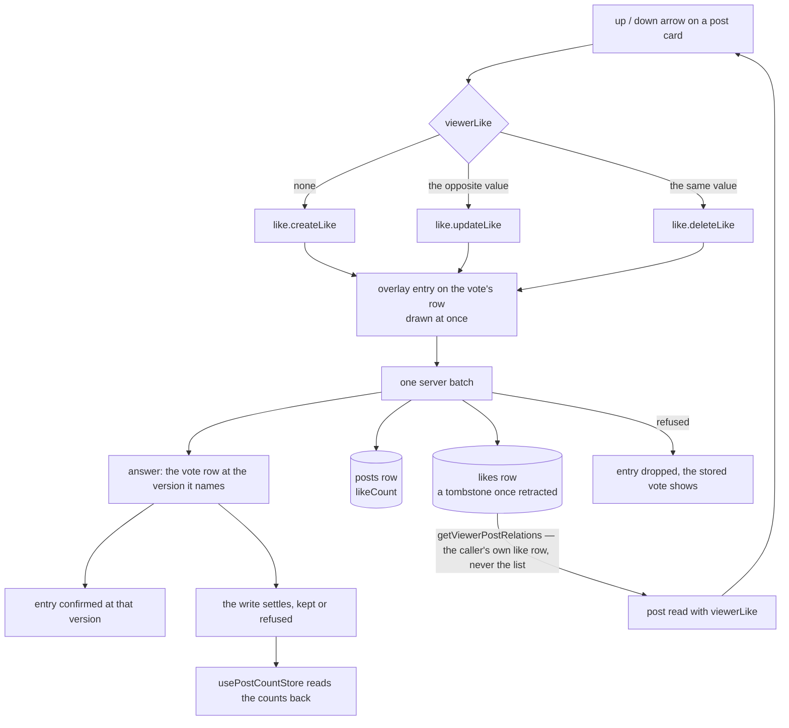

# Likes

Reddit-style voting: each user holds at most one like per post with `value ∈ {1, −1}`, shown as up/down arrows on every post and comment card beside the net count.

## How it works

```mermaid
flowchart TD
  arrows["up / down arrow on a post card"] --> pick{"viewerLike"}
  pick -->|"none"| createLike["like.createLike"]
  pick -->|"the opposite value"| updateLike["like.updateLike"]
  pick -->|"the same value"| deleteLike["like.deleteLike"]
  createLike --> entry["overlay entry on the vote's row<br/>drawn at once"]
  updateLike --> entry
  deleteLike --> entry
  entry --> batch["one server batch"]
  batch --> row[("likes row<br/>a tombstone once retracted")]
  batch --> count[("posts row<br/>likeCount")]
  batch --> answer["answer: the vote row at the version it names"]
  batch -->|"refused"| drop["entry dropped, the stored vote shows"]
  answer --> confirm["entry confirmed at that version"]
  answer --> settle["the write settles, kept or refused"]
  settle --> read["usePostCountStore reads the counts back"]
  row -->|"getViewerPostRelations — the caller's own like row, never the list"| viewer["post read with viewerLike"]
  viewer --> arrows
```

**Model** — `likes(userId, postId, value)` with a composite primary key (one row per user per post) and a DB check constraining `value` to ±1. The post's `likeCount` is the denormalized net sum. A retracted vote is not deleted: its row keeps the key with `deletedAt` set and its version raised, so a client holding the vote learns of the retraction from a read. A vote made again revives that row. A partial index over the tombstones serves the nightly purge, which removes a tombstone once it is older than `TOMBSTONE_RETENTION_MS`.

**Mutations** — three procedures, each one batch that writes the like row and adjusts `likeCount`. The stored [ranking](../feed-and-ranking/design.md) follows in its own write, guarded on the count it was computed from, so the last vote to land writes the final ranking:

The server is the only writer of `likeCount`. The client reads it back with `post.readPostCounts` (a batch read over the ids it changed) and never adds a vote to it, per [client data](../../architecture/client-data/design.md).

- `createLike` — first vote (`likeCount += value`). It also revives a retracted vote of the same member.
- `updateLike` — flip an existing vote (`likeCount += 2 × value`, rejecting no-op flips).
- `deleteLike` — retract (`likeCount −= value`), which leaves the vote's row as a tombstone.

**Viewer-scoped reads** — every procedure that returns a post (reads and mutations alike) carries `viewerLike: Like | undefined` on `PostInPostWithRelations`: at most the viewer's own like row, never the full list, since the net count already lives in the denormalized `likeCount`. A retracted vote comes back as its tombstone, which the client's view hides. The `likes` relation is only the server-side fetch strategy — `getViewerPostRelations` filters it to the caller, and `getPostWithViewerLike` maps the result. Unauthenticated rate-limited reads have no viewer, so they skip the like lookup entirely and neither arrow is pressed. A hot feed page's payload is O(posts) instead of O(total likes).

**Client** — the vote pill (`PostLikeSection`) holds two toggles, each pressed while it is the viewer's vote; `PostVoteButton` reads that from `viewerLike` and maps a press to the right mutation (up with no vote held = create, up over a down vote = flip, up over an up vote = retract, …). A withdrawal is a press like any other and is not asked first, so the button's template carries the `vue/no-restricted-syntax` disable for its `deleteLike` call. One like store, `useLikeStore`, is the only write path, and the viewer's vote is a row of the overlay's like table rather than a field patched on each held copy of a post. A create, a flip and a retraction are overlay entries that draw the vote at once: a first vote as a row with no version until the server names one, a retraction as the row's `deletedAt` until the server's tombstone confirms it. The server's answer confirms each entry at the version it names. Every copy of the post reads `viewerLike` from that one row, so a vote cast on a post's page is already on its feed card, and no component says which list a post came from. A refused write drops its entry, and the vote shows as it was.

The entries touch only the vote's row, so the store never moves a count. After every vote write settles, whatever its answer, `usePostCountStore` reads the post's counts back with `post.readPostCounts`, and it holds each count at the version of its post's row, taking a newer count over an older one only. The counts are read back because another viewer's vote changes them too, and the server's adjustment is the only exact value.

## Procedures

| Procedure         | Auth   | Input             | Purpose      |
| ----------------- | ------ | ----------------- | ------------ |
| `like.createLike` | authed | postId, value(±1) | first vote   |
| `like.updateLike` | authed | postId, value(±1) | flip vote    |
| `like.deleteLike` | authed | postId            | retract vote |

## Key files

Paths are `apps/web`-relative; a `packages/` path is repo-relative.

| File                                                            | Role                                                                    |
| --------------------------------------------------------------- | ----------------------------------------------------------------------- |
| `packages/db-schema/src/schema/post/likesInPost.ts`             | table, ±1 check and the tombstone index                                 |
| `packages/db-schema/src/models/post/PostInPostWithRelations.ts` | `PostInPostWithRelations` + `viewerLike`                                |
| `server/trpc/routers/like.ts`                                   | batched mutations                                                       |
| `server/services/post/getViewerPostRelations.ts`                | viewer-filtered likes fetch strategy                                    |
| `server/services/post/getPostWithViewerLike.ts`                 | maps the fetched row to `viewerLike`                                    |
| `app/components/Post/VoteButton.vue`                            | one arrow: its toggle and its write                                     |
| `app/services/post/overlay/getSetLikeEntry.ts`                  | the entry that draws a vote as the one it would make                    |
| `app/services/post/overlay/getLikePatchEntry.ts`                | the entry that changes a held vote's value, or retracts it              |
| `app/store/post/like.ts`                                        | the one like store over every list, reading the counts back after each  |
| `app/store/post/count.ts`                                       | the one owner of the post counts, by post id, and their batched re-read |

## Notes

- Like achievements (`LikeAchievementDefinitionMap`) trigger on these procedure paths like all achievement definitions.
