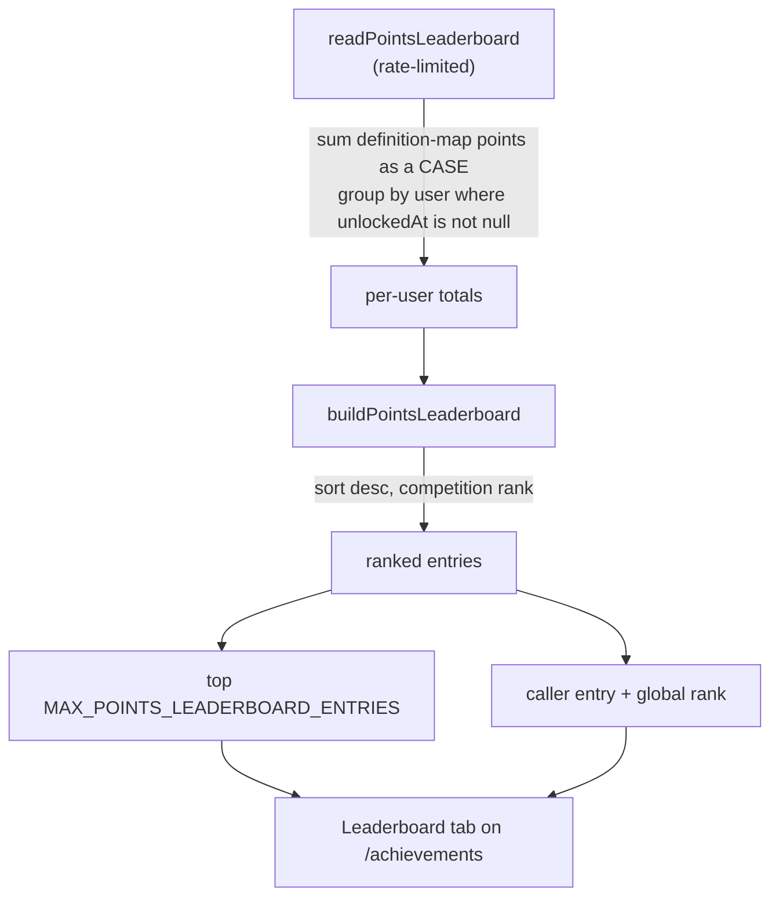

# Points Leaderboard

A global ranking of users with at least one unlocked achievement by the summed `points` of their unlocks. Every achievement already carries a points value and unlocks live in Postgres, so the leaderboard is one aggregate over existing tables plus a page — no new schema. It gives the games and products a shared competitive surface.

## How it works

Points live in the definition map (`AchievementDefinitionMap`), not the database, so `readPointsLeaderboard` injects them into SQL as a `CASE` over the achievement name and sums per user with a `GROUP BY` — the result set is one row per user with an unlock, never one row per unlock. `buildPointsLeaderboard` then ranks the totals competition-style (users with equal totals share a rank) and returns the top window plus the caller's own entry.

- **Ranking** — competition-style: an entry's rank is one plus the number of strictly higher totals, so ties share a rank. The caller's `self` entry carries its global rank even when it falls outside the top window; the client highlights the caller's row and appends `self` when it is not already shown.
- **Identity** — only the public profile columns (`id`, `name`, `image`) are carried, never email — mirroring the public-profile allowlist (`readUser`). Each row links to `/user/<id>`.
- **Hidden achievements** count toward totals. A total could in principle be decomposed to infer a hidden unlock, but that infers nothing new: any user's full unlock list — hidden included — is already public via `readUserAchievements`. Hiddenness masks names and descriptions in the gallery, not the fact of an unlock.
- **No denormalized total** — points change only on unlock, so the aggregate runs off existing tables; a `points` column on users is added only if the query ever hurts.

## Procedures

| Procedure                           | Auth         | Input | Purpose                                                     |
| ----------------------------------- | ------------ | ----- | ----------------------------------------------------------- |
| `achievement.readPointsLeaderboard` | rate-limited | —     | top-ranked users by total points plus the caller's own rank |

## Key files

Paths relative to `packages/app`.

| File                                                    | Role                                               |
| ------------------------------------------------------- | -------------------------------------------------- |
| `server/trpc/routers/achievement.ts`                    | `readPointsLeaderboard` procedure + SQL points sum |
| `server/services/achievement/buildPointsLeaderboard.ts` | pure competition ranking over per-user totals      |
| `shared/models/achievement/PointsLeaderboard.ts`        | the `{ entries, self }` payload shape              |
| `shared/services/achievement/constants.ts`              | `MAX_POINTS_LEADERBOARD_ENTRIES`                   |
| `app/pages/achievements.vue`                            | Gallery / Leaderboard view tabs                    |
| `app/components/Achievement/Leaderboard/Index.vue`      | wrapper — non-blocking `useQuery` fetch            |
| `app/components/Achievement/Leaderboard/Card.vue`       | the ranking list + caller-row append               |
| `app/components/Achievement/Leaderboard/Item.vue`       | one ranked row (rank, avatar, name, points)        |

## Notes

- Opt-out/privacy is out of scope: achievements are already readable per user via `readUserAchievements`.
- The aggregate returns one row per user with an unlock; ranking (and the caller's global rank) still happens in the server over that set. If it ever hurts, denormalize a `points` total onto users and rank in SQL.
