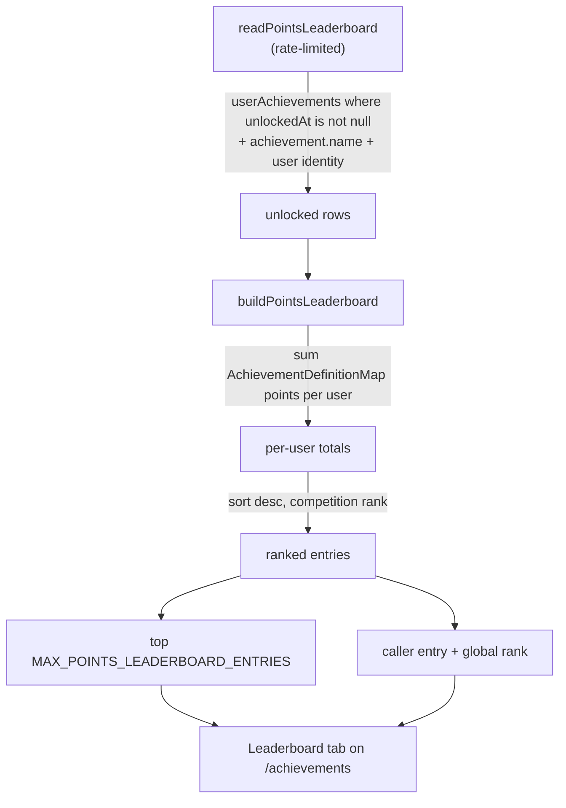

# Points Leaderboard

A global ranking of every user by the summed `points` of their unlocked achievements. Every achievement already carries a points value and unlocks live in Postgres, so the leaderboard is one aggregate over existing tables plus a page — no new schema. It gives the games and products a shared competitive surface.

## How it works

Points live in the definition map (`AchievementDefinitionMap`), not the database, so the summation happens in the server rather than in SQL. `readPointsLeaderboard` fetches every unlocked `userAchievements` row with its achievement name and the owner's public identity, then `buildPointsLeaderboard` aggregates points per user, ranks competition-style (users with equal totals share a rank), and returns the top window plus the caller's own entry.

- **Ranking** — competition-style: an entry's rank is one plus the number of strictly higher totals, so ties share a rank. The caller's `self` entry carries its global rank even when it falls outside the top window; the client highlights the caller's row and appends `self` when it is not already shown.
- **Identity** — only the public profile columns (`id`, `name`, `image`) are carried, never email — mirroring the public-profile allowlist (`readUser`). Each row links to `/user/<id>`.
- **Hidden achievements** count toward totals without being revealed — only names and descriptions are masked in the gallery, points are public metadata, so there is no leak.
- **No denormalized total** — points change only on unlock, so the aggregate runs off existing tables; a `points` column on users is added only if the query ever hurts.

## Procedures

| Procedure                           | Auth         | Input | Purpose                                                     |
| ----------------------------------- | ------------ | ----- | ----------------------------------------------------------- |
| `achievement.readPointsLeaderboard` | rate-limited | —     | top-ranked users by total points plus the caller's own rank |

## Key files

Paths relative to `packages/app`.

| File                                                    | Role                                        |
| ------------------------------------------------------- | ------------------------------------------- |
| `server/trpc/routers/achievement.ts`                    | `readPointsLeaderboard` procedure           |
| `server/services/achievement/buildPointsLeaderboard.ts` | pure aggregation + competition ranking      |
| `shared/models/achievement/PointsLeaderboard.ts`        | the `{ entries, self }` payload shape       |
| `shared/services/achievement/constants.ts`              | `MAX_POINTS_LEADERBOARD_ENTRIES`            |
| `app/pages/achievements.vue`                            | Gallery / Leaderboard view tabs             |
| `app/components/Achievement/Leaderboard.vue`            | the ranking list + caller-row append        |
| `app/components/Achievement/LeaderboardItem.vue`        | one ranked row (rank, avatar, name, points) |

## Notes

- Opt-out/privacy is out of scope: achievements are already readable per user via `readUserAchievements`.
- The aggregate fetches every unlocked row and sums in memory; this is the honest MVP given points live in the definition map. If the fetch ever hurts, denormalize a `points` total onto users and rank in SQL.
