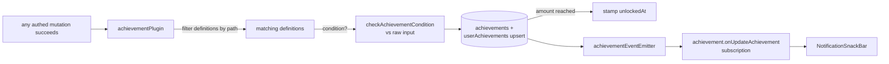

# Unlock Pipeline

Every authed mutation flows through `achievementPlugin`, which turns matching procedure calls into progress rows and pushes unlocks to the client over a tRPC subscription.

## How it works

The plugin runs **after** `next()` and only for successful mutations. For each definition whose `triggerPath` equals the called path (and whose condition, if any, passes against the raw input): lazily insert the `achievements` row on first encounter, upsert the caller's `userAchievements` counter, skip entirely if already unlocked, stamp `unlockedAt` when the threshold is met, and finally emit one `updateAchievement` event with everything that changed. The subscription filters events to the session user and the snackbar list toasts progress/unlocks live anywhere in the app.

The achievement router is merged separately from the main root router to break a circular dependency — the plugin needs `TRPCPaths` derived from the routers it wraps.

## Procedures

| Procedure                          | Auth         | Input            | Purpose                                       |
| ---------------------------------- | ------------ | ---------------- | --------------------------------------------- |
| `achievement.readAchievementMap`   | authed       | —                | all definitions (hidden ones masked as `???`) |
| `achievement.readUserAchievements` | rate-limited | optional user id | a user's progress rows (defaults to caller)   |
| `achievement.onUpdateAchievement`  | authed       | —                | live progress/unlock events                   |

## Key files

Paths relative to `packages/app`.

| File                                                       | Role                               |
| ---------------------------------------------------------- | ---------------------------------- |
| `server/trpc/plugins/achievementPlugin.ts`                 | the middleware                     |
| `server/services/achievement/checkAchievementCondition.ts` | condition evaluation               |
| `shared/services/achievement/achievementDefinitions.ts`    | merged definition map              |
| `server/trpc/routers/achievement.ts`                       | read + subscription procedures     |
| `app/components/Achievement/`                              | gallery grid + notification toasts |
| `packages/db-schema/src/schema/userAchievements.ts`        | progress rows                      |

## Notes

- Processing is synchronous in the request path but **best-effort**: the whole post-mutation block and each definition's writes run behind `getResultAsync` boundaries, so a failure is logged with its path, user, and definition name and the original mutation result is always returned. A lost counter increment self-heals on the next trigger; an unmet `amount: 1` condition retries naturally on the next qualifying call. Escalate to EventGrid only if plugin latency ever shows in traces.
- `readUserAchievements` accepts another user's id, so achievement showcases on user-facing surfaces need no new procedure.
