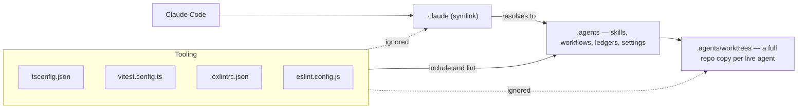

# Agent configuration

Coding agents read a tree of repo-specific configuration: skills that state conventions, workflow scripts, sweep ledgers, and the permission allowlist. That tree is stored **once**, at `.agents/`, under a vendor-neutral name. `.claude` is a symlink pointing at it, so Claude Code — the agent this repo is driven by day to day — resolves `.claude/skills` and `.claude/settings.local.json` without a second copy of anything. The same idea already governs the instruction file: `AGENTS.md` is the real file, and `CLAUDE.md` and `GEMINI.md` are symlinks to it.

The direction matters. The vendor-neutral path owns the bytes and every tool configuration is written against it; the vendor path is the alias. Adding a second agent means adding a second symlink, never moving files or teaching the toolchain a new root.

## Every tool reads the real path

Globbers follow directory symlinks. A repo-wide walk that treated `.claude` as an ordinary directory would therefore enumerate the entire agent tree a second time under a second name — and, worse, would do so through the worktrees directory, where each entry is a full copy of the monorepo. So the alias is ignored everywhere and the real path is what tools are pointed at.

`AGENT_DIRECTORY` and `AGENT_WORKTREES_DIRECTORY` in `@esposter/configuration` are the single source for both paths, so anything that can import interpolates them instead of repeating a literal. `tsconfig.json` and `.oxlintrc.json` are JSON with no import mechanism, so they repeat the worktrees literal and `scripts/agentWorktrees.test.ts` pins the copies to the constant — both have been silently un-excluded once before by an unrelated edit widening a glob.

Only the agent harness's machine-local `.git/info/exclude` hides live worktrees from git. No clone, CI runner, or non-git tool ever reads that file, which is why each tool states the exclusion in its own configuration rather than relying on ignore rules.

## Configuration there, documentation in public

Documentation is **public by default**. Everything explanatory lives in `packages/app/content/docs`, ships with the app, and is readable at `/docs` on the deployed site — it is written for a person in a browser, and hiding it in a dotfolder is what stops it being read. See [monorepo tooling](/docs/architecture/monorepo-tooling) for how that package is built and published.

`.agents/` holds only what a machine consumes:

| Lives in `.agents/`                                  | Lives in the docs                                  |
| ---------------------------------------------------- | -------------------------------------------------- |
| Skills — conventions written as agent instructions   | The decision a convention encodes, and its why     |
| Workflow scripts and their tests                     | What a workflow is for and when to reach for it    |
| Sweep ledgers — per-unit progress state              | The convention a sweep is carrying across the repo |
| Harness settings and the permission allowlist        | Nothing — it is pure tool configuration            |
| Issue tracker, triage label, and domain-doc pointers | Nothing — command recipes for one toolchain        |

The test is whether a human would ever want to read it on the website. If the answer is yes, it is documentation and belongs under `content/docs`; a skill then links to that page instead of restating it, so one topic keeps one owner.

## The engineering skills look for `docs/agents/`

The installed Matt Pocock engineering skills — `triage`, `to-tickets`, `to-spec`, `wayfinder`, `grill-with-docs`,
`improve-codebase-architecture` — were scaffolded to read their configuration from `docs/agents/*.md`, and several
say so literally: one of them tells the user to re-run `/setup-matt-pocock-skills` when `docs/agents/issue-tracker.md`
is missing. **It is not missing; it is at `.agents/issue-tracker.md`**, because this repo has no root `docs/` folder
at all — `packages/app/content/docs` is the public docs site, and a second root-level `docs/` would read as a rival
to it.

`AGENTS.md` names the real paths, so a skill that reads the instruction file first finds them. Re-running the setup
skill is what to avoid: it writes a fresh copy under `docs/agents/`, leaving two sources of truth and creating the
root `docs/` folder this layout exists to avoid. Point the skill at `.agents/` instead.

## Key files

| Path                                      | Role                                                                       |
| ----------------------------------------- | -------------------------------------------------------------------------- |
| `.agents`                                 | The agent tree — skills, workflows, ledgers, harness settings              |
| `.claude`                                 | Symlink alias to `.agents` so Claude Code resolves its own paths           |
| `AGENTS.md`                               | Repo instruction file — `CLAUDE.md` and `GEMINI.md` are symlinks to it     |
| `packages/configuration/src/constants.ts` | `AGENT_DIRECTORY` and `AGENT_WORKTREES_DIRECTORY`, the only source of both |
| `scripts/agentWorktrees.test.ts`          | Pins the worktrees exclusion in the configs that cannot import it          |
