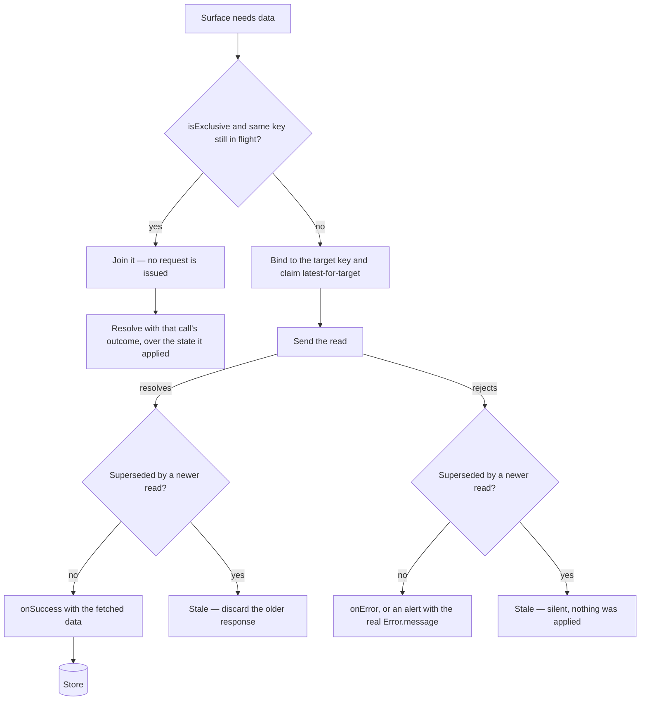
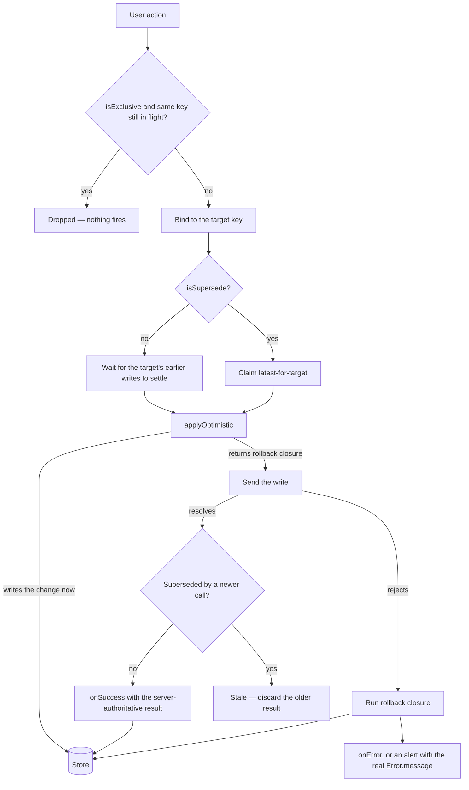

# Async Operations

Every user-facing async operation on the client declares exactly two things: **what it targets** and **whether it reads or writes**. `useMutation` (`packages/app/app/composables/shared/useMutation.ts`) derives the **default** concurrency behaviour from those two facts, and the two opt-ins below — `isExclusive` and `isSupersede` — are the only things that change it.

## No call site orders its own async work

**No call site chains promises, holds a map of in-flight promises, or tracks a generation counter, a call id or an `isSaving` flag to order its own async work.** If an ordering is worth having, it belongs in the primitive, keyed by target — and it is already there.

The reason is not tidiness. Protection applied by hand is protection that gets forgotten: every surface that forgot it was silently losing writes or serving stale reads, and every surface that remembered wrote a subtly different version of the same queue, so a bug fixed in one never reached the others. If a surface seems to need an ordering of its own, it needs the right `key` instead.

## The principle that decides the default

Ask one question of an operation: **does discarding its result lose information?**

- A **read** loses nothing. You asked for the freshest data, a newer read is already on its way, and there is no side effect to unwind. Discarding a superseded response is exactly what you wanted.
- A **write** loses two things. It loses its **error** — the only signal that the value the user is looking at was never persisted — and it loses its **rollback**, the only thing that takes that value back off the screen.

So the defaults are asymmetric on purpose: **reads are latest-wins per target, writes queue per target.** A write is dropped only when a caller says, explicitly, that dropping it is the intent.

## Targets

The `key` is the identity of the thing being operated on, and it is always explicit — the same reason a Pinia store id is. Reads and writes choose it the same way. It is resolved when the operation is **issued**, so the result is applied against the state it was issued for even if the screen has moved on by the time it lands. Choosing one is mechanical:

- **Operation on an existing entity** → its id or natural composite (`input.id`, `` `${userId}-${roleId}` ``).
- **Singleton target** — the current user's settings, the one dataset a composable shows — → the scope's id when one exists, else a stable name (`key: "userSettings"`). Keys are scoped per `useMutation()` instance, so names cannot collide across instances.
- **Create with no id yet** → a per-call `Symbol("createRoom")`, so independent creates never queue behind or supersede each other.
- **Anything the primitive cannot take verbatim** — a key is a `PropertyKey`, and nothing else is accepted — → narrow the source type until it is one, never `String()` it. Stringifying collapses distinct keys onto a single target (`"1,2"` and `[1, 2]` both become `1,2`), which is why `IndexedDbDatabaseSchema` types every index key as a string: an IndexedDB partition is then its own target, unconverted.

Two writes that share a key are two writes to the same thing, and they run one at a time. Two writes with different keys are independent and run concurrently. Note that "same entity" is not the same question as "same value": the Attachments settings panel writes a maximum file size and a list of allowed types through one `key: room.id`, because both are writes to that room — but neither replaces the other, so both must land.

Reads and writes never share a queue, even on one key: a read waits for nobody.

## Reads — `executeQuery`

`executeQuery(query, { isExclusive, key, onError, onSuccess })` is latest-wins for its key. A superseded read never runs `onSuccess`, never runs `onError`, and never alerts — it reports `Stale` and stays silent, because a race it lost is not something the user needs to hear about. Reads for one key otherwise run concurrently, so a slow response can never overwrite a fast one issued after it.

One opt-in narrows this:

- **`isExclusive`** — single-flight. While a read with the same key is in flight, a second caller issues no request of its own: it **joins** that call and resolves with its outcome. Its own `onSuccess`/`onError` do not run — the call it joined already applied the state and reported — so by the time the joiner resolves, the data it asked for is in the store. For the fan-out reads that every instance of a surface issues on mount: one favourites set behind a list, a blade and Home, or one room's follow state behind every follow button in it.

A joined read is never `Dropped`. Dropping is right for a write, whose caller wanted an effect that is already happening, and wrong for a read, whose caller wanted the data — a caller handed nothing renders an empty list beside a populated one.

Two things `isExclusive` deliberately does **not** do:

- **It does not cache.** Only a read still in flight can be joined, so read-once-per-session or read-once-per-room stays a flag at the call site (`isLoaded`, a `loadedRoomIds` set) guarding whether to call at all. That is a caching concern, not a concurrency one.
- **It does not apply to an invalidating re-read.** A read issued _because_ something changed must not join the answer that the change just invalidated, so `refreshFavorites` re-reads without it and wins on latest-wins instead.

`isPending` doubles as the loading flag for a read composable — `useQuery` hands it back alongside `data` — so no composable keeps its own `isLoading` ref.

## Writes — `executeMutation`

`executeMutation(mutate, { applyOptimistic, isExclusive, isSupersede, key, onError, onSuccess })` queues per key. `applyOptimistic` runs when the write is **sent**, not when it was issued, so its snapshot reflects whatever the write ahead of it stored — a queued write builds on its predecessor's outcome instead of on a stale copy of the screen. For the same reason, a write that reads a version token or resolves a create-or-update branch does that **inside** `mutate`, not before the call.

Two opt-ins narrow this, and nothing else does:

- **`isSupersede`** — latest-wins instead of queueing, for a control that fires per keystroke or per drag frame, where the earlier value is already replaced on screen by the later one and losing it costs nothing. A superseded write still runs its rollback and still surfaces its error: superseding drops the older **result**, never the older **failure**.
- **`isExclusive`** — single-flight. While a write with the same key is in flight, further calls are **dropped** outright: nothing fires, nothing is queued, and the caller gets `Dropped`. For non-idempotent creates that must never double-fire, like `createLike`.

Everything else queues. If a write is worth issuing, it is worth landing.

## The two opt-ins at a glance

| Opt-in        | On a read                                       | On a write                          |
| ------------- | ----------------------------------------------- | ----------------------------------- |
| `isExclusive` | Joins the in-flight call and shares its outcome | Drops the duplicate — nothing fires |
| `isSupersede` | Not an option — a read is latest-wins already   | Latest-wins instead of queueing     |

## Outcomes

Neither entry point throws; both resolve to an outcome discriminated on `MutationStatus`, which is the only signal a call did not land.

| Status      | For a read                                                                                                                 | For a write                                                                                                                     |
| ----------- | -------------------------------------------------------------------------------------------------------------------------- | ------------------------------------------------------------------------------------------------------------------------------- |
| `Succeeded` | Fetched while still the latest for its target — carries the data, which `onSuccess` has already applied                    | Persisted — carries the server-authoritative result                                                                             |
| `Failed`    | Rejected while still the latest. Nothing was applied, so nothing is unwound, and the error is reported or alerted          | Rejected. The optimistic change has been rolled back and the error reported or alerted by this point                            |
| `Stale`     | Superseded by a newer read for the same target. Silent by design — no callbacks, no alert, whether it resolved or rejected | Only with `isSupersede`, and only after resolving **successfully**. A superseded write that _failed_ reports `Failed`, not this |
| `Dropped`   | Never — a read is joined, not dropped                                                                                      | With `isExclusive`, behind an in-flight sibling. Never sent                                                                     |

A joined read reports the outcome of the call it joined, failures included.

## Read lifecycle

## Write lifecycle

## Key files

| File                                                           | Role                                                                           |
| -------------------------------------------------------------- | ------------------------------------------------------------------------------ |
| `packages/app/app/composables/shared/useMutation.ts`           | The primitive — per-target queue, latest-wins guard, pending counts, reporting |
| `packages/app/app/composables/shared/useQuery.ts`              | Read composable built on `executeQuery` — auto-fetch on setup, `data` ref      |
| `packages/app/app/models/shared/MutationStatus.ts`             | The four outcomes                                                              |
| `packages/app/shared/util/function/getSynchronizedFunction.ts` | Fires an async operation from a sync callback slot                             |

## Notes

- **Not only tRPC.** Both entry points take a plain `() => Promise<T>`, so an IndexedDB write or any other local async work is ordered the same way — `usePaginationCache` keys its cache writes on the partition, so one partition's rewrites run in order while another partition's never wait behind them.
- **A guard is handed to you, never built.** An operation whose body has to check mid-flight — a multi-step local media switch — receives `checkIsStale` as its first argument. It asks the primitive whether it is still the latest for its target and never tracks that itself.
- **Latest-wins is per target, so a switch away still needs its own check.** A read whose target moved on entirely — the room changed while IndexedDB answered — was never superseded, because the new read has a different key. Re-check the source after the await and bail.
- **Latest-wins protects state, not the server.** A superseding write still issues its network call. Preventing a second trigger while the first is in flight belongs to the surface — see [in-flight guarding](/docs/architecture/client-data#in-flight-guarding).
- **Search-as-you-type is the one read that goes further.** `useAutoSearch` (see [Search](/docs/architecture/search)) actually cancels the superseded request with an `AbortController` instead of ignoring its response.
