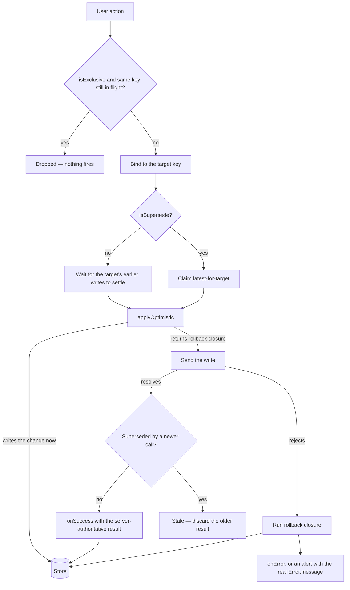

# Async Operations

Every user-facing async operation on the client declares exactly two things: **what it targets** and **whether it reads or writes**. `useMutation` (`packages/app/app/composables/shared/useMutation.ts`) derives the concurrency behaviour from those two facts. No call site wraps a call in a queue, a debounce, or a staleness guard of its own — protection that has to be remembered at the call site is protection that gets forgotten, and every surface that forgot it was silently losing writes.

## The principle that decides the default

Ask one question of an operation: **does discarding its result lose information?**

- A **read** loses nothing. You asked for the freshest data, a newer read is already on its way, and there is no side effect to unwind. Discarding a superseded response is exactly what you wanted.
- A **write** loses two things. It loses its **error** — the only signal that the value the user is looking at was never persisted — and it loses its **rollback**, the only thing that takes that value back off the screen.

So the defaults are asymmetric on purpose: **reads are latest-wins per target, writes queue per target.** A write is dropped only when a caller says, explicitly, that dropping it is the intent.

## Targets

The `key` is the identity of the thing being operated on, and it is always explicit — the same reason a Pinia store id is. It is resolved when the operation is **issued**, so the result is applied against the state it was issued for even if the screen has moved on by the time it lands. Choosing one is mechanical:

- **Operation on an existing entity** → its id or natural composite (`input.id`, `` `${userId}-${roleId}` ``).
- **Singleton target** — the current user's settings, the one dataset a composable shows — → the scope's id when one exists, else a stable name (`key: "userSettings"`). Keys are scoped per `useMutation()` instance, so names cannot collide across instances.
- **Create with no id yet** → a per-call `Symbol("createRoom")`, so independent creates never queue behind or supersede each other.

Two writes that share a key are two writes to the same thing, and they run one at a time. Two writes with different keys are independent and run concurrently. Note that "same entity" is not the same question as "same value": the Attachments settings panel writes a maximum file size and a list of allowed types through one `key: room.id`, because both are writes to that room — but neither replaces the other, so both must land.

## Reads — `executeQuery`

`executeQuery(query, { key, onError, onSuccess })` is latest-wins for its key. A superseded read never runs `onSuccess`, never runs `onError`, and never alerts — it reports `Stale` and stays silent, because a race it lost is not something the user needs to hear about. Reads for one key run concurrently, so a slow response can never overwrite a fast one issued after it.

`isPending` doubles as the loading flag for a read composable, so no composable keeps its own `isLoading` ref.

## Writes — `executeMutation`

`executeMutation(mutate, { applyOptimistic, key, onError, onSuccess })` queues per key. `applyOptimistic` runs when the write is **sent**, not when it was issued, so its snapshot reflects whatever the write ahead of it stored — a queued write builds on its predecessor's outcome instead of on a stale copy of the screen. For the same reason, a write that reads a version token or resolves a create-or-update branch does that **inside** `mutate`, not before the call.

Two opt-ins narrow this, and nothing else does:

- **`isSupersede`** — latest-wins instead of queueing, for a control that fires per keystroke or per drag frame, where the earlier value is already replaced on screen by the later one and losing it costs nothing. A superseded write still runs its rollback and still surfaces its error: superseding drops the older **result**, never the older **failure**.
- **`isExclusive`** — single-flight. While a call with the same key is in flight, further calls are dropped outright: nothing fires and nothing is queued. For non-idempotent creates that must never double-fire, like `createLike`.

Everything else queues. If a write is worth issuing, it is worth landing.

## Outcomes

Neither entry point throws; both resolve to an outcome discriminated on `MutationStatus`, which is the only signal a call did not land.

| Status      | Means                                                      | Produced by                                            |
| ----------- | ---------------------------------------------------------- | ------------------------------------------------------ |
| `Succeeded` | Persisted — carries the result                             | Any operation that resolved while still current        |
| `Failed`    | Rejected — carries the error, after rollback and reporting | Any write, and a read that lost no race                |
| `Stale`     | Superseded — the result is discarded, nothing was unwound  | A read, or a write that opted into `isSupersede`       |
| `Dropped`   | Never sent                                                 | A write with `isExclusive` behind an in-flight sibling |

## Write lifecycle

## Key files

| File                                                           | Role                                                                           |
| -------------------------------------------------------------- | ------------------------------------------------------------------------------ |
| `packages/app/app/composables/shared/useMutation.ts`           | The primitive — per-target queue, latest-wins guard, pending counts, reporting |
| `packages/app/app/composables/shared/useQuery.ts`              | Read composable built on `executeQuery` — auto-fetch on setup, `data` ref      |
| `packages/app/app/models/shared/MutationStatus.ts`             | The four outcomes                                                              |
| `packages/app/shared/util/function/getSynchronizedFunction.ts` | Fires an async operation from a sync callback slot                             |

## Notes

- **Hand-rolled concurrency is banned.** No call-id bookkeeping, no promise chains, no `isSaving` flags. If a surface seems to need one, it needs the right `key` instead.
- **A guard is handed to you, never built.** An operation whose body has to check mid-flight — a multi-step local media switch — receives `checkIsStale` as its first argument. It asks the primitive whether it is still the latest for its target and never tracks that itself.
- **Latest-wins protects state, not the server.** A superseding write still issues its network call. Preventing a second trigger while the first is in flight belongs to the surface — see [in-flight guarding](/docs/architecture/client-data#in-flight-guarding).
- **Search-as-you-type is the one read that goes further.** `useAutoSearch` (see [Search](/docs/architecture/search)) actually cancels the superseded request with an `AbortController` instead of ignoring its response.
