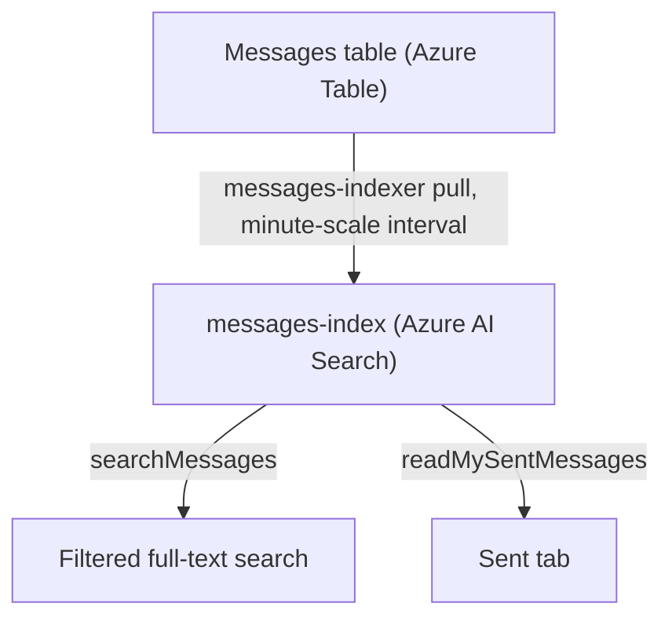
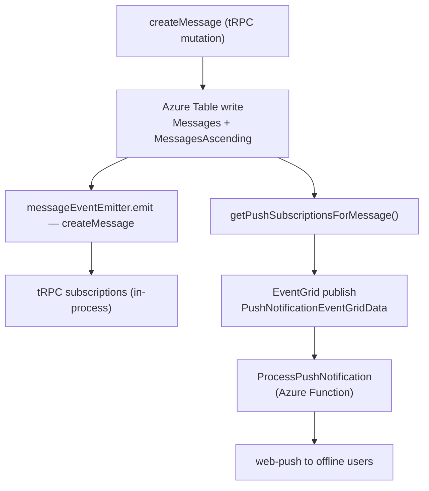

# Azure Services

Which Azure services are used, what each one owns, and which package accesses it.

## Service map

| Service                 | What it stores / does                                                                                                                                                                                                                    | Primary access point                                                                                             |
| ----------------------- | ---------------------------------------------------------------------------------------------------------------------------------------------------------------------------------------------------------------------------------------- | ---------------------------------------------------------------------------------------------------------------- |
| **Azure Blob Storage**  | Profile images, message file attachments, resource content + publish snapshots, game save state                                                                                                                                          | `server/composables/azure/container/useContainerClient.ts`                                                       |
| **Azure Table Storage** | Append-heavy, time-ordered streams keyed by their owning entity — messages and their mirrors, moderation, survey, resource and program records (`AzureTable` is the full set)                                                            | `server/composables/azure/table/useTableClient.ts`                                                               |
| **Azure AI Search**     | Message full-text search index (`searchMessages`, `readMySentMessages`)                                                                                                                                                                  | `server/composables/azure/search/useSearchClient.ts`                                                             |
| **Azure Functions**     | Async workers — push notifications (message, friend request, thread reply), webhook delivery, scheduled message jobs, TodoList due reminders, durable blob deletion, dead-letter replay, resource purging, storage-ledger reconciliation | `packages/azure-functions/src/functions/`                                                                        |
| **Azure Event Grid**    | Decouples mutations from fire-and-forget async work; app publishes events, Functions consume them                                                                                                                                        | `server/composables/azure/eventGrid/useEventGridPublisherClient.ts`                                              |
| **Azure Service Bus**   | Delayed/scheduled work — the `scheduled-message-jobs` queue (delivery at a future `runAt`) and the `todo-reminders` queue (TodoList due reminders)                                                                                       | `server/composables/azure/serviceBus/useServiceBusSender.ts`                                                     |
| **Azure Web PubSub**    | Webhook message delivery and cross-process fan-out (separate from tRPC subscriptions)                                                                                                                                                    | `server/composables/azure/webPubSub/useWebPubSubServiceClient.ts`                                                |
| **LiveKit**             | Audio/video SFU — signaling, media tracks, participant lifecycle                                                                                                                                                                         | `server/api/webhooks/livekit.post.ts` (webhook); `livekit-server-sdk` server-side; `livekit-client` browser-side |

EventGrid vs Service Bus: EventGrid is fire-and-forget **now** (push a notification the moment a message lands); Service Bus is fire **later** (a scheduled message job or TodoList reminder must run at its `runAt`/`dueAt`). Both terminate in Azure Functions handlers.

Not every EventGrid handler consumes an event this app published. `ReconcileStorageLedgerEntry` — the deployed function, which calls the service of the same name — subscribes to the storage account's own **system topic**, so `Microsoft.Storage.BlobCreated` is what replaces a client's declared upload size with the stored object's real length in the per-user storage ledger — a fact no server of ours ever observes, because the block PUT never passes through one ([storage quotas](/docs/platform/storage-quotas)).

## Blob Storage containers

Container names live in the `AzureContainer` enum (`packages/db-schema/src/models/azure/container/AzureContainer.ts`):

| Container (`AzureContainer`) | Contents                                                                                                                                      |
| ---------------------------- | --------------------------------------------------------------------------------------------------------------------------------------------- |
| `AppAssets`                  | App-owned static assets                                                                                                                       |
| `ClickerAssets`              | Clicker game save state (`{userId}/save`)                                                                                                     |
| `DeadLetter`                 | Event Grid dead-letter payloads plus their `archived/` and `quarantine/` copies → [Event Grid dead-letter](/docs/infra/eventgrid-dead-letter) |
| `DungeonsAssets`             | Dungeons game save state (`{userId}/save`)                                                                                                    |
| `MessageAssets`              | Message file attachments (`{roomId}/{fileId}\|{filename}`). Lifecycle policy tiers blobs Cool@30d → Cold@90d to cut storage cost              |
| `PrivateUserAssets`          | Per-user private blobs                                                                                                                        |
| `PublicUserAssets`           | User profile images (`{userId}/ProfileImage`), room profile images (`rooms/{roomId}/ProfileImage/{uuid}`)                                     |
| `ResourceAssets`             | Resource content blobs, publish snapshots, and type-owned files → [resources](/docs/architecture/resources)                                   |

## Table Storage tables

Table names live in the `AzureTable` enum (`packages/db-schema/src/models/azure/table/AzureTable.ts`) — that enum is the full set, and the default shape is `partitionKey = <owning entity id>` (a room, a resource, a survey resource) with `rowKey = reverseTickedTimestamp` for newest-first reads. Moderation logs and notes, resource activity and program participants are all that shape and need nothing said about them. The ones that are not:

| Table (`AzureTable`) | Departure                                                                                                |
| -------------------- | -------------------------------------------------------------------------------------------------------- |
| `MessagesAscending`  | Key-only mirror of `Messages` keyed by the original timestamp, so the same rows can be read oldest-first |
| `MessagesMetadata`   | Sidecar entities keyed to a message rather than to a point in time                                       |
| `ResourceViews`      | Best-effort view counters bucketed per resource per UTC day, not one row per event                       |
| `SurveyResponses`    | `partitionKey = survey resource id`, and served as a dataset → [datasets](/docs/architecture/datasets)   |

## Search index (`messages-index`)

Azure AI Search holds one index, `messages-index`, that powers filtered message search (`searchMessages`) and the Sent tab (`readMySentMessages`). Its full schema is a data-plane resource — not Pulumi-managed — recreated from `packages/infra/data/searchIndexes/messages-index.json`.

The index is populated by a **scheduled Azure Table pull indexer** (`messages-indexer`), not by a push on write: the indexer reads the `Messages` table on an interval measured in minutes and upserts each row as a document. A newly sent message therefore becomes searchable shortly after it lands rather than synchronously.

The indexer owns the index, so nothing in this repo writes documents to it. Its own control plane is the operational tooling: `GET /indexers/messages-indexer/status` reports the last runs, document counts, and per-document errors, and `POST /indexers/messages-indexer/reset` followed by `POST .../run` clears the high-water mark and re-reads the whole table. Both are one click each in the portal's indexer blade. Soft deletes need no special handling — `deletedAt` is a column the indexer already carries, and queries exclude it with a null clause.

Each document is keyed by `RowKey` (the message's reverse-ticked `rowKey`), so re-feeding the same message is an idempotent upsert. The fields that matter:

| Field                                                                          | Role                                                                    |
| ------------------------------------------------------------------------------ | ----------------------------------------------------------------------- |
| `RowKey`                                                                       | Document key — `Edm.String`, sortable, filterable                       |
| `PartitionKey`                                                                 | Owning room id — filterable (scopes search to a room)                   |
| `message`                                                                      | Searchable body text, analyzer `en.lucene`                              |
| `files/filename`                                                               | Searchable attachment name, analyzer `standard.lucene`                  |
| `appUser/name`                                                                 | Searchable sender name, analyzer `standard.lucene`                      |
| `userId`                                                                       | Filterable — the Sent tab filters to the caller's own messages          |
| `deletedAt`                                                                    | Filterable — a null clause excludes soft-deleted messages at query time |
| `createdAt` / `updatedAt`                                                      | Filterable + sortable — the Sent tab orders by `createdAt` descending   |
| `type`, `isEdited`, `isForward`, `isPinned`, `mentions`, `linkPreviewResponse` | Retrievable/filterable message attributes                               |

Relevance uses BM25 similarity with the `messageBoost` scoring profile as default — the `message` field is weighted 3× and `appUser/name` 1.5×, so a query hitting the body outranks one hitting only the sender name. The canonical searchable-field list lives in `SearchIndexSearchableFieldsMap` (`packages/db-schema`).

## Azure Table vs Postgres

Use **Azure Table** for high-volume, append-heavy, time-ordered data with no complex joins (messages, moderation logs, survey responses). `partitionKey = <owning entity id>`, `rowKey = reverseTickedTimestamp` gives newest-first ordering for free.

Use **Postgres (Drizzle)** for relational, queryable data — users, rooms, roles, bans, invites, push subscriptions, posts, achievements, resources, call sessions.

When adding a new feature: pick Postgres for anything relational or queryable; pick Azure Table for anything message-like (high write volume, time-ordered, no complex joins).

## Event flow: createMessage → push notification

EventGrid decouples the HTTP response from push delivery. The Function handles retries independently of the tRPC request lifecycle.

## Real-time architecture (three layers)

| Layer                 | Technology                                                                                  | Scope                  | What it drives                                                |
| --------------------- | ------------------------------------------------------------------------------------------- | ---------------------- | ------------------------------------------------------------- |
| In-process events     | NodeJS `EventEmitter` (`messageEventEmitter`, `moderationEventEmitter`, `roomEventEmitter`) | Single server instance | tRPC subscriptions (`onCreateMessage`, `onAdminAction`, etc.) |
| Cross-process fan-out | Azure Web PubSub                                                                            | All server instances   | Webhook message delivery                                      |
| Media / signaling     | LiveKit SFU                                                                                 | External service       | Audio, video, screenshare tracks and participant lifecycle    |

tRPC subscriptions are driven by the in-process EventEmitter. The LiveKit webhook (`server/api/webhooks/livekit.post.ts`) feeds participant join/leave back into `callEventEmitter` so non-participants and tRPC subscriptions stay consistent without touching the SFU.
