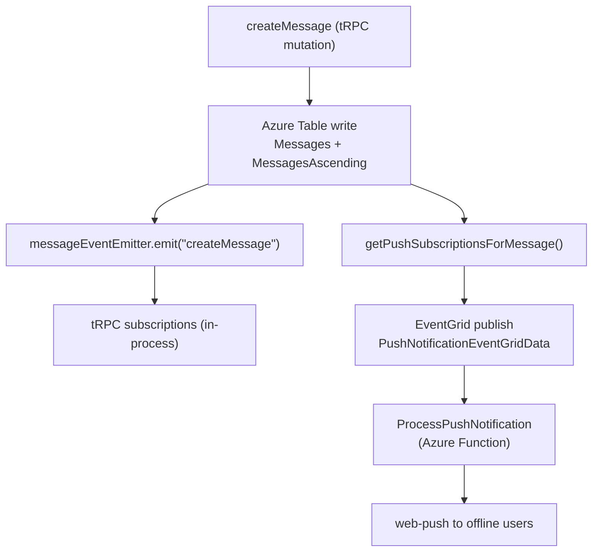

# Azure Services

Which Azure services are used, what each one owns, and which package accesses it.

## Service map

| Service                 | What it stores / does                                                                                      | Primary access point                                                                                             |
| ----------------------- | ---------------------------------------------------------------------------------------------------------- | ---------------------------------------------------------------------------------------------------------------- |
| **Azure Blob Storage**  | Profile images, message file attachments, resource content + publish snapshots, game save state            | `server/composables/azure/container/useContainerClient.ts`                                                       |
| **Azure Table Storage** | Messages (newest-first + ascending mirrors + metadata), moderation logs, survey responses                  | `server/composables/azure/table/useTableClient.ts`                                                               |
| **Azure AI Search**     | Message full-text search index (`searchMessages`, `readMySentMessages`)                                    | `server/composables/azure/search/useSearchClient.ts`                                                             |
| **Azure Functions**     | Async workers — push notifications, friend request notifications, webhook delivery, scheduled message jobs | `packages/azure-functions/src/functions/`                                                                        |
| **Azure Event Grid**    | Decouples mutations from fire-and-forget async work; app publishes events, Functions consume them          | `server/composables/azure/eventGrid/useEventGridPublisherClient.ts`                                              |
| **Azure Service Bus**   | Delayed/scheduled work — scheduled message jobs enqueued for delivery at a future `runAt`                  | `server/composables/azure/serviceBus/useServiceBusSender.ts`                                                     |
| **Azure Web PubSub**    | Webhook message delivery and cross-process fan-out (separate from tRPC subscriptions)                      | `server/composables/azure/webPubSub/useWebPubSubServiceClient.ts`                                                |
| **LiveKit**             | Audio/video SFU — signaling, media tracks, participant lifecycle                                           | `server/api/webhooks/livekit.post.ts` (webhook); `livekit-server-sdk` server-side; `livekit-client` browser-side |

EventGrid vs Service Bus: EventGrid is fire-and-forget **now** (push a notification the moment a message lands); Service Bus is fire **later** (a scheduled message job must run at its `runAt`). Both terminate in Azure Functions handlers.

## Blob Storage containers

Container names live in the `AzureContainer` enum (`packages/db-schema/src/models/azure/container/AzureContainer.ts`):

| Container (`AzureContainer`) | Contents                                                                                                                       |
| ---------------------------- | ------------------------------------------------------------------------------------------------------------------------------ |
| `AppAssets`                  | App-owned static assets                                                                                                        |
| `ClickerAssets`              | Clicker game save state (`{userId}/save`)                                                                                      |
| `DungeonsAssets`             | Dungeons game save state (`{userId}/save`)                                                                                     |
| `MessageAssets`              | Message file attachments (`{roomId}/{fileId}`). Lifecycle policy tiers blobs Cool@30d → Cold@90d to cut storage cost           |
| `PrivateUserAssets`          | Per-user private blobs                                                                                                         |
| `PublicUserAssets`           | User profile images (`{userId}/ProfileImage`), room profile images (`rooms/{roomId}/ProfileImage`)                             |
| `ResourceAssets`             | Resource content blobs, publish snapshots, and type-owned files → [/docs/architecture/resources](/docs/architecture/resources) |

## Table Storage tables

Table names live in the `AzureTable` enum (`packages/db-schema/src/models/azure/table/AzureTable.ts`):

| Table (`AzureTable`) | Contents                                                                                                           |
| -------------------- | ------------------------------------------------------------------------------------------------------------------ |
| `Messages`           | Room messages, `partitionKey = roomId`, `rowKey = reverseTickedTimestamp` (newest-first)                           |
| `MessagesAscending`  | Key-only index of messages keyed by the original timestamp, for ascending reads                                    |
| `MessagesMetadata`   | Per-message metadata entities                                                                                      |
| `ModerationLog`      | Moderation/admin action log per room                                                                               |
| `SurveyResponses`    | Survey responses, `partitionKey = survey resource id` → [/docs/architecture/datasets](/docs/architecture/datasets) |

## Azure Table vs Postgres

Use **Azure Table** for high-volume, append-heavy, time-ordered data with no complex joins (messages, moderation logs, survey responses). `partitionKey = <owning entity id>`, `rowKey = reverseTickedTimestamp` gives newest-first ordering for free.

Use **Postgres (Drizzle)** for relational, queryable data — users, rooms, roles, bans, invites, push subscriptions, posts, achievements, resources, call sessions.

When adding a new feature: pick Postgres for anything relational or queryable; pick Azure Table for anything message-like (high write volume, time-ordered, no complex joins).

## Event flow: createMessage → push notification

EventGrid decouples the HTTP response from push delivery. The Function handles retries independently of the tRPC request lifecycle.

## Real-time architecture (three layers)

| Layer                 | Technology                                                                                  | Scope                  | What it drives                                                |
| --------------------- | ------------------------------------------------------------------------------------------- | ---------------------- | ------------------------------------------------------------- |
| In-process events     | NodeJS `EventEmitter` (`messageEventEmitter`, `moderationEventEmitter`, `roomEventEmitter`) | Single server instance | tRPC subscriptions (`onCreateMessage`, `onAdminAction`, etc.) |
| Cross-process fan-out | Azure Web PubSub                                                                            | All server instances   | Webhook message delivery                                      |
| Media / signaling     | LiveKit SFU                                                                                 | External service       | Audio, video, screenshare tracks and participant lifecycle    |

tRPC subscriptions are driven by the in-process EventEmitter. The LiveKit webhook (`server/api/webhooks/livekit.post.ts`) feeds participant join/leave back into `callEventEmitter` so non-participants and tRPC subscriptions stay consistent without touching the SFU.
