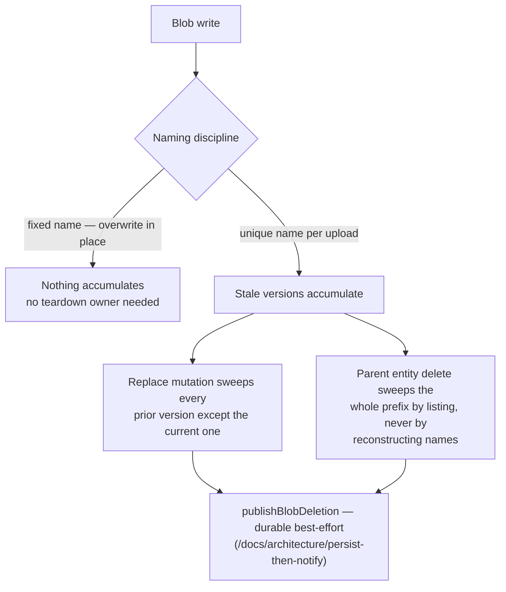

# Blob Lifecycle Ownership

Which mutations tear down which blobs is decided **here**, once — not re-derived per feature or per review. Every user-written blob prefix appears in the table below with its naming discipline and the mutations that sweep it. A new blob write is not complete until it has a row; a delete-path mutation is not complete until it covers every row keyed by the entity it deletes.

## Naming decides teardown

- **Fixed name, overwritten in place** — one blob per slot, replaced by the next upload. Nothing accumulates, so no mutation owns a sweep.
- **Unique name per upload** — chosen where overwrite-in-place would race (a delayed cleanup could delete a concurrent re-upload) or where snapshots must be immutable. The cost of uniqueness is that stale versions accumulate, so **both** the replace path and the parent-delete path must sweep them.

Every sweep goes through `publishBlobDeletion` — the durable best-effort escalation of [persist then notify](/docs/architecture/persist-then-notify). Inline `deleteIfExists` calls at mutation sites are banned; a parent-entity sweep lists the prefix inside the publish thunk rather than reconstructing blob names it cannot know.

## The ownership table

| Blob (container · prefix)                                 | Naming             | Written by                           | Torn down by                                                                                                                                     |
| --------------------------------------------------------- | ------------------ | ------------------------------------ | ------------------------------------------------------------------------------------------------------------------------------------------------ |
| `MessageAssets` · `{roomId}/…` files + thumbnails         | unique per upload  | message attachment upload            | `message.deleteFile` (one file + its thumbnail), `deleteMessage` (all the message's files + thumbnails), `deleteRoom` (whole `{roomId}/` prefix) |
| `PublicUserAssets` · `rooms/{roomId}/ProfileImage/{uuid}` | unique per upload  | room `generateProfileImageUploadUrl` | `updateRoom` on image change (every version except the one the room now points at), `deleteRoom` (whole prefix)                                  |
| `PublicUserAssets` · `{userId}/ProfileImage`              | fixed, overwritten | user `generateProfileImageUploadUrl` | none — replace overwrites the single blob                                                                                                        |
| `ResourceAssets` · `{id}/files/…`                         | unique per upload  | resource asset upload                | resource `deleteFile` (one asset), `purgeResource` (whole `{id}/` directory)                                                                     |
| `ResourceAssets` · `{id}/published/{n}/…`                 | immutable snapshot | publish clone (`cloneContentAssets`) | `unpublishResource` (whole published prefix), `purgeResource`                                                                                    |
| `ResourceAssets` · `{id}/content.json`                    | fixed, overwritten | `saveResourceContent`                | `purgeResource`                                                                                                                                  |
| `ClickerAssets` / `DungeonsAssets` · `{userId}/save`      | fixed, overwritten | game save writes                     | none — overwrite in place                                                                                                                        |

Soft-deleting a resource deliberately keeps every `ResourceAssets` blob — restore must hand back a whole resource, so `purgeResource` is the only sweep of the `{id}/` directory ([recycle bin](/docs/platform/recycle-bin)).

## Notes

- The `MessageAssets` room-level and `PublicUserAssets` room-profile-image sweeps both run in `deleteRoom` — a room delete owns every prefix keyed by its room id, across containers.
- Room profile images written before uploads moved to the per-upload prefix sit at the flat `{roomId}/ProfileImage` name. `listRoomProfileImageBlobNames` lists it alongside the current prefix, so both sweeps collect those too; nothing writes that name any more.
- `DeadLetter` is not user data and is swept by its 30-day lifecycle rule, not by a mutation ([Event Grid dead-letter](/docs/infra/eventgrid-dead-letter)).
