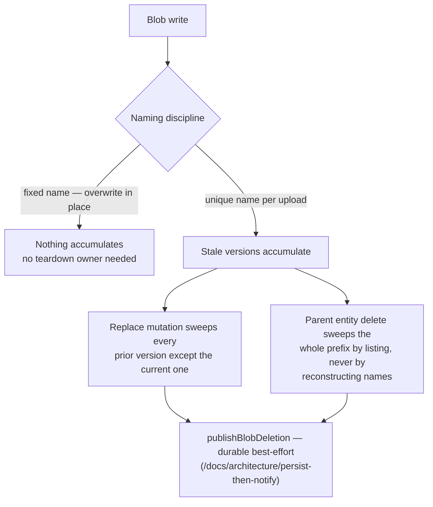

# Blob Lifecycle Ownership

Which mutations tear down which blobs is decided **here**, once — not re-derived per feature or per review. Every user-written blob prefix appears in the table below with its naming discipline and the mutations that sweep it. A new blob write is not complete until it has a row; a delete-path mutation is not complete until it covers every row keyed by the entity it deletes.

## Naming decides teardown

- **Fixed name, overwritten in place** — one blob per slot, replaced by the next upload. Nothing accumulates, so no mutation owns a sweep.
- **Unique name per upload** — chosen where overwrite-in-place would race (a delayed cleanup could delete a concurrent re-upload) or where snapshots must be immutable. The cost of uniqueness is that stale versions accumulate, so **both** the replace path and the parent-delete path must sweep them.

Every sweep goes through `publishBlobDeletion` — the durable best-effort escalation of [persist then notify](/docs/architecture/persist-then-notify). Inline `deleteIfExists` calls at mutation sites are banned; a parent-entity sweep lists the prefix inside the publish thunk rather than reconstructing blob names it cannot know.

## Who may name a blob for deletion

A sweep that walks a persisted entity is authorized by that entity — `deleteMessage` reads the message's own `files`, so the caller can only ever name what the guard already let them delete. **A delete whose blob names come from the request body has no such backing**, and room membership is not a substitute: an unreferenced composer upload and a posted attachment share one `{roomId}/…` namespace, and every member receives every attachment's `id` and `filename` on the wire. Membership alone therefore lets any member permanently destroy any other member's posted files, leaving no entity that records it happened.

So a client-named delete carries proof of the grant that created the blob. `message.generateUploadFileSasEntities` mints `createUploadFileToken(userId, roomId, id)` — an HMAC over the grant, keyed by the app secret — beside each write SAS, and `message.deleteUploadFiles` rejects the whole request unless every file's token verifies for the calling user (`getIsUploadFileTokenValid`, compared with `timingSafeEqual`). Only the member the write target was minted for holds it, so knowing an id buys nothing. The consequence is accepted deliberately: **a composer that loses its tokens (a reload mid-upload) can no longer reclaim those blobs**, and they stay until the room is deleted — the alternative is a delete anyone in the room can aim at anyone else.

The grant **expires with the write SAS it was minted beside** (`WRITE_SAS_DURATION_MS`), and the expiry is signed with the rest of the token so it cannot be edited. An unexpiring grant stays valid after the upload has been attached to a message, where the blob is no longer a loose upload at all — reclaiming it then deletes a posted attachment out from under the message still listing it, leaving every member a permanently broken download and nothing recording why.

Nothing is added to the namespace to make this checkable — the token is the check. A new client-named delete path either carries a grant token or does not ship.

## A name from the request body is one segment, never a path

The grant authorizes _which_ blob, not _what it is called_. Blob names are assembled by interpolation, and the storage sdk resolves the result through `URL.pathname`, which normalizes `..` away — so a caller-supplied `filename` or `blobPath` carrying a separator or a dot segment walks the delete straight out of the prefix the grant covered, and out of the container. Every client-supplied piece of a blob name is therefore constrained to a single separator-free, non-dot segment at its schema (`BLOB_SEGMENT_REGEX` on `fileEntitySchema.filename` and on resource `deleteFile`'s `blobPath`), which covers the upload SAS target and every delete that names the file in one place.

The same applies to a name reconstructed from a **stored** column: `roomsInMessage.image` is free text, so `updateRoom`'s sweep only trusts the name it derives when that name is one an upload could actually have written — a prefix from `getRoomProfileImageBlobPrefixes` plus a single segment. Round-tripping a value through the database does not make it ours.

## Prefix deletions are bounded twice

`publishBlobPrefixDeletion` exists for a set the request path cannot afford to enumerate (a room's whole attachment directory), so the handler lists it at delivery time instead. Delivery is at-least-once and a dead-lettered event can be replayed hours later, which makes the delivery-time listing a different set from the one the publisher decided on:

- **Bounded in time.** The publisher stamps `createdBefore: new Date()` into the event and the handler passes it to `listBlobNames`. Without it, a redelivered unpublish deletes the snapshot of a _republish_ that happened in between — the publication row still says published, and every asset 404s. Named-blob events carry no timestamp because their set was fixed when they were published.
- **Bounded in width.** The deletes go out in waves of `MAX_CONCURRENT_BLOB_DELETIONS` rather than one `Promise.all` over the whole listing. A room with tens of thousands of attachments would otherwise fire that many simultaneous DELETEs — the account throttles, one rejection fails the batch, and the redelivery repeats the same fan-out, so the blobs are never actually deleted. `deleteDirectory`'s `BlobBatchClient` is not the substitute here: the handler needs `deleteIfExists` semantics so a replay converges instead of failing on what the first attempt removed.

## A sweep runs only on a real replacement

The replace-path sweep is keyed on the value **changing**, not on the field being present in the input. `updateRoom` compares the submitted `image` against the row it read moments earlier and does nothing when they match. A settings form that was opened before another admin's upload resubmits the url it loaded with; treating that as a replacement deletes the other admin's freshly uploaded avatar, and it puts two blob listings on the request path of a save that dropped nothing.

## The ownership table

| Blob (container · prefix)                                 | Naming             | Written by                           | Torn down by                                                                                                                                                                                                      |
| --------------------------------------------------------- | ------------------ | ------------------------------------ | ----------------------------------------------------------------------------------------------------------------------------------------------------------------------------------------------------------------- |
| `MessageAssets` · `{roomId}/…` files + thumbnails         | unique per upload  | message attachment upload            | `message.deleteFile` (one file + its thumbnail), `deleteMessage` (all the message's files + thumbnails), `deleteUploadFiles` (a composer revert, grant-token authorized), `deleteRoom` (whole `{roomId}/` prefix) |
| `PublicUserAssets` · `rooms/{roomId}/ProfileImage/{uuid}` | unique per upload  | room `generateProfileImageUploadUrl` | `updateRoom` on image change (every version except the one the room now points at), `deleteRoom` (whole prefix)                                                                                                   |
| `PublicUserAssets` · `{userId}/ProfileImage`              | fixed, overwritten | user `generateProfileImageUploadUrl` | none — replace overwrites the single blob                                                                                                                                                                         |
| `ResourceAssets` · `{id}/files/…`                         | unique per upload  | resource asset upload                | resource `deleteFile` (one asset), `purgeResource` (whole `{id}/` directory)                                                                                                                                      |
| `ResourceAssets` · `{id}/published/{publishId}/…`         | immutable snapshot | publish clone (`cloneContentAssets`) | `unpublishResource` (whole published prefix), `purgeResource`                                                                                                                                                     |
| `ResourceAssets` · `{id}/content.json`                    | fixed, overwritten | `saveResourceContent`                | `purgeResource`                                                                                                                                                                                                   |
| `ClickerAssets` / `DungeonsAssets` · `{userId}/save`      | fixed, overwritten | game save writes                     | none — overwrite in place                                                                                                                                                                                         |

Soft-deleting a resource deliberately keeps every `ResourceAssets` blob — restore must hand back a whole resource, so `purgeResource` is the only sweep of the `{id}/` directory ([recycle bin](/docs/platform/recycle-bin)).

## Notes

- The `MessageAssets` room-level and `PublicUserAssets` room-profile-image sweeps both run in `deleteRoom` — a room delete owns every prefix keyed by its room id, across containers.
- Room profile images written before uploads moved to the per-upload prefix sit at the flat `{roomId}/ProfileImage` name. `listRoomProfileImageBlobNames` lists it alongside the current prefix, so both sweeps collect those too; nothing writes that name any more.
- `DeadLetter` is not user data and is swept by its 30-day lifecycle rule, not by a mutation ([Event Grid dead-letter](/docs/infra/eventgrid-dead-letter)).
